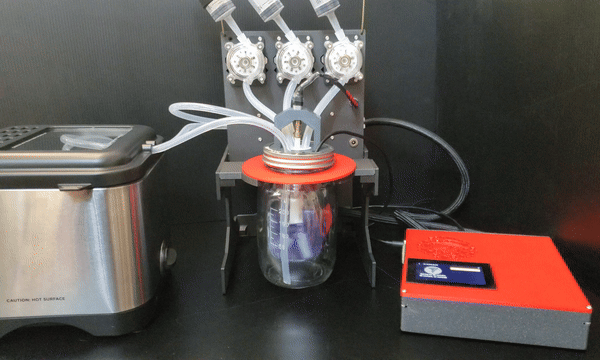

# MicroLab

The MicroLab is an open-source, DIY, automated controlled lab reactor (CLR) that people can assemble with parts available online. We hope this will do for chemistry what the 3D printer did for manufacturing: provide a DIY, hackable, low-cost method to design and produce certain needful things that otherwise would be out of reach.



## The MicroLab Suite

For the MicroLab to be accessible to the most people, it was developed as part of a hardware/software stack called the MicroLab Suite. The different software programs help take the information about a compound you want to make and translate it into a recipe (code) that the MicroLab runs to create the compound.

You can find an introduction to the project, what the heck is a CLR, what's in the MicroLab Suite, and why we are doing this at all on the [About the MicroLab and MicroLab Suite](docs/motivation.md) page.


## Getting Started Making Your MicroLab

This section is for you if you want to build a MicroLab and start using it. We tried to make building the MicroLab friendly for folks newer to electronics, but you will need some knowledge and skills with electronics (or the patience to learn a few things).

- Learn [About the MicroLab and MicroLab Suite](docs/motivation.md) so you have an understanding of what you are building.
- **Start here for [How to build & use the MicroLab and MicroLab Suite](docs/index.md)**

## Getting Started Developing the MicroLab


This section is for you if you want to help develop the MicroLab and will need to tinker with the code base. If you're thinking about doing this, be sure to check out the [development wiki](https://github.com/FourThievesVinegar/solderless-microlab/wiki) and the [current issues](https://github.com/FourThievesVinegar/solderless-microlab/issues) planned for development.

You will need to get a copy of the MicroLab software, set up your development environment either with a Docker container, on a Pi, or locally on your computer.

### Installing the MicroLab software locally

Use the instructions below for a fresh install of the MicroLab software on your machine.

If you intend to construct a full MicroLab, [we recommend using our build scripts to make a disk image](https://github.com/FourThievesVinegar/microlab-image). See below if you want to run a development environment on another computer.

## Dev Environment Option 1: Docker Development

For ease of setup/experimentation we added docker containers for both the GUI and the API.
If you don't have docker-compose installed on your system you can install docker desktop following [these docs](https://docs.docker.com/compose/install/)

```bash
git clone https://github.com/FourThievesVinegar/solderless-microlab.git
cd solderless-microlab

## To run API & GUI
docker-compose up --build gui

## Alternatively
## To run just the API
docker-compose up --build api
```

If you're running docker with a hardware setup you'll need to edit docker-compose.yml and uncomment the lines specified in the file.

Docker-compose mounts `docker/microlab-docker.ini` local file as `/etc/microlab/microlab.ini` in the container. To modify microlab config
just edit `docker/microlab-docker.ini` file and restart the container in docker-compose.

For making local development simpler - `backend/` directory is also mounted as container's `/app` directory. Any local file change is automatically reflected in the container but in most cases you would also need to restart container anyway so the python processes load from updated files.

## Dev Environment Option 2: Laptop Setup

Clone the repo:

```bash
git clone https://github.com/FourThievesVinegar/solderless-microlab.git
cd solderless-microlab
```

### API Server

#### Install dependencies:

##### Python

(for Debian / Ubuntu)

```bash
sudo apt update
sudo apt install python3 python3-pip python-virtualenv python3-virtualenv
```

The backend is tested against CPython 3.9 to 3.13.

Note: some versions of Linux have dropped support for Python2 and `python-virtualenv`.

(for macOS)

```bash
brew update
brew install python3
pip3 install virtualenv
```

Set up a Python virtual environment:
virtualenv -p python3 --system-site-packages .venv

```bash
cd backend
virtualenv -p python3 --system-site-packages .venv
source .venv/bin/activate
(env) $ pip install -r requirements.txt
```

##### Install needed packages

(on the Pi)

```bash
sudo apt -y install screen git python3-flask python3-pip python3-serial

```

#### Start the server

```bash
(env) $ python main.py
```

### Web GUI

#### Install dependencies

(for Debian / Ubuntu)

Follow a guide to install yarn for Debian:

https://classic.yarnpkg.com/en/docs/install/#debian-stable

In summary:

```bash
curl -sS https://dl.yarnpkg.com/debian/pubkey.gpg | sudo apt-key add -
echo "deb https://dl.yarnpkg.com/debian/ stable main" | sudo tee /etc/apt/sources.list.d/yarn.list
sudo apt update
sudo apt install yarn
```

(for macOS)

```bash
brew update
brew install yarn
```

#### Run the GUI:

```bash
cd gui
yarn install
yarn start
```

The GUI will now be listening on port 3000.

## MicroLab Hardware Options

### Hardware Emulation

To run the software without a functioning hardware environment, go to the settings menu and change the "MicroLab Controller" setting to "simulation-pi" and "Lab Hardware Config" to "ftv_simulation_microlabv0.5.0"

### MicroLab Setup - Enabling SSH

If you have a MicroLab to run the software on, you may want to enable SSH on the Pi. This makes remote development easier. Instructions for doing so can be found here: https://itsfoss.com/ssh-into-raspberry/

## Start Developing

Once your environment is setup, head on over to the [Backend README](/backend)
