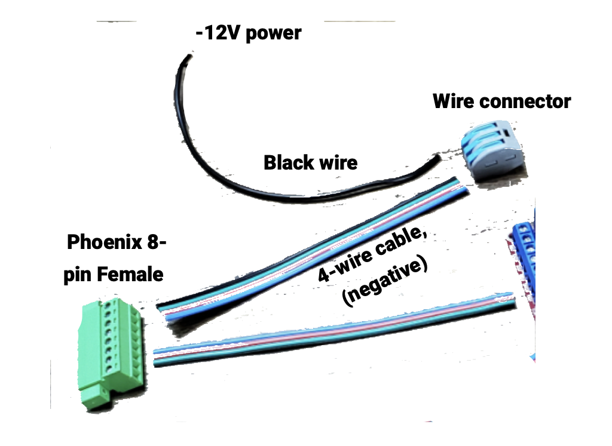
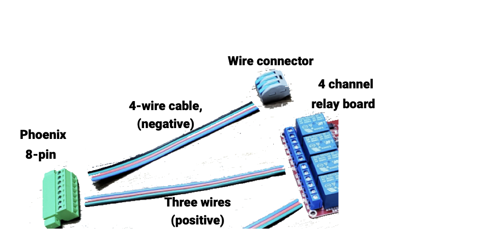
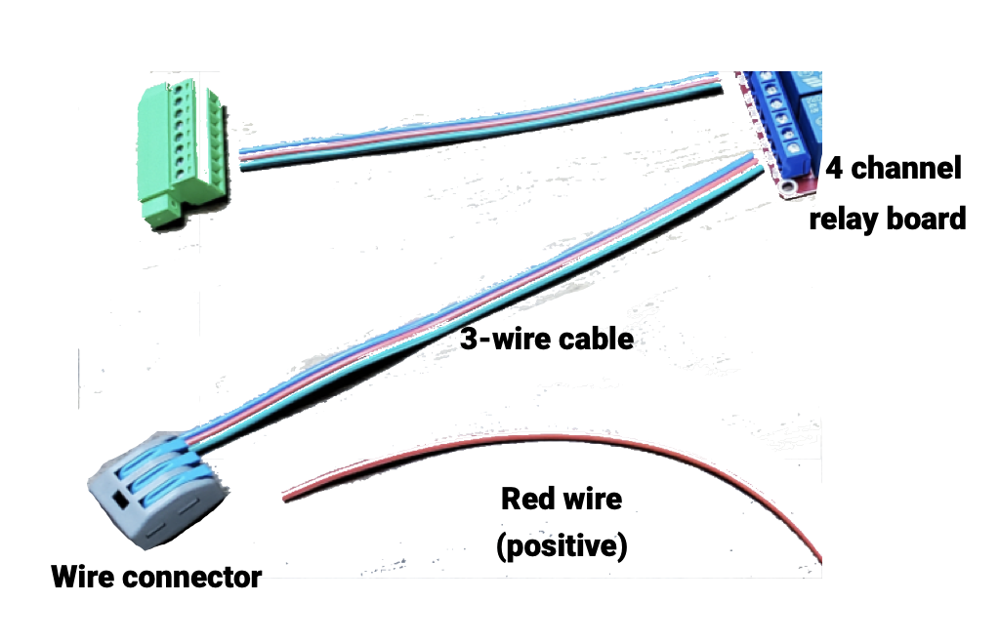
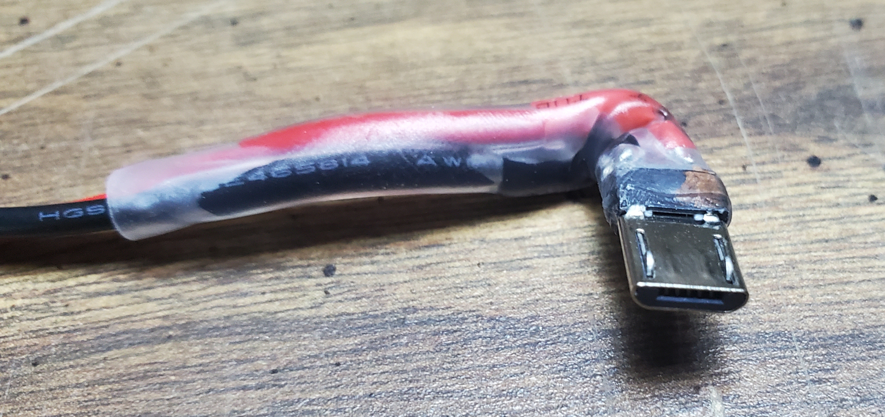
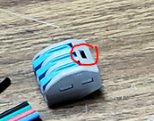

# MicroLab


# Control Unit Assembly


We'll start by assembling the brains of the operation, the Control Unit. As the most complex component of the MicroLab, this will take some time and patience.

  

<br />  
<br />   

To wire things up properly we'll tackle different parts of the Control Unit and then put them all together.

Steps:
* Raspberry Pi Setup
* Arduino Setup
* 8pin Relay Subassembly
* 12pin Relay Subassembly
* Case Setup
* Wiring the 12v & USB power
* GPIO setup
* Final Mounting
* Makine ML Cables


## Skills Needed

* Wire stripping [URL]
* Reading circuit board diagrams [URL]
* Torrenting software

## Tools Needed

* Wire strippers
* Hex key for M3 screws, 2mm if from kit
* Computer w/ SD readers. You may need an SD card to USB converter
* Small phillips head screw driver
* Flush cutters
* Needle nose pilers


## Parts Needed

Be sure to check the [MicroLab Parts List](microlab-parts-list.xslx) for more information about the purchased parts.

More information about the 3D printed parts that can found on the [How to build & use the MicroLab and MicroLab Suite](docs/index.md) page.


* Control Unit box
* Control Unit lid
* Sub-component mounts (optional but nice to hold your stuff in place)


| Section | Part ID      | Part Name     | Count | Notes |
|--- | ------------- | ------------- |------| ----|
Section|Parts|Name|Count
Board - Pi|CU-RPI|Raspberry Pi 3 Model B Board|1
Board - Pi|CU-SCR|Touch screen [For CU-RPI]|1
Board - Pi|CU-SD32|Micro SD card - 32GB|1
Board - Pi|CU-UPC|Micro USB Power Cable - right angle [For CU-RPI]|1 | Right-angle / 90 degree Micro end  will fit better in the case
|||
Board - Arduino|CU-UNO|Arduino UNO|1
Board - Arduino|CU-CNC|Arduino CNC shield|1
Board - Arduino|CU-SMD|Stepper Motor Drivers [For CU-CNC]|1
Board - Arduino|CU-SPS|CNC Shield Power Supply - 12V|1
Board - Arduino|SP-SMC|Stepper Motor Cables| 3 | Used here and in [Assembling the Pumps](/docs/assembly-pumps-unit.md). Cables came with pumps.
|||
Calibration|N/A|Assembled Pi [From Boards section]|1
Calibration|N/A|Assembled Arduino [includes CU-SPS and SP-SMC]|1
Calibration|PU-PSP|Peristaltic pumps with stepper motors|3 | Used here for testing.  
|||
8Pin Relay|SP-PC8|Phoenix Connectors| 8-pin - female side|2
8Pin Relay|CU-RLY|4 Channel Relay Board - 5V|1
8Pin Relay|CU-WCL|Wire connectors| lever|
8Pin Relay|CU-WCL|Wire connectors| lever|
8Pin Relay|SP-CAB|Cables (Control to Pumps)|15ft| Used to make short wires
8Pin Relay|CU-JMP|Breadboard Jumper Wires - male-female|5
|||
12Pin Relay|SP-PC12|Phoenix Connectors 12-pin - female side|2
12Pin Relay|CU-RLY|4 Channel Relay Board - 5V|1
|||
Case|CU-CBC|Control Box/Case (Printed)|1 | [Check the printed parts section](docs/index.md)
Case|CU-CBL|Control Lid (Printed)|1 | [Check the printed parts section](docs/index.md)
Case|CU-CBL|Sub-component mounts (Printed)|1 | [Check the printed parts section](docs/index.md)
Case|MC-PLG|Barrel plug connector - female side (Control Unit and Pumps)|1 | 5.5mm x 2.1mm
Case|SP-PC12|Phoenix Connectors 12-pin - female wired assembly|2
Case|SP-PC8|Phoenix Connectors 8-pin - female wired assembly|2
Case|SP-PC2|Phoenix Connectors 2-pin|2
Case|SP-QDC|Quick-disconnect connectors [for SP-PC2]|2
Case|CU-BTN|12mm button 12v w/ lights (optional)|1
Case|CU-USB|Mountable USB cables|1
Case|SP-M3S-16|16mm M3 screws (Control Unit)|6
|||
12v USB|MC-PLG|Barrel plug connector - male (Control unit and Pumps)|1
12v USB|CU-SDC|USB step-down converter - 12v to 5v|1
12v USB|CU-A2B|USB A/B cable [For CU-RPI to CU-UNO]|1
|SP-M3S-20|20mm M3 screws (Control Unit)|2
|||
GPIO Step|CU-JMP|Breadboard Jumper Wires - male-female|5
GPIO Step|SP-QDC|Quick-disconnect connectors [for SP-PC2]|2
|||
Final Mount|CU-SCR|Touch screen [For CU-RPI]|1
Final Mount|CU-CBL|Control Lid (Printed)|1
Final Mount|SP-M3S-16|16mm M3 screws (Control Unit)|2
|||
ML Cables |SP-CAB|Cables (Control to Pumps)|15 ft
ML Cables |SP-PC8|Phoenix Connectors 8-pin - male|2
ML Cables |SP-PC12|Phoenix Connectors 12-pin - male|2
ML Cables |SP-SWW|Split Wire Wrap|?
|||

## Boards Setup
The Raspberry Pi is a single board computer and the Arduino is a single board microcontroller.

The Raspberry Pi runs the MicroLabs software, the touchscreen and controls the Arduino.

The Arduino controls the peristaltic pumps with stepper motors

### Raspberry Pi Setup

#### Installing the MicroLab software on the SD card

1. Install [Raspberry Pi Imager](https://www.raspberrypi.com/news/raspberry-pi-imager-imaging-utility/) onto a computer. Link for imager
1. Download our disk image torrent from [our website](https://fourthievesvinegar.org/microlab/).
   * The image is a version of the OS with the MicroLab software already installed.
   * The production image already has drivers for the LCD touchscreen installed - you MUST use the touchscreen with the production image.
       * The 3.5" touchscreen uses goodtft and XPT2046 touch controller drivers.
   * Please continue to seed the torrent!
   * **NOTE:** If you have a different display, you will need to use the development image, then download and install the appropriate drivers. The development image requires using an external monitor.
1. Connect the MicroSD card to your computer.
1. Launch the Raspberry Pi Imager.
1. Select “Choose OS”, and scroll down to “Use Custom”.
1. Select the downloaded MicroLab image file.
1. Click “Storage”, and select your SD card.
1. Click “Write”.
1. Allow the Raspberry Pi Imager program to write to the SD card.
1. Wait for verification. The imager program will also run a verification check to make sure the OS was installed correctly. This will take several minutes.

#### Installing the SD card

1. Once complete, remove the SD card from your computer, and insert into your Raspberry Pi.
**Note:** The SD card extends beyond the edge of the Pi's circuit board. The Pi is very delicate with the card inserted, so take care.

#### Installing the touchscreen

1. Line the touchscreen up with the Raspberry Pi's board. Position the screen's female headers over the Raspberry Pi's GPIO pins and then push down gently until the screen is completely connected to the board.


**NOTE:** We will need to remove the touchscreen  again to put the GPIO pins in place

### Arduino Setup

In this section to setup the Arduino board we will
* Install software that runs the stepper motors
* Attach the CNC shield
* Install the stepper motor boards on the shield

Detailed pin diagram here [https://blog.protoneer.co.nz/arduino-cnc-shield-v3-00-assembly-guide/](https://blog.protoneer.co.nz/arduino-cnc-shield-v3-00-assembly-guide/)


1. Installing the grbl software. Follow the instructions [here](https://github.com/gnea/grbl/wiki/Compiling-Grbl) to compile and flash ```grbl``` to the arduino
1. Assembling the Arduino
  1. **Critical Safety Note: ALWAYS disconnect the power before connecting or disconnecting the stepper motors from the CNC shield** Failure to follow them can hurt both you and the component.

  1. This external video shows the assembly of the CNC shield and stepper motor driver boards. Note: We use 3 motor driver boards while the video shows 4 being installed. In the video the four sockets for the drivers are labeled X, Y, Z, and A. We will only use sockets X, Y, and Z.
   [https://youtu.be/zUb8tiFCwmk?t=37](https://youtu.be/zUb8tiFCwmk?t=37)
  1. Add the CNC shield
    * To orient the CNC shield correctly, position it so the 12v power connection is in the lower left, the reset button is in the upper left.
    * Place CNC shield on the Arduino, push the CNC pins  into the blue header sockets on the Arduino until it is fully connected.

  1. Add the Stepper Motor Driver Boards
    * Orient each of the drivers. **The A4988 driver has a small potentiometer on the BOTTOM center of its circuit board** The potentiometer looks like a small phillips head screw.
    * Insert the stepper motors driver boards into the X, Y, and Z slots on the shield.

  1. Set Enable Pin to Ground
    * Place 1 female-female jumper lead on the enable and ground pins to
  enable the board.
  
  1. Add Stepper Motor Cables
    * Connect the stepper motors cables

  1. Connect the Power Supply (but don't turn it on)
    * Take the Power Supply (CU-SPS) and the connect to the 12v power connection on the lower left of the shield should be directly above the Arduino power jack also on the lower left.
    * Be sure to double check that
       * you have installed the drivers according to the manufacturer's instructions
       * all the drivers are firmly seated in the sockets, and that none of the heat sinks shifted during installation.
    * **Double check the polarity otherwise the power supply may damage the stepper motor driver boards** <br>


Note: Keep it turned off. At this point you do not turn on the power to the shield. If a stepper motor is not connected to the shield, it can cause the stepper motors drivers to overheat and become damaged. ALWAYS connect stepper motors to the CNC Shield before powering it on to test or use it.

## Stepper Motor Calibration

Before we continue with assembly we should tune the potentiometers and test the stepper motor wiring.

We will need the:
- Raspberry Pi that is setup
- Arduino that is setup
- **Pi power cable?**
- Peristaltic pumps with stepper motors
- Small phillips head screw driver

### Potentiometer tuning

* On the Arduino, each A4988 stepper motor driver board has a small potentiometer that look like a small phillips head screw on the board.
* You **DEFINITELY** want to tune the potentiometers. If you don't, the stepper motors will likely behave strangely and could be damaged by excess voltage.


Note:
In the image above, the potentiometers are circled and their slightly-flat sides are pointed to the left. This is the "slightly-open" position.

**WARNING!** Failure to correctly tune the potentometers can damage the motor controller and the motors themselves.

How to tune:
You will **gently** turn the potentometers on the motor control boards clockwise or counter-clockwise using a small phillips head screw driver. Be careful to stop once there is any resistance, do not to turn past the resistance.
* Turning them clockwise "closes" the voltage down
* Turning them counter-clockwise "opens" the voltage up

1. Attach the Arduino's stepper motor cables to the stepper motor on the peristalic pump.

1. Double check the everything is connected properly.
1. Start with the potentiometers in the "closed" position.

1. Power on the Raspberry Pi, the Arduino shield and the pumps.
1. **Don't we need to add cable between Arduino and Pi?**
1. On the Raspberry Pi, the MicroLab software will load, locate the Test Recipe and choose to manually run each of the peristalic pumps. **More detail needed**<br>

1. Slowly turn the potentiometer counter-clockwise an eighth of a turn at a time to "open" them. Check if the stepper motors turn smoothly. If they do not move, "open" the potentiometer an eighth-turn and try again. If they move erratically, your voltage is likely too high and you "close" the potentiometer.

1. Once tuned, power off the motors and the Raspberry Pi. Remove the stepper motor cabls from the stepper motors of the eristaltic pumps.

* You can tune the potentiometers later as well, but the lid on the Control Unit will need to be off.


### Stepper motor verification
Check each peristaltic pump's motor. With the cables and power disconnected, you should be able to spin the shaft of the stepper motor with your fingers and feel almost no resistance.

Testing the motor. Take a short length of wire and jumper the top two pins (Pins 1 and 2) of the connector together.


If the motor is wired correctly you should now feel some resistance when you spin the shaft (you should be able to feel the “steps” in the stepper motor). Repeat this procedure with the bottom two pins (Pins 3 and 4).

If you do not feel any change in resistance, try jumpering other combinations of pins until you identify the two pairs. See Troubleshooting Stepper Motor if you continue to have issues.


## Assembling the 8-pin relay sub-assembly

Time for wiring! This step is where the bulk of the assembling happens for the Control Unit.\\


**Wire Order:**
Important note: This where the order of wires for one of your cables is determined!

If looking at the connector from outside the case, from left to right the wires will go:
* Heat negative (-), blue
* Heat positive (+), blue
* Cool negative (-), red
* Cool positive (+), red
* Stir negative (-), green
* Stir positive (+), green
* Light negative (-), black
* Light positive (+), black

```ascii
Phoenix connector wires as viewed from outside the case

-----------------
|-|+|-|+|-|+|-|+|
-----------------
  ^   ^   ^   ^
Heat  |  Stir |
    Cool    Light
```


<br>
<br>


**Components:**

| Section | Part ID      | Part Name     | Count | Notes |
|--- | ------------- | ------------- |------| ----|  
|||
8Pin Relay|SP-PC8|Phoenix Connectors 8-pin - female side|2
8Pin Relay|CU-RLY|4 Channel Relay Board - 5V|1
8Pin Relay|CU-WCL|Wire connectors|
8Pin Relay|CU-WCL|Wire connectors|
8Pin Relay|SP-CAB|Cables (Control to Pumps)|15ft| Used to make short wires
8Pin Relay|CU-JMP|Breadboard Jumper Wires - male-female|5
|||


**Prepare Wires**

- Take the 4-wire cable (SP-CAB) and cut two 4" sections and three 6" sections.
   - Take one of the 4" sections and separate out the red and black wires to use
   - Take the second 4" section and sepereate all four colors (red, blue, green, black)
   - Take one of the 6" sections and remove the black wire leaving a red, blue, andgreen 3-wire cable to use


You should now have
- 4" Wires
    - 1 blue (Phoenix)
    - 2 red wires (5v relay)  (Phoenix)
    - 1 green wire  (Phoenix)
    - 2 black wire (5v relay)  (Phoenix)
- 6" wires
    - 1 3-wire cable (red, blue, green) (relays to the +12v power)
    - 1 4-wire cable (8-pin Phoenix connector to the -12v power)
-  3 male-to-female jumper wires

Begin by stripping the ends of all 4' and 6" wires and cables. These will be inserted into various screw terminals on the relays and Phoenix connector.


**Assembly:**
When working with screw terminals, remember that they are only as secure as they are tight. Use firm but gentle turns when screwing down terminals - you want them to be tight, but you don't want to damage the slots on the heads of the screws. You should be able to lightly tug on the wires without them moving.

- Wiring the 12v half of the sub-assembly
-Wiring the Phoneix connector
  - Positives. On the back on the female 8-pin Phoneix connector, insert a 4" green, red, blue wire into the correct positive (+) terminal and tighten the terminals. The black terminal will be empty for now.
      - The wire pattern will be reversed when adding wires from the the back of the female connector. So from left to right, skip the first two terminals and then place the green +, red + and blue + wires.

      

Note: When working with screw terminals, remember that they are only as secure as they are tight. Use firm but gentle turns when screwing down terminals - you want them to be tight, but you don't want to damage the slots on the heads of the screws. You should be able to lightly tug on the wires without them moving.

  - Negatives. On the Phoenix connector, take the 6" 4-wire cable and insert each of its wires (black, green, red, blue) into the correct negative (-) terminal and screw them down
  - Take the other end of the 4-wire cable and place the black and green wire in their own slots of the 4-to-1 wire connector. Then put the red and blue wires together in one slot. That leaves the last slot open for power (-12V), put the 4" black wire in that slot.

  


  - Wiring the relay   

    

     - Take the female phoneix connector and insert each of its 4" positive wires into the "NO" (Normally Open) terminals on the 4-channel relay board. The terminals are labeled "NO1", NO1 as so on. Screw the terminals down gently but firmly.
        
     - Use the 3-wire cable, put each of its wires into the terminals labeled "COM" (common) and tighten the terminals.

     - Take the other end of the 3-wire cable and insert each of its wires into a wire connector. In the remaining open slot, insert one of the 4" red wires, which will later connect to the 12v manifold.
  


- Wiring the 5v half of the sub-assembly
  - We highly recommend gently bending the male headers of the jumper wires to a 90 degree angle with a needle nose pilers before inserting them in the terminals.

    
  - The relay board will has:
      - (DC+) terminal - insert a 4" red wire
      - (DC-) terminal - insert a 4" black wire
      - (IN1) terminal - insert the male end of the Jumper wire
      - (IN2) terminal - insert the male end of the Jumper wire
      - (IN3) terminal - insert the male end of the Jumper wire
      - (IN4) terminal -  [no action]
  - To conserve space and prevent short circuits, we recommend using flush cutters to remove excess material from the underside of the boards. Once this is complete, use electrical tape to cover over the bottom of the boards.
  - Gently bend all wires on both sides of the relay up and wrap them with thin (half width) strips of electrical tape. This tape prevents shorts and helps keep the wires from being damaged as you arrange components in the case.


  - Take a wire connector and insert the red wire from DC+ into one of slots and one red wire in another slot.
  - Take another wire connector Do the same with the black wire(s) in the other lever connector (the (-) USB wire is usually black).

Take a moment to review and appreciate your work. This is the most fiddly part of the assembly. Nice job! 🎉

## Assembling the 12-pin stepper sub-assembly


**Components:**

- 12-pin panel-mounted female Phoenix-style connector
- 3x the half of the stepper motor cables that connect to the motor control board

**Assembly:**

- Use a small screwdriver to open the screw terminals on the 12-pin Phoenix receptacle.
- Cut, strip, and insert the wires into the 12 screw terminals, tightening them down one-by-one
- NOTE: There are 8 total places where we will be screwing wires into Phoenix connector screw terminals, each of which is an opportunity to make a mistake by changing the order of the wires. The key is to ensure that the wiring is consistent across all connections (i.e.: the leftmost wire stays the leftmost in all the junctions and cables and all other wires are also in the same order). Remember that the leftmost wire looking from the outside becomes the rightmost wire when looking from the inside.
- We recommend ordering them alphabetically (x, Y, Z) as seen from the outside of the case.

## Mounting the components to the case

Mount the panel-mounted components to the case.


**Components:**

- Female barrel plug connector (5.5mm x 2.1mm)
- Phoenix connectors
  - 12-pin assembly and 8-pin assembly
  - and 2-pin connector
- Button
- USB ports
- 6x 16mm M3 screws

**Assembly:**

- Feed the 12-in and 8-pin female sockets out through the appropriate holes on the front of the case, then clip them into the Phoenix connector mounting pieces.
- Use M3 screws to mount the Phoenix connectors to the case in the matching two holes in the front and the smaller rectangular hole in the back.
- Insert the button in the circular hole on the left side and attach with the matching nut.
- Insert the female barrel plug connector in the circular hole on the back side and attach with the matching nut.
- Mount the USB ports to the front of the case. They should come with their own screws. We recommend installing them with the plastic rectangle at the top, but feel free to be a chaos muppet about it if that's your jam.
- If the circular holes are too small or the pre-printed holes don't fit your USB ports, you can use a drill or scrape with a knife to widen or add new holes.

## Wiring the 12V and USB power

This is where we wire the power manifold and connect it to the other sub-assemblies.


**Components:**

- Male barrel plug connector (5.5mm x 2.1mm)
- KV-426 lever connector (i.e.: a 1-to-3 splitter for both + and - leads)
- Buck Converter module
- Micro USB cable

**Assembly:**

- Insert the wires for the female barrel plug connector into the 1x side of the lever connector.
- Insert the wires for the male barrel plug connector into the 3x side of the lever connector.
  - Note: You should be able to insert up to 2 wires into each socket on the lever connector. Twisting wires together may make this easier.
  - Note: **Make sure the wires are sufficiently stripped!** If the lever connector closes on the wire's insulation, it will not work! Expect to remove 1/4" or more of the insulation.
- Plug the male barrel plug connector into the Buck Converter module.
- Plug the USB cable for the Pi and the USB cable for the relays into the USB ports on the Buck Converter.
- Position the Buck Converter as far to the left side of the case as possible. If using straps, find an appropriate position to attach the strap the case by punching a hole in a piece of two-sided velcro and inserting a short M3 screw, then screwing it into a hole on the case bottom.
- Insert the + and - wires from the 8-pin relay sub-assembly into the 3x side of the lever connector
- Following the manufacturer's instructions, insert the + and - leads for the button light into the 3x side of the lever connector - this way the button light will turn on whenever the Control Unit is powered.
- Next, insert the + and - leads that the button's switch controls into the open terminal on the 8 pin connector and the lever connector. Remember that LEDs have a polarity

## Putting things in the case

**Components:**

- The whole case assembly up to now.
- The Arduino stack
- USB A-to-B cable
- A short red wire and a short black wire (~3" to connect the Arduino motor shield to the 12v power)
- 2x 20mm M3 screws

**Assembly:**

- Insert the Arduino stack into its spot on the right of the case with its USB port facing the center. It should slot into the supports snugly when pushed toward the right side of the case.
  - Make sure the USB B cable is inserted in the arduino and that there are red and black wires secured to the (+) and (-) terminals on the motor control board.
  - OPTIONAL: If you find that the Arduino is not secure in the supports, you can use a velcro strap to hold it in place. Punch a small hole in the strap and attach it to the bottom of the case using an M3 screw.
- Use the M3 screws to secure the 1-to-3 lever connector / 12v manifold onto the front of the case. Deez nuts (as with all of the nuts) should remain on the inside and out of sight.
- Feed the male barrel plug along the bottom of the case to the right side and plug it into the Buck converter.
  - OPTIONAL (but recommended): Secure the Buck converter to the case with a strap.
- Place the relays on top of the buck converter with the 12v wires facing the front and the 5v wires facing the back. This may require some careful arrangement of wires and you may want to reduce the length of some of them. The main goal is to get the bottom of the relay board(s) sitting on top of the Buck converter without much above them - this ensures there is enough room for the Pi.
- Plug the micro USB cable into the Pi. Wrap the USB cables toward the front of the case and plug them in to the Pi as well. For now, remove the touchscreen.
- Insert the Pi into its supports, starting with the left side of the board, and keeping the USB ports toward the center. The supports have catches that should hold the board snugly in place.

## Connecting the GPIO pins and stepper cables

The GPIO pins let the Pi control the relays in the case as well as the switchable power brick outside it.


**Components:**

- 5x male-to-female breadboard headers (3 of these will be from the 8-pin relay sub-assembly)
- 2x quick-disconnect connectors (or other appropriate connector for your 2-pin Phoenix connector)

**Assembly:**

- Connecting the GPIO pins
  - Use pliers or wire strippers to crimp the quick disconnect connectors onto the new male headers. Gently tug to make sure they are secure. If they come out, re-insert and continue crimping.
  - Connect the quick disconnect connectors to the 2-pin Phoenix port, making sure that the contacts are securely in place.
  - Mate the female headers with the GPIO pins on the Pi. Check your board's GPIO reference and the `ftv_microlabv0.5.0.yaml` file for mappings. They should be:
    - Stirrer: 16
    - Heater: 26
    - Heater pump: 20
    - Cooler pump: 21
  - Connect the quick-disconnect connectors to the 2-pin Phoenix connector (order does not matter). One should be connected to the appropriate GPIO pin and the other should be connected to a ground (-) GPIO pin.
  - Carefully tuck the wires into the box so that they will not obstruct the lid.
- Connecting the stepper motor cables
  - Connect each of the 4-pin female headers to the appropriate male headers on the motor control board.

## Final mounting and assembly

Before you close the case, you probably want to test that everything is wired correctly. We **highly** recommend testing all the functionality of the MicroLab using the Test Recipe. Of course, if something doesn't work right or stops working in the future, you can always open it back up again.

NOTE: As you put things into the case, you may notice that the long wires that made things easy to work with during assembly are now getting in the way of things. Feel free to cut internal wires shorter - with non-solder connectors, this shouldn't be too hard.

**Components:**

- Touch screen
- Control Unit lid
- 2x 16mm M3 screws

**Assembly:**

- Gently fold over the GPIO wires as much as possible, then attach the touchscreen to the Pi. If you find the headers are too tall, you can attempt to cut them shorter but this can cause problems as the insides are delicate and not designed for this. You may need shorter headers in this case.
- Place the lid on top of the Control Unit box, slightly overhanging the front, then slide it toward the back so that the tabs on the lid fit into the slots on the box. Align the screw holes on each and secure the lid in place using the 16mm screws.

🥳 YAY! ✨🦄✨ You did it! 💖


## MicroLab Cables

To connect the Control Unit to the Pumps Unit, we will use a pair of cables: 8-wire and 12-wire. Savvy readers will notice that this corresponds with the Phoenix connectors.

When this step is complete, you will have two cables that plug into the ports on the Control Unit and the Pumps Unit. It should not matter which end of the cable is in which unit. Make sure that the wire order is consistent at both ends of the cables.


**Components:**

- ~10 feet of 4-wire cabling cut into 5 ~2.5-foot lengths
- 2x 8-pin male Phoenix connectors
- 2x 12-pin male Phoenix connectors
- 2x split wire wraps (slightly shorter than the cables)

**Assembly:**

- Cut and strip the cables so that the wire ends can be inserted into the male Phoenix connectors' receptacles. Instead of screws, these use small orange pushbuttons to open the receptacle.
- NOTE: This is another place where wires can get crossed. To ensure proper connectivity between the Control Unit and the Pumps Unit, make sure that the wires are consistently placed. One way to do this is to place the male Phoenix connectors together and make sure that each wire retains its position from left to right when viewed from the front. You will also need to make sure that the wiring in the Pump Unit is consistent with this.


## Wrapping up

This concludes the assembly instructions for the Control Unit. Next up: Assembling the Pumps Unit!


**Variations**

- The MicroLab is designed to be assembled without the need for soldering or other specialized tooling. However, if you are equipped to solder and have some heat shrink, you can construct one at a slightly lower cost and with less junk in the case by replacing the lever-action wire connectors with solder joints or screw cap connectors.
- Additionally, you can save space in the case by splicing wires and modifying components like USB cables to remove extraneous material.



*Pictured above: A modified micro USB cable with most of its plastic shell removed, sealed in clear heat shrink.*



*Pictured above: A lever connector. If you need to test your circuits, you can insert a multimeter probe into the circled hole to take a reading. Screws on screw terminals can be used in a similar way.*


## Attaching straps (Optional)

### Parts needed
- Control Box (printed)
- 1/2 inch wide velcro straps
- 4 of the 3mm M3 screws and nuts
- MC-FVP 12v to 5v step-down converter (Buck)
- 9-pin relay
- 12 -pin relay
- ??? relay

The straps are optional, but highly recommended if you will be shipping your MicroLab or otherwise expect it to get jostled. These straps can hold the converter and relays in place.

The Control Unit box has holes in the bottom so the velcro straps can be held in place with the 3mm M3 screws.

1.  Cut the straps long enough to wrap around your components. You will need to experiment with placing the converter and relays on the left side of the case to make sure they will fit under the Pi and be secured by the length of velcro.<br>

1. Once you are satified with palcement of the straps, use the M3 screws and nuts to secure the velcro.

