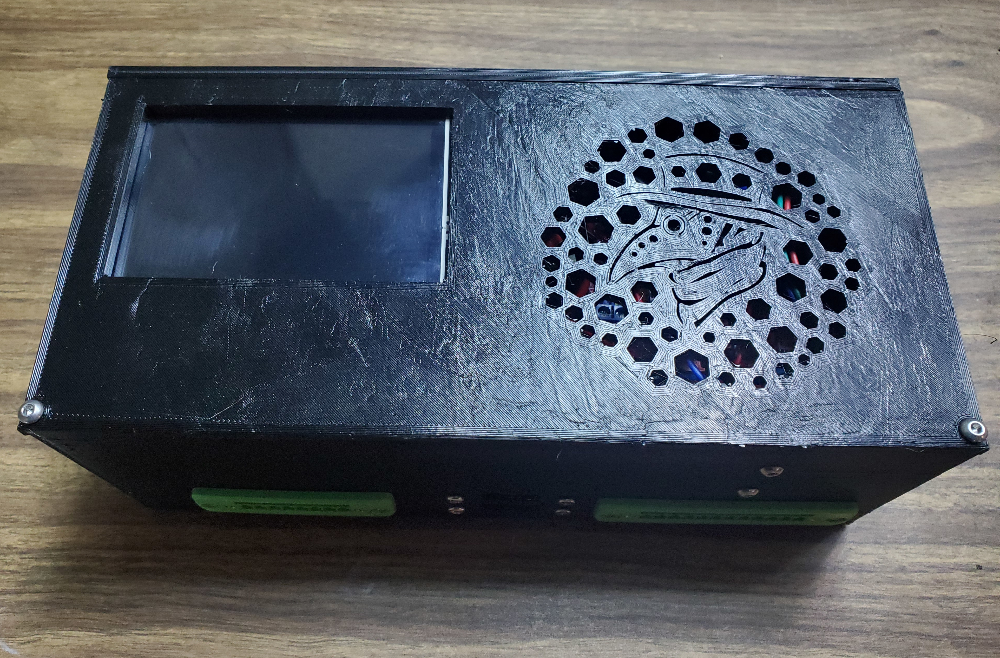
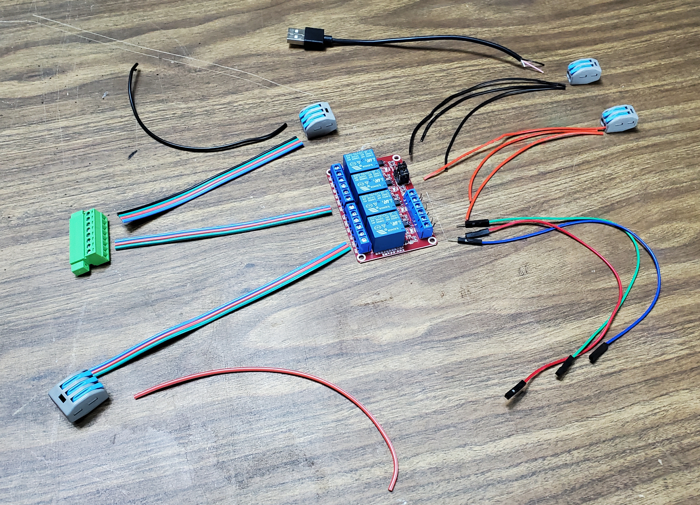
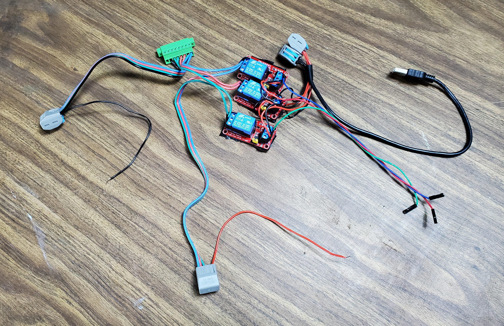
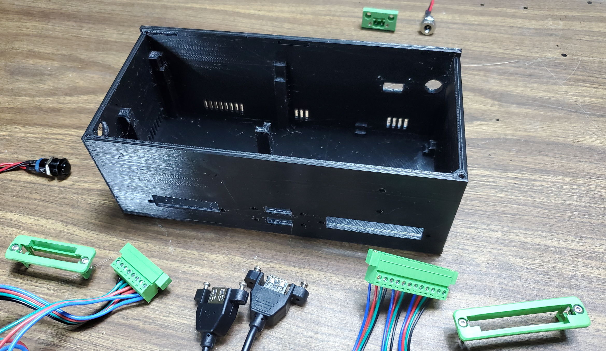
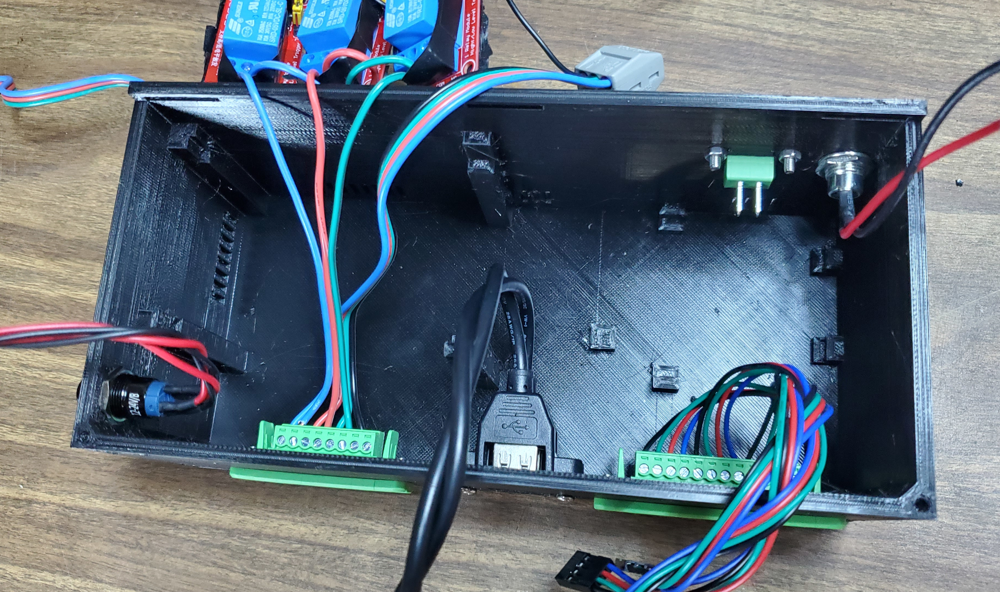
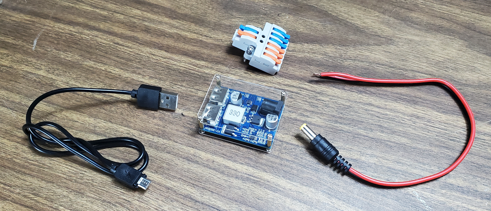
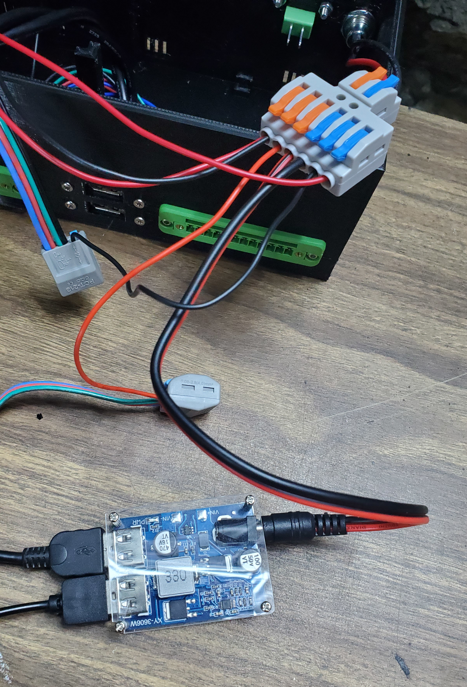
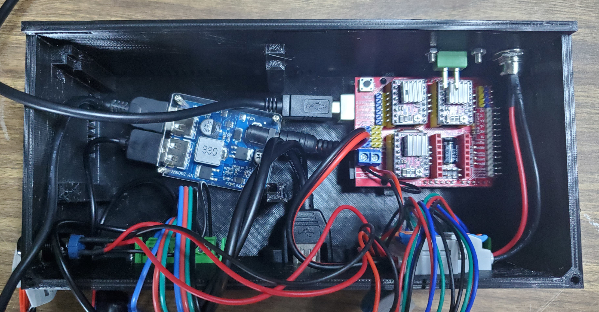
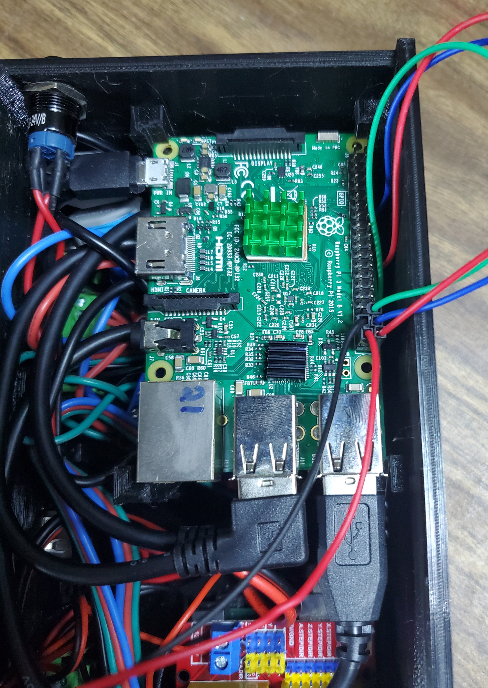
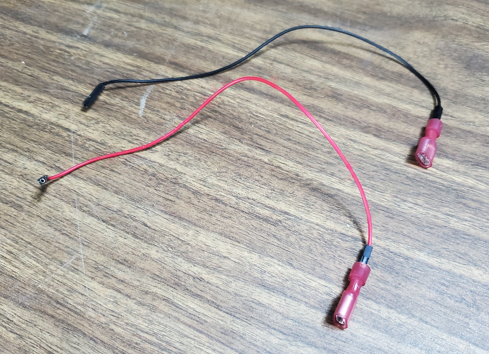

# MicroLab Control Unit Assembly

The Control Unit is the brains of the operation. It's also the most complex component of the MicroLab itself, so be ready to take some time and care to get everything wired up properly.



**Some notes:**

- The MicroLab is designed to be assembled without the need for soldering or other specialized tooling. However, if you are equipped to solder and have some heat shrink, you can construct one at a slightly lower cost and with less junk in the case by replacing the lever-action wire connectors with solder joints or screw cap connectors.
- Additionally, you can save space in the case by splicing wires and modifying components like USB cables to remove extraneous material.

TODO: Pic comparing stock and modified micro USB
A modified micro USB cable

## Purchased Parts

### Wires and Cables and Connectors (Oh my!)

- USB A/B cable for rPi to Arduino
- USB A cable (cut off with + and - wires exposed and stripped)
- Micro USB cable to power the rPi (check your SBC to see which cable is appropriate)
- Female barrel plug connector (5.5mm x 2.1mm)
- Male barrel plug connector (5.5mm x 2.1mm)
- KV-426 lever connector (i.e.: a 1-to-3 splitter for both + and - leads)
- 2x 2-wide lever nuts (or another way to join 4 small wires)
- 2x 3-wide lever nuts (or another way to join 6 small wires)
- 12-pin panel-mounted female Phoenix-style connector
  - 3x the half of the stepper motor cables that connect to the motor control board
- 8-pin panel-mounted female Phoenix-style connector
- 2-pin panel-mounted female Phoenix-style connector
  - 2x Quick disconnect connectors (if your 2-pin connector requires them)
- Cable materials (to connect to the Pumps Unit)
  - 2x 12-pin male Phoenix-style connector
  - 2x 8-pin male Phoenix-style connector
  - ~10 feet of 4-wire cabling cut into 2-foot lengths
- Assorted wire for inside the case (more 4-wire cable can be handy, especially the ribbon-style that can be easily split into individual wires)
- 5x male-to-female breadboard headers (at least). You want short headers so that they fit comfortably on the GPIO pins under the touchscreen.

### Raspberry Pi

- Raspberry Pi 3 Model B Board (We have also successfully done preliminary testing on a Libre Computer Le Potato, although the touch-screen can be finicky)
- Raspberry Pi 3 b+ compatible display 3.5 inch TFT LCD Screen Kit, 3.5" 480x320 Resolution and XPT2046 touch controller
- Micro SD card, 32GB
  - Please note: we are aware that RPi hired a UK Spy Cop and were aggressively oblivious as to why that's a problem. For this and several other reasons, including increasing prices, we are investigating alternatives. We use "Raspberry Pi" as a short-hand for "single-board computer" (SBC) and encourage experimentation with Libre Computer and other replacements.
- Arduino
- Arduino UNO SMD Rev3
- CNC Shield - Expansion Board V3.0 +UNO R3 Board
- 4x A4988 Stepper Motor Driver with Heatsink (K75-CNC-UK)
- Stepper motor drivers (quantity 4)

### Misc

- 3x Individual relays that can switch 12v and be activated by as low as 3.3v. Typically these are small and blue and come on their own little circuit board. A single 4-relay board will also work.
- Buck Converter module (to step down 12v to 5v). Must have at least two 5v outputs.
- Button-style switch. This switches the reactor light and indicates when the MicroLab is powered. You can use another switch if you have one you really like.
- Double-sided velcro straps for wire management and for holding components in place (optional, but highly recommended)
- Assorted M3 screws (TODO: Which lengths and how many?)

## Printed Parts

- Control Unit box
- Control Unit lid

## Raspberry Pi Formatting/Setup

### Putting OS and MicroLab software on an SD card

1. Install Raspberry Pi Imager onto a computer.
1. Download our disk image torrent from [our website" SRC="https://fourthievesvinegar.org/microlab/).
   1. Please continue to seed the torrent!
   1. This image is a version of the OS with the MicroLab software already installed.
      1. The production image already has drivers for the LCD screen installed - you MUST use the touchscreen with the production image.
      1. The development image uses the HDMI port and requires an external monitor.
      1. If you plan to do extensive development on an external monitor, you can cut or drill a hole in the side of the case to allow an HDMI cable to pass through.
      1. The external USB ports can be used to attach a mouse and keyboard for development or ease of use.
      1. NOTE: The touch screen is primarily used for mobility and portability. Users familiar with networking may also choose to run the lab “headless”, and connect across a network without a monitor or USB input devices.
      1. NOTE: The production image has drivers for the 3.5" display using goodtft and XPT2046 touch controller drivers. If you have a different display, you will need to use the development image, then download and install the appropriate drivers. The development image requires using an external monitor.
1. Connect the MicroSD card to your computer. You may need an SD card to USB converter. [part #]
1. Launch the Raspberry Pi Imager.
1. Select “Choose OS”, and scroll down to “Use Custom”.
1. Select the downloaded [imagefile].
1. Click “storage”, and select your SD card.
1. Click “Write”.
1. Allow the Raspberry Pi Imager program to write to the SD card.
1. The imager program will also run a verification check to make sure the OS was installed correctly. This will take several minutes.

### Installing SD the card

1. Once complete, remove the SD card from your computer, and insert into your Raspberry Pi.
1. Note that the SD card extends beyond the edge of the Pi's circuit board. The Pi is very delicate with the card inserted, so take care.

### Installing the touchscreen

1. Gently slide the screen's female headers over the Pi's GPIO pins.
1. The screen should line up with the Pi's board and the end of the headers should aldo coincide.
1. NOTE: We will need to remove this again to put the GPIO pins in place

## Arduino Setup
1. Before assembling, follow the instructions [here](https://github.com/gnea/grbl/wiki/Compiling-Grbl) to compile and flash grbl to the arduino
   1. Detailed pin diagram here [https://blog.protoneer.co.nz/arduino-cnc-shield-v3-00-assembly-guide/](https://blog.protoneer.co.nz/arduino-cnc-shield-v3-00-assembly-guide/)
   1. Note: Video overview of CNC shield assembly and operation [https://youtu.be/zUb8tiFCwmk?t=37](https://youtu.be/zUb8tiFCwmk?t=37)
   1. Note: Critical safety information when working with the CNC shields. Failure to follow them can hurt both you and the component. NEVER connect or disconnect any stepper motor to the CNC Shield while the power is on or connected
   1. ALWAYS disconnect the power before connecting or disconnecting the stepper motors
   1. When installing the motor driver, be sure to correctly orient the driver so the enable pin matches the EN pin on the CNC Shield. **The A4988 driver has a small potentiometer on the BOTTOM center of the circuit board**, and the EN pin is on the top left. Make sure you have installed the drivers correctly per the manufacturer's instructions.
   1. ALWAYS connect a stepper motor to the CNC Shield when testing or using it. If a stepper motor is not connected it can cause the driver to overheat and become damaged.
   1. When attaching the heatsink to the drivers, it is critical that the heatsink is centered on the chip and does not contact any of the pins. Failure to correctly place the heatsink can cause the driver to short out and fail.
   1. (video part 1: 00:18 WARNING: video incorrectly shows installing all 4 drivers) Mount the motor control drivers (MC-MDR) on the CNC hat (MC-CNC). The four drivers are labeled X, Y, Z, and A. Since this project only requires three stepper motors, we will only use sockets X, Y, and Z. To ensure you have the orientation correct, orient the CNC hat so that the 12v power connection is in the lower left, the reset button is in the upper left. Orient each of the A4988 drivers so that the small potentiometer (looks like a small phillips head screw) is toward the bottom of the board.
      1. Double check that you have installed the drivers according to the manufacturer's instructions.
      1. Double check that all of the drivers are firmly seated in the sockets, and that none of the heat sinks shifted during installation.
   1. Mount the CNC Hat on the Arduino. The 12v power connection on the lower left of the hat should be directly above the Arduino power jack also on the lower left.

### Verify stepper motor wires and tune the potentiometers

You can do this step before assembling the Reactor if you have:

- A working Pi,
- a working Arduino with the motor shield connected to a 12v power source,
- stepper motors or stepper-driven peristaltic pumps, and
- the stepper motor cables.

You can also perform this step after assembling the other units. You **DEFINITELY** want to tune the potentiometers. If you don't, the stepper motors will likely behave very strangely and could be damaged by excess voltage. You can use the Test Recipe on the MicroLab to do this, which has an option to manually run each of the reagent pumps, as well as activing the stirrer and heating tools. You can also do this after assembling the other units, but be sure to do it before you close the lid on the Control Unit.

#### Motor board potentiometer tuning


Note that in the image above, the potentiometers are circled and their slightly-flat sides are pointed to the left. This is the "slightly-open" position.

**WARNING!** Failure to correctly tune the potentometers can damage the motor controller and the motors themselves.

To tune them, **gently** turn the potentometers on the motor control boards clockwise using a small phillips head screw driver, taking care not to turn past any resistance. Turning them clockwise "closes" the voltage down while turning them counter-clockwise "opens" the voltage up. Start with the potentiometers in the "closed" position, and slowly "open" each of them an eighth of a turn at a time until the stepper motors respond correctly - the motors should turn smoothly. If they do not move, "open" the potentometer an eighth-turn and try again. If they move erratically, your voltage is likely too high.

#### Stepper motor verification

If you have trouble with the pumps, you may want to verify that your stepper motors are wired correctly and that your control board is calibrated. Each motor will have four different color wires. To verify that the motor is wired in a way that is compatible with the CNC Hat, you need to identify the pairs of wires that feed the two coils inside the motor. **It is likely that the cables that came with the stepper motors will *just work* but verification can be helpful if you run into trouble.**

With the motor disconnected, you should be able to spin the shaft with your fingers and feel almost no resistance. Take a short length of wire and jumper the top two pins (Pins 1 and 2) of the connector together. If the motor is wired correctly you should now feel some resistance when you spin the shaft (you should be able to feel the “steps” in the stepper motor). Repeat this procedure with the bottom two pins (Pins 3 and 4). If you do not feel any change in resistance, try jumpering other combinations of pins until you identify the two pairs. It is ESSENTIAL that the top two pins form a pair, and the bottom two pins form a pair, but the order of the wires within each pair does not matter. For example, if you find that pins 1 and 3 are a pair, you will need to rewire the connector so that these two are the top pair, and pins 2 and 4 are the bottom pair.

## Control Unit assembly

With the release of v0.6 of the microlab, all cases and housings are now 3D printed. The Control Unit box and lid are designed to support all components and ports that comprise the unit. Because the control unit has by far the most sub-components of any of the MicroLab modules, we have broken down the instructrions by sub-assembly.

### Attaching straps (optional)

The Control Unit box has holes in the bottom to accomodate short M3 screws to hold velcro straps in place. These straps can hold the Buck Converter and relays in place. They are optional, but highly recommended if you will be shipping your MicroLab or otherwise expect it to get jostled. Be sure to cut the straps long enough to wrap around your components. Experiment with placing the Buck Converter and relays on the left side of the case to make sure they will fit under the Pi.

### Assembling the 8-pin relay sub-assembly

This is where much of the wiring inside the Control Unit happens. Once you get through this step, you'll be well on your way to assembling the Control Unit!

This step is where the order of wires for one of your cables is determined! We use and recommend the following:

```ascii
Phoenix connector wires as viewed from outside the case

-----------------
|-|+|-|+|-|+|-|+|
-----------------
  ^   ^   ^   ^
Heat  |  Stir |
    Cool    Light
```

Note that in our assembly, the cables inside the Control Unit are color-coded per circuit (blue for heat, red for cool, green for stir, and black for the light). When we assemble the cable later, we will simply use the ribbons in their regular order without any color coding by function.





Note that in the image above, 3 (+) and 3 (-) wires are shown for connecting to the relay board even though the 4x board only requires one of each (+/-).

**Components:**

- 8-pin female Phoenix connector (the part with screw terminals that the other part with the screw terminals fit into)
- 3x individual relays (or 4x relay board)
- 2x 2-wide lever nuts (or another way to join 4 small wires)
- 2x 3-wide lever nuts (or another way to join 6 small wires)
- Assorted wires
  - 4x red wires and 4x black wires (~4" for 5v relay power - only one of each is needed for a 4x relay board)
  - 3x short wires (~4" for connecting the relays to the 8-pin Phoenix connector - preferably color-coded)
  - 2x 3-wire and 1x 4-wire cables (~6" for connecting the relays to the +12v power and the 8-pin Phoenix connector to the -12v power)
- 3x male-to-female leads (for signaling from Pi to relays)
- USB cable (cut off with the "A" side intact and the + / - wires exposed and stripped)

**Assembly:**

- Begin by stripping the ends of all wires and cables. These will be inserted into various screw terminals on the relays and Phoenix connector. When working with screw terminals, remember that they are only as secure as they are tight. Use firm but gentle turns when screwing down terminals - you want them to be tight, but you don't want to damage the slots on the heads of the screws. You should be able to lightly tug on the wires without them moving.
- Wiring the 12v half of the sub-assembly
  - Insert the 3 short wires into the (+) terminals of the 8-pin connector and tighten the terminals (See ASCII art above). Later, we will put the switched lead from the button into the fourth (+) terminal.
  - Insert one of each of the wires from the 4-wire cable into the open (-) terminals and screw them down.
  - Insert the other ends of that cable into one of the 3-wide lever connectors. Each slot on the connector should accomodate 2 of the wires. Twisting the wires together with pliers may help. In the unused slot, insert one of the black wires - later we will connect it to the (-) side of the 1-to-3 lever connector that will act as the 12v power manifold.
  - Insert each of the short wires into the controlled side of the relay in a terminal labeled "NO" (normally open). Screw the terminals down gently but firmly.
  - Insert the corresponding ends of the 3-wire cable into the terminals labeled "COM" (common) and tighten the terminals.
  - Insert the other ends of the 3-wire cable into the other 3-wide lever connector, again doubling up in one of the slots. In the remaining open slot, insert one of the short red wires, which will later connect to the 12v manifold.
- Wiring the 5v half of the sub-assembly
  - Each relay board will have a (DC+), (DC-), and (IN) terminal. Insert and secure red wires into the (DC+), black wires into the (DC-), and the male end of the male-to-female breadboard headers into the (IN) terminal. 
    - We highly recommend gently bending the male header to a 90 degree angle before doing the previous step for reasons that will become clear in the following steps.
  - To conserve space and prevent short circuits, we also recommend using flush cutters to remove excess material from the underside of the boards. Once this is complete, use electrical tape to cover over the bottom of the boards.
  - Gently bend all wires on both sides of the relay up and wrap them with thin (half width) strips of electrical tape. This tape prevents shorts and helps keep the wires from being damaged as you arrange components in the case.
  - Finally, insert the remaining red wires into one of the 2-wide lever connectors along with the (+) wire from the cut USB cable (usually this is red). Do the same with the black wires in the other lever connector (the (-) USB wire is usually black).

Take a moment to review and appreciate your work. This is the most fiddly part of the assembly. Nice job! 🎉

### Assembling the 12-pin stepper sub-assembly


**Components:**

- 12-pin panel-mounted female Phoenix-style connector
- 3x the half of the stepper motor cables that connect to the motor control board

**Assembly:**

- Use a small screwdriver to open the screw terminals on the 12-pin Phoenix receptacle.
- Cut, strip, and insert the wires into the 12 screw terminals, tightening them down one-by-one
- NOTE: There are 8 total places where we will be screwing wires into Phoenix connector screw terminals, each of which is an opportunity to make a mistake by changing the order of the wires. The key is to ensure that the wiring is consistent across all connections (i.e.: the leftmost wire stays the leftmost in all the junctions and cables and all other wires are also in the same order). Remember that the leftmost wire looking from the outside becomes the rightmost wire when looking from the inside.
- We recommend ordering them alphabetically (x, Y, Z) as seen from the outside of the case.

### Mounting the components to the case

Mount the panel-mounted components to the case.




**Components:**

- Female barrel plug connector (5.5mm x 2.1mm)
- Phoenix connectors
  - 12-pin assembly and 8-pin assembly
  - and 2-pin connector
- Button
- USB ports
- 6x 16mm M3 screws

**Assembly:**

- Feed the 12-in and 8-pin female sockets out through the appropriate holes on the front of the case, then clip them into the Phoenix connector mounting pieces.
- Use M3 screws to mount the Phoenix connectors to the case in the matching two holes in the front and the smaller rectangular hole in the back.
- Insert the button in the circular hole on the left side and attach with the matching nut.
- Insert the female barrel plug connector in the circular hole on the back side and attach with the matching nut.
- Mount the USB ports to the front of the case. They should come with their own screws. We recommend installing them with the plastic rectangle at the top, but feel free to be a chaos muppet about it if that's your jam.
- If the circular holes are too small or the pre-printed holes don't fit your USB ports, you can use a drill or scrape with a knife to widen or add new holes.

### Wiring the 12V and USB power

This is where we wire the power manifold and connect it to the other sub-assemblies.





**Components:**

- Male barrel plug connector (5.5mm x 2.1mm)
- KV-426 lever connector (i.e.: a 1-to-3 splitter for both + and - leads)
- Buck Converter module
- Micro USB cable

**Assembly:**

- Insert the wires for the female barrel plug connector into the 1x side of the lever connector.
- Insert the wires for the male barrel plug connector into the 3x side of the lever connector.
  - Note: You should be able to insert up to 2 wires into each socket on the lever connector. Twisting wires together may make this easier.
  - Note: **Make sure the wires are sufficiently stripped!** If the lever connector closes on the wire's insulation, it will not work! Expect to remove 1/4" or more of the insulation.
- Plug the male barrel plug connector into the Buck Converter module.
- Plug the USB cable for the Pi and the USB cable for the relays into the USB ports on the Buck Converter.
- Position the Buck Converter as far to the left side of the case as possible. If using straps, find an appropriate position to attach the strap the case by punching a hole in a piece of two-sided velcro and inserting a short M3 screw, then screwing it into a hole on the case bottom.
- Insert the + and - wires from the 8-pin relay sub-assembly into the 3x side of the lever connector
- Following the manufacturer's instructions, insert the + and - leads for the button light into the 3x side of the lever connector - this way the button light will turn on whenever the Control Unit is powered.
- Next, insert the + and - leads that the button's switch controls into the open terminal on the 8 pin connector and the lever connector. Remember that LEDs have a polarity 

### Putting things in the case

**Components:**

- The whole case assembly up to now.
- The Arduino stack
- USB A-to-B cable
- A short red wire and a short black wire (~3" to connect the Arduino motor shield to the 12v power)
- 2x 20mm M3 screws

**Assembly:**

- Insert the Arduino stack into its spot on the right of the case with its USB port facing the center. It should slot into the supports snugly when pushed toward the right side of the case.
  - Make sure the USB B cable is inserted in the arduino and that there are red and black wires secured to the (+) and (-) terminals on the motor control board.
  - OPTIONAL: If you find that the Arduino is not secure in the supports, you can use a velcro strap to hold it in place. Punch a small hole in the strap and attach it to the bottom of the case using an M3 screw.
- Use the M3 screws to secure the 1-to-3 lever connector / 12v manifold onto the front of the case. Deez nuts (as with all of the nuts) should remain on the inside and out of sight.
- Feed the male barrel plug along the bottom of the case to the right side and plug it into the Buck converter.
  - OPTIONAL (but recommended): Secure the Buck converter to the case with a strap.
- Place the relays on top of the buck converter with the 12v wires facing the front and the 5v wires facing the back. This may require some careful arrangement of wires and you may want to reduce the length of some of them. The main goal is to get the bottom of the relay board(s) sitting on top of the Buck converter without much above them - this ensures there is enough room for the Pi.
- Plug the micro USB cable into the Pi. Wrap the USB cables toward the front of the case and plug them in to the Pi as well. For now, remove the touchscreen.
- Insert the Pi into its supports, starting with the left side of the board, and keeping the USB ports toward the center. The supports have catches that should hold the board snugly in place.

### Connecting the GPIO pins and stepper cables

The GPIO pins let the Pi control the relays in the case as well as the switchable power brick outside it.




**Components:**

- 5x male-to-female breadboard headers (3 of these will be from the 8-pin relay sub-assembly)
- 2x quick-disconnect connectors (or other appropriate connector for your 2-pin Phoenix connector)

**Assembly:**

- Connecting the GPIO pins
  - Use pliers or wire strippers to crimp the quick disconnect connectors onto the new male headers. Gently tug to make sure they are secure. If they come out, re-insert and continue crimping.
  - Connect the quick disconnect connectors to the 2-pin Phoenix port, making sure that the contacts are securely in place.
  - Mate the female headers with the GPIO pins on the Pi. Check your board's GPIO reference and the `ftv_microlabv0.5.0.yaml` file for mappings. They should be:
    - Stirrer: 16
    - Heater: 26
    - Heater pump: 20
    - Cooler pump: 21
  - Connect the quick-disconnect connectors to the 2-pin Phoenix connector (order does not matter). One should be connected to the appropriate GPIO pin and the other should be connected to a ground (-) GPIO pin.
  - Carefully tuck the wires into the box so that they will not obstruct the lid.
- Connecting the stepper motor cables
  - Connect each of the 4-pin female headers to the appropriate male headers on the motor control board.

### Final mounting and assembly

Before you close the case, you probably want to test that everything is wired correctly. We **highly** recommend testing all the functionality of the MicroLab using the Test Recipe. Of course, if something doesn't work right or stops working in the future, you can always open it back up again.

NOTE: As you put things into the case, you may notice that the long wires that made things easy to work with during assembly are now getting in the way of things. Feel free to cut internal wires shorter - with non-solder connectors, this shouldn't be too hard.

**Components:**

- Touch screen
- Control Unit lid
- 2x 16mm M3 screws

**Assembly:**

- Gently fold over the GPIO wires as much as possible, then attach the touchscreen to the Pi. If you find the headers are too tall, you can attempt to cut them shorter but this can cause problems as the insides are delicate and not designed for this. You may need shorter headers in this case.
- Place the lid on top of the Control Unit box, slightly overhanging the front, then slide it toward the back so that the tabs on the lid fit into the slots on the box. Align the screw holes on each and secure the lid in place using the 16mm screws.

🥳 YAY! ✨🦄✨ You did it! 💖


### Connector Cables

To connect the Control Unit to the Pumps Unit, we will use a pair of cables: 8-wire and 12-wire. Savvy readers will notice that this corresponds with the Phoenix connectors.

When this step is complete, you will have two cables that plug into the ports on the Control Unit and the Pumps Unit. It should not matter which end of the cable is in which unit. Make sure that the wire order is consistent at both ends of the cables.


**Components:**

- ~10 feet of 4-wire cabling cut into 5 ~2.5-foot lengths
- 2x 8-pin male Phoenix connectors
- 2x 12-pin male Phoenix connectors
- 2x split wire wraps (slightly shorter than the cables)

**Assembly:**

- Cut and strip the cables so that the wire ends can be inserted into the male Phoenix connectors' receptacles. Instead of screws, these use small orange pushbuttons to open the receptacle.
- NOTE: This is another place where wires can get crossed. To ensure proper connectivity between the Control Unit and the Pumps Unit, make sure that the wires are consistently placed. One way to do this is to place the male Phoenix connectors together and make sure that each wire retains its position from left to right when viewed from the front. You will also need to make sure that the wiring in the Pump Unit is consistent with this.


## Wrapping up

This concludes the assembly instructions for the Control Unit. Next up: Assembling the Pumps Unit!