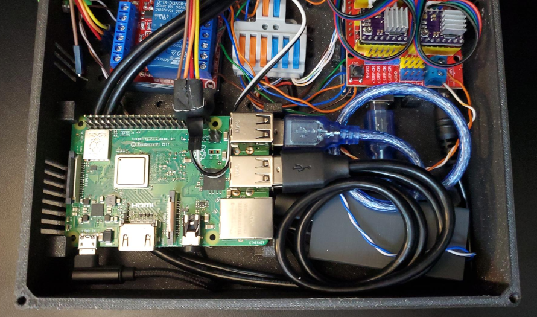
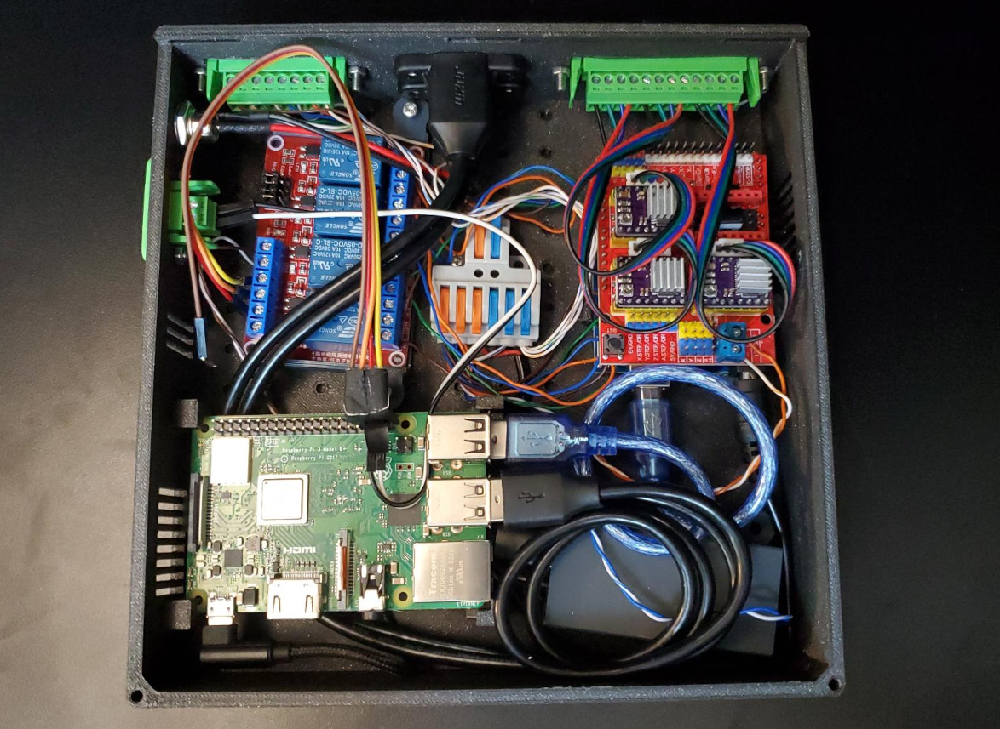

# Control Unit Assembly

We'll start by assembling the brains of the operation, the Control Unit. As the most complex component of the MicroLab, this will take some time and patience.

  
  


To wire things up properly we'll tackle different parts of the Control Unit and then put them all together. We've broken it down by these steps:

* [Setup Control Boards - Raspberry Pi](#raspberry)
* [Setup Control Boards - Arduino](#arduino)
* [Assembling the 12V Circuit](#12V)
   * [Relay Board Wiring](#12vrelay)
   * [Arduino Shield Wiring](#12vshield)
   * [12V to 5V converter Wiring](#12vconvert)
* [Wiring 5V and Signals on the Relay Board](#5vrelay)
* [Mounting Components in the Case](#case)
* [Installing the Components in the Control Unit Case](#installcase)
   * [12V to 5V Converter](#installcon)
   * [Arduino](#installard)
   * [12V Wire Connector](#installwire)
   * [Raspberry Pi](#installpi)
* [Final Assembly](#final)
* [Making MicroLab Cables](#cables)

## Skills Needed

<a name="skills"></a>

* Wire stripping - one example [video](https://www.youtube.com/watch?v=N__OLJvq2HE)
* Reading pinout diagrams
* Torrenting software

## Tools Needed

* Wire cutters/stripper (CU-WCS)
* Computer with an SD reader. You may need an SD card to USB converter
* Small phillips head screwdriver for M3 screws, one came in kit on the parts list
* Flush cutters (CU-FCT)
* Needle nose pilers (CU-NNP)

## Parts Needed

**Purchased parts info.** For more information on purchased parts, check the [MicroLab Parts List](microlab-parts-list.xslx).

**Printer parts info.** Parts listed as printed, like "CU-CB Control Case (Printed)", are 3D printed, check the [3D Printed Parts section ](docs/index.md#3d) of the "How to build the MicroLab" page.

| Section | Part ID      | Part Name     | Count | Notes |
|--- | ------------- | ------------- |------| ----|
Control Unit (CU)|	CU-RPI|	1|	Raspberry Pi 3 Model B Board
Control Unit (CU)|	CU-SCR|	1|	Touchscreen for Raspberry Pi
Control Unit (CU)|	CU-SD32|1|	Micro SD card, 32GB
Control Unit (CU)|	CU-UPC|	1|	 Micro USB Cable, right angle
Control Unit (CU)|	CU-UNO|	1|	Arduino UNO
Control Unit (CU)|	CU-CNC|	1|	Arduino CNC shield
Control Unit (CU)|	CU-SMD|	3|	Stepper Motor Drivers [For CU-CNC]
Control Unit (CU)|	CU-A2B|	1|	USB A/B cable for Raspberry Pi to Arduino
Control Unit (CU)|	CU-RLY|	1|	4-Channel Relay Board
Control Unit (CU)|	CU-WCL|	1|	Wire Connector (lever), 2-in-6-out
Control Unit (CU)|	CU-JMP|	5|	Breadboard Jumper Wires, male-female
Control Unit (CU)|	CU-RLY|	1|	4 Channel Relay Board, 5V
Control Unit (CU)|	CU-POW|	1|	Power Supply, 12V 5A
Control Unit (CU)|	CU-CBC|	1|	Control Case (Printed)
Control Unit (CU)|	CU-CBL|	1|	Control Lid (Printed)
Control Unit (CU)|	CU-CCP|	1|	Converter case (Printed)
Control Unit (CU)|	CU-RCP|	1|	Relay case (Printed)
Control Unit (CU)|	CU-PLG|	2|	Barrel plug connectors, 5.5mm x 2.1mm
Control Unit (CU)|	CU-USB|	2|	Mountable USB cables
Control Unit (CU)|	CU-USB|	2|	Mountable USB cables
Control Unit (CU)|	CU-SDC|	1|	12V to 5V Converter, stepdown
Control Unit (CU)|	CU-UTS|	1|	USB to Screw Terminal adapter
Control Unit (CU)|	CU-RAH| 1|	Right angle header row
Control Unit (CU)|	CU-WCS|	1|	Wire Cutter and Stripper
Control Unit (CU)|	CU-FCT|	1|	Flush cutters
Control Unit (CU)|	CU-NNP|	1|	Needle-nose pilers
Shared Parts|	SP-CAB|	15ft roll|	4-wire cable, 18 gauge
Shared Parts|	SP-RBW|	40ft roll|	2-wire cable, red and Black , 18 gauge
Shared Parts|	SP-SWW|	15ft roll|	Split Wire Wrap
Shared Parts|	SP-PC12|	2|	12-pin connector, panel-mount screw terminal
Shared Parts|	SP-PC8|	2|	8-pin connector, panel-mount screw terminal
Shared Parts|	SP-PC2|	1|	2-pin connector, panel-mount screw terminal
Shared Parts|	SP-M3S-12|	23|	12mm M3 screws with nuts
Shared Parts|	SP-M3S-16|	28|	16mm M3 screws with nuts
Shared Parts|	SP-M3S-20|	5	|20mm M3 screws with nuts
Shared Parts|	SP-M3S-30|	5	|30mm M3 screws with nuts
Shared Parts|	SP-SMC|	6|	Stepper motor cables
Shared Parts|	SP-ETN|	1 roll|	Electrical tape, narrow

#### **Prepare Wires**

- The Stepper Motor cables (SP-SMC) should have come with the three peristaltic pumps with stepper motors. Take the 3 cables and cut them in half with the wire cuters.
- Strip both ends on each of the wires (see [Skills Needed](#skills)) for help with stripping wires). Expect to remove 1/4" or more of the insulation. If the lever connector or screw terminal closes on the insulation the electricity won't pass through.
- You should now have 6 cables, three to connect the Arduino to the 12-pin connector in the Control Unit and three to connect the pumps to the 12-pin unit in the Pumps box.


## Control Boards Setup
The Raspberry Pi, a single board computer, and the Arduino, single board microcontroller, are the control boards of the MicroLab.  

The Raspberry Pi runs the show using the MicroLab software and coordinating turning on/off all the different components. The Arduino controls the stepper motors of the peristaltic pumps and gets its instructions from the Raspberry Pi.

### Raspberry Pi Setup
<a name="raspberry"></a>

#### Installing the MicroLab software on the Pi
The Raspberry Pi runs its software from the SD card. In this section we will have you install the custom MicroLab disk image which has the Raspberry Pi operating system, the MicroLab software and the touchscreen drivers bundled together.

1. **Install Raspberry Pi Imager.** [Follow the Raspberry Pi website instructions](https://www.raspberrypi.com/documentation/computers/getting-started.html#install-using-imager) to install the Raspberry Pi Imager software onto a computer.
1. **Download the MicroLab production disk image.** Check [our website](https://fourthievesvinegar.org/microlab/) for a link to torrent or download the MicroLab disk image to the computer. Please be sure to [torrent safely](https://www.tomsguide.com/features/how-to-torrent-safely-five-ways-to-reduce-the-risk-of-sharing-p2p).
   * **NOTE:** If you have a different touchscreen display, you will need to use the development image, then download and install the appropriate drivers.
1. **Connect the MicroSD card to your computer.**
1. **Install the MicroLab disk image onto the SD card** [following the Raspberry Pi website instructions](https://www.raspberrypi.com/documentation/computers/getting-started.html#install-using-imager).
   * Be sure to "Use Custom" for the OS and then select the MicroLab disk image.
1. **Verify the disk.** The imager program will run a verification check to make sure the OS was installed correctly. This will take several minutes.
1. **Install the SD card.** Once complete, remove the SD card from your computer, and insert into your Raspberry Pi.
 * **Note:** The SD card extends beyond the edge of the Pi's circuit board.

#### Installing the touchscreen

1. Line the touchscreen up with the Raspberry Pi's board. Position the screen's female headers over the Raspberry Pi's header pins (pins 1-26, see picture) and then push down gently until the screen is completely connected to the board.


**NOTE:** We will need to remove the touchscreen to put the GPIO pins in place later in the instructions.

### Arduino Setup
<a name="arduino"></a>

In this section to set up the Arduino board we will:
* Install software that controls the CNC shield
* Attach the CNC shield
* Install the stepper motor driver modules on the shield

Detailed pin diagram here [https://blog.protoneer.co.nz/arduino-cnc-shield-v3-00-assembly-guide/](https://blog.protoneer.co.nz/arduino-cnc-shield-v3-00-assembly-guide/)

**Critical Safety Note:** ALWAYS disconnect the power before connecting or disconnecting the stepper motors from the CNC shield. Failure to do so can hurt both you and the component.

1. **Installing the CNC shield controller software.** The Arduino Uno board requires the [GRBL](https://github.com/gnea/grbl/) software to control the CNC shield. Execute the following script with root permissions from the Raspberry Pi to download and flash the GRBL:
    ```shell
    sudo /home/thief/solderless-microlab/scripts/flash-grbl-arduino.sh
    ``` 
    NOTE: you can access detailed how-to instructions [here](https://github.com/gnea/grbl/wiki/Compiling-Grbl) to compile and flash ```grbl``` to the arduino manually.

1. **Watch the installation video** This external video shows the assembly of the CNC shield and stepper motor driver boards. [YouTube Video link](https://youtu.be/zUb8tiFCwmk?t=37)  
    NOTE: We use 3 motor driver modules (the X, Y and Z) while the video shows 4 being installed.


1. **Install the CNC shield.** Place CNC shield on the Arduino, push the CNC pins into the header sockets on the Arduino until it is fully connected.


1. **Add Heatsinks to Stepper Motor Driver Modules.** Each Stepper Motor Driver module comes with a small heatsink. Peel the adhesive and attach a heatsink to the square black chip on the top of each Stepper Motor Driver module.


1. **Add the Stepper Motor Driver Modules.** Orient and insert the stepper motors driver boards into the X, Y, and Z slots on the shield.


1. OPTIONAL: **Set Enable Pin to Ground.** Place a female-female jumper on the Enable and Ground pins to enable the board.

1. **Add Stepper Motor Cables.** The stepper motors cables have a female connector on one end and bare wire on the other. Connect a female connector to the X header, Y header, and Z header on the CNC shield.


## Assembling the 12V Circuit
<a name="12V"></a>
Time for wiring! This step is where the bulk of the assembling happens for the Control Unit.


The majority of the wires in the Control Unit can be grouped as:
* 12V Power
* 5V Power
* Signals

The 12V circuit is where all the necessary wires are connected so electricity can get from the 12V power supply into the Control Unit and then be sent out at the right time to the 12V components in the MicroLab, specifically:
 * Through the 4-channel relay board to the
    * Heating pump (circulating pump)
    * Cooling pump (circulating pump)
    * Stir rod
    * Accessory port
 * Through the Ardunio shield to the peristaltic pumps
 * To the 12V to 5V converter to provide 5V power


### Relay Board Wiring
<a name="relay"></a>
In order to send 12V out to components: the 4-channel relay board, the 8-pin connector and the 12V wire connector all connect to each other.


#### **Wire Order**
<a name="wireorder"></a>
Please read and get comfortable with the wiring order explained on the [MicroLab Wiring](/docs/wiring.md) page. It's important to maintain the same wiring order throughout the project.

**8-pin connector - internal**
The 8-pin connector passes 12V along to the Accessory port (Acc), Stir rod (Stir), Cooling pump (Cool), and Heating pump (Heat) wires.

From inside the case the 8pin connector wiring order will look like this:


#### **Parts**

| Part ID | Part Name  | Count | Notes |
|--- | ------------- | ------------- |------|
|||
SP-PC8|8-pin connector |2
CU-RLY|4 Channel Relay Board|1
CU-WCL|Wire Connector  | 1| Called 12V Wire Connector
CU-JMP|Breadboard Jumper Wires - male-female|5
SP-CAB|4-wire cable |15ft roll| Used to make short wires
SP-RBW|2-wire cable, red and black, 18 gauge |40ft roll| Used to make short wires


#### **Prepare Wires**

- Take the 4-wire cable (SP-CAB) and cut one 4" section and one 6" section.
   - Take the 4" section and separate all four colors (red, blue, green, black)
- Take the 2-wire cable (SP-RBW) and cut one 4" section and four 6" sections
   - Take the 6" sections and separate the red and black wires
- Strip both ends on each of the wires (see [Skills Needed](#raspberry) for help with stripping wires). Expect to remove 1/4" or more of the insulation. If the lever connector or screw terminal closes on the insulation the electricity won't pass through.

You should now have:
- 4" Wires
    - 1 green wire (for 8-pin)
    - 1 blue wire (for 8-pin)
    - 4 black wires (for 8-pin)
    - 4 red wires (for 8-pin)
- 6" wires
    - 4 red wires (for Relay board to the 12V wire connector)
    - 4 black wires (for 8-pin connector to the 12V wire connector)


#### **Wiring the 8-pin connector**
We will attach the positive wires (color coded) and negative wires to the 8-pin connector socket (SP-PC8) first.
* The connectors have 3 pieces: socket, mount plate and plug.


  - **Wiring the Positives.** Take one of the 8-pin connector sockets and from the back use a small screwdriver to loosen the 8 screw terminals. Working left to right, insert the 4" black, green, red, blue wires into the correct positive (+) terminals and tighten the terminals. Use the photo below or the [wiring order](/docs/wiring.md) page to confirm placement.
    - Don't overtighten the screw terminal. Once done you should be able to lightly tug on the wires without them moving.  

- **Wiring the Negatives.** Next on the 8-pin socket, insert the 6" black cables into the negative (+) terminals and tighten the terminals.
  
- **Connecting the negative wires.** Take the 12V Wire Connector, open the first two lever slots on the negative side of the connector (shown as the right side with blue levers in our picture). Take the 8-pin negative wires, put two wires in each slot and close the slots.

  


#### **Wiring the 4-channel Relay Board**

A relay is electronic on/off switch for the pumps etc. Each of the four relays on the 4-channel Relay Board has three screw terminals.


For this project we will only use two of the terminals with each relay, the NO and the COM. The Normally Open (NO) means it keeps that part of the circuit open by default and no power flows. When the relay is activated, it physically connects the NO terminal to the Common (COM) terminal completing the circuit and then the power flows.


- **Wiring the NOs**
    - Take the 8-pin socket and insert the end of each of the 4" positive wires into the numbered NO terminals (NO1, NO2 etc) on the Relay Board. Tighten the terminals.
       - Black - NO4
       - Green - NO3
       - Red - NO2
       - Blue - NO1


- **Wiring the COMs**
   - Take the 4 red wires, insert one wire into each of the terminals labeled "COM" (common) tighten the terminals.

- **Connecting the Relay Board to the 12V Wire Connector**
 - Take the 12V wire connector, open the first two lever slots on the positive side of the connector (shown as the left side with red levers in our picture). Take the other end of the relay board's red COM wires, put two wires in each slot and close the slots.


###  Arduino Shield wiring

<a name="12vshield"></a>
In order to send 12V out to the peristaltic pumps, the Arduino CNC shield needs to be connected to the 12V Wiring Connector and the 12-pin connector.


#### Wire Order

<a name="wireorder"></a>
Please read and get comfortable with the wiring order explained on the [MicroLab Wiring](/docs/wiring.md) page. It's important to maintain the same wiring order throughout the project.

**12-pin connector - internal**.
The 12-pin connector passes 12V to the three peristaltic pumps. When looking at the pumps mounted to their box from left to right we'll call them X, Y and Z.

From inside the case the 12-pin connector wiring order will look like this:


#### Assembling the 12-pin Connector


**Parts**

| Part ID      | Part Name     | Count | Notes |
| ------------- | ------------- |------| ----|
|SP-PC12|12-pin connector|1|
|SP-SMC|Stepper motor cables|6|

- Assembled Ardunio with the 4-wire stepper motor cables that were connected in the [Arduino Setup](#arduino) section.

**Assembly**

- Use a small screwdriver to open the screw terminals on the 12-pin connector.
- The stepper motor cables have a connector on one end and stripped wire on the other end. The wires need to be attached in order. Starting from the left take the Z wires and attach them in order:
  * Black  
  * Green
  * Blue
  * Red
- Next attach the Y and then X wires using the same order.


#### Wiring the 12V power on the CNC Shield

With CNC shield wired for the stepper motors, we will now wire it for the 12V power needed to drive those motors.


**Parts**

| Part ID      | Part Name     | Count | Notes |
| ------------- | ------------- |------| ----|
|CU-WCL|Wire Connector (lever), 2-in-6-out|1| 12V Wire Connector
|SP-RBW|2-wire cable, red and black, 18 gauge |40ft roll| Used to make short wires

- Assembled Ardunio with the 4-wire stepper motor cables that were connected tin the [Arduino Setup](#arduino) section.

**Prepare Wires**

- Take the 2-wire cable (SP-RBW) and cut one 6" section
- Take the 6" section and separate the red and black wires
- Strip both ends on each of the wires (see [Skills Needed](#raspberry) for help with stripping wires).
    - Expect to remove 1/4" or more of the insulation. If the lever connector or screw terminal closes on the insulation the electricity won't pass through.

**Assembly**

- Wiring the Arduino's CNC Shield
    - Use a small screwdriver to open the screw terminals on CNC shield.
    - Insert the red wire into the positive (+) terminal on the CVC shield and tighten the terminal.
    - Insert the black wire into the negative (-) terminal on the CVC shield and tighten the terminal.
- Wiring the 12V Wire Connector (CU-WCL)
   - On the 12V Wire Connector there should be an empty slot on the positive (red) side. Open that lever, add the red wire and then close the lever.
   - On the 12V Wire Connector there should be an empty slot on the negative (black) side. Open that lever, add the black wire and then close the lever.


Take a moment to review and appreciate your work. This is the most fiddly part of the assembly. Nice job! 🎉

### Wiring the 12V to 5V Converter

<a name="12vconvert"></a>

The 12V Wire Connector passes the 12V power to the converter which, as the name says, will covert it into 5V power. The Converter sends the 5V power to the Raspberry Pi and 4-channel Relay Board as their power supplies.


#### Parts

| Part ID      | Part Name     | Count | Notes |
| ------------- | ------------- |------| ----|
|CU-PLG|Barrel plug connectors|1| Male connector
|CU-WCL|Wire Connector (lever), 2-in-6-out|1| 12V Wire Connector
|CU-SDC|12V to 5V Converter |1 |


#### Assembly

- Take the 12V Wire Connector, locate the empty slot on the positive (red) side. Open the lever, insert the red wire and then close the lever.
- On the 12V Wire Connector locate the empty slot on the negative (black) side. Open that lever, insert the black wire and then close the lever.
- Plug the male barrel plug connector into the 12V to 5V converter module.


## Wiring 5V and Signals on the Relay Board

<a name="5vrelay"></a>

The rest of the wiring runs some combination of lower voltage power, signals and data between components.

The Raspberry Pi, 4-Channel Relay Board and the Arduino all run using 5V power. The 12V to 5V Converter supplies that power to the Raspberry Pi and 4-Channel Relay Board so they can work.

The Raspberry Pi sends 5V power (and data) out to the Ardunio and the 2 mounted USB ports through USB cables.  



#### Relay Board Layout

We've already wired the 4 relays on the "12V side" of the 4-Channel Relay Board. Now we are going to wire the other half of the board, you will see a small terminal block with 6 screw terminals.


These six terminals are:
  - **(DC+) terminal**: 5V power positive (+) to run Relay Board
  - **(DC-) terminal**: 5V power negative (-) to run Relay Board
  - **(IN1) terminal**: Signals Relay Board to turn on/off Relay 1 (Blue/Heat)
  - **(IN2) terminal**: Signals Relay Board to turn on/off Relay 2 (Red/Cool)
  - **(IN3) terminal**: Signals Relay Board to turn on/off Relay 3 (Green/Stir)
  - **(IN4) terminal**: Signals Relay Board to turn on/off Relay 4 (Black/Accessory)


**Parts**

| Part ID      | Part Name     | Count | Notes |
| ------------- | ------------- |------| ----|
|CU-CNC|12V to 5V Converter |1
|CU-WCL|Wire Connector (lever), 2-in-6-out|1
|SP-RBW|2-wire cable, red and black, 18 gauge |40ft roll| Used to make short wires | 1
|CU-RAH| Right angle header row
CU-JMP|Breadboard Jumper Wires - male-female|4| For consistency we used black, green, red, and blue
|SP-ETN|Electrical tape, narrow|1 roll
|CU-RCP|Relay case|1


**Prepare Wires**

  - Take the 2-wire cable (SP-RBW) and cut one 6" section
    - Take the 6" section and separate the red and black wires
    - Strip both ends on each of the wires (see [Skills Needed](#raspberry) for help with stripping wires).
  - Prep the headers. Take the right angle header row and use the wire cutters to cut four 1-pin pieces.
     - If not using the 90 degree header pins, then use needle nose pilers to gently bend each of the male headers on the Jumper wires to a 90 degree angle.


**Assembly**

- **Adding wires.** Use a small screwdriver to open the 6 screw terminals on Relay Board. Then insert the appropriate wire to the terminal and then tighten the screw terminal.
  - **(DC+) terminal**: attach the 6" red wire
  - **(DC-) terminal**: attach the 6" black wire
  - **(IN1) terminal**: attach the right-angle header pin and then plug in the male end of the blue (Heat) jumper wire
  - **(IN2) terminal**: attach the right-angle header pin and then plug in the male end of the red (Cool) jumper wire
  - **(IN3) terminal**: attach the right-angle header pin and then plug in the green (Stir) jumper wire
  - **(IN4) terminal**: attach the right-angle header pin and then plug in the black (Accessory) jumper wire
  

- **Relay Board cleanup.** To conserve space and prevent short circuits, we recommend using flush cutters to trim pins sticking out on the underside of the board. Then use electrical tape to cover the bottom of the board.
- **Relay Board Case**. The prepped Relay Board should fit in the Relay Board Case
   - For more information about the 3D printed parts check the [How to build & use the MicroLab and MicroLab Suite](docs/index.md) page.
- **Cable Management.** Gently bend all wires on both sides of the relay up and wrap them with narrow strips of electrical tape.
 - Tape prevents shorts and helps keep the wires from being damaged as you arrange components in the case.


Now we will mount the connectors to the Control Unit Case.


## Mounting Components in the Case
<a name="case"></a>

To connect the Control Unit to the outside world we will mount the connectors to the case:

* 12-pin connector (out to peristaltic pumps)
* 8-pin connector (out to circulating pumps, stir rod, and accessory port)
* 2-pin connector (out to heating coil)
* USB ports (2) (out to thermistor)
* Barrel port (12V in)

#### **Parts**

|Part ID      | Part Name     | Count | Notes |
| ------------- | ------------- |------| ----|
|CU-CBC|Control Case (Printed)|1
|CU-WCL|Wire Connector (lever), 2-in-6-out|1
SP-PC12| 12-pin connector|1| Mount plate
SP-PC8|	8-pin connector| 1 | Mount plate
SP-PC2|	2-pin connector|1 | Mount plate
CU-PLG|	Barrel plug connectors | Female barrel plug connector
CU-USB|	Mountable USB cables|2 |
SP-QDC|	Quick-disconnect connectors|2 |
SP-M3S-16|16 mm M3 screws with nuts| 6 |

- 12V Circuit
  - 4-channel relay, wired to the 8-pin socket
  - Arduino w/ CNC shield, wired to the 12-pin socket
  - 12V Wired Connector
  - 12V to 5V Converter


### **Place the 12V Circuit**

- Orient the case so the 8-pin and 12-pin openings are at top when looking down at the case.
- Across the top half of the case gently place from the left (see picture):
   - 4-channel Relay Board
   - 12V Wired Connector
   - Arduino w/ CNC shield
- In the bottom right of the case, place the 12V to 5V Converter.


### Installing the 12/8/2-pin connectors


- **Install the 12-pin mount plate.** Orient the mount plate and use 2 M3 screws to install it on the outside of the case.
- **Connect the 12-pin socket** Take the 12-pin socket attached to the Arduino and connect it to the back of the 12-pin mounting plate.
- **Install the 8-pin mount plate.** Orient the mount plate and use 2 M3 screws to install it on the outside of the case.
- **Connect the 8-pin socket** Take the 8-pin socket attached to the Relay Board and connect it to the back of the 8-pin mounting plate.
- **Install the 2-pin assembly.** Orient the mount plate and use 2 M3 screws to install it on the outside of the case (left-side). We won't connect the 2-pin socket in this step.


### Installing the Ports

**Install the Barrel Port.** Insert the female barrel plug connector in the circular hole on the left side of the case and attach with the matching nut.

**Install the USB Ports.** Mount the USB ports to the case. The USB case holes are between the 8-pin and 12-pin connectors. They should have come with their own screws. We recommend installing them with the plastic rectangle at the top, but feel free to be a chaos muppet about it if that's your jam.

## Installing the Components in the Control Unit Case
<a name="installcase"></a>

Now we can connect some last wires and install all the components in the case:

* 4-channel Relay Board
* Arduino w/ CNC shield
* 12V Wire Connector
* Raspberry Pi w/ touchscreen





#### **Parts**

- Case w/ connectors installed
- 12V Circuit
  - 4-channel relay, wired to the 8-pin socket
  - Arduino w/ CNC shield, wired to the 12-pin socket
  - 12V Wired Connector
  - 12V to 5V Converter
- Converter case
- Barrel plug connector
- 20 mm M3 screws with nuts (2)
- Micro USB Cable, right angle, Power cable for Raspberry Pi
- USB A/B cable for Raspberry Pi to Arduino


### Installing the 12V to 5V Converter
<a name="installcon"></a>

**Parts:**

- 12V to 5V Converter
- Converter case
- Micro USB cable for Raspberry Pi
- 4-channel Relay Board


**Assembly**
- **Place Converter in its converter case.** Orient the 12Vto 5V converter and slide it into the Converter Case (shows as orange case in picture).
- **Add Power for the Raspberry Pi.** Plug the USB cable for the Raspberry Pi into the USB port on the converter.
- **Add Power for the Relay Board.** Insert the DC+ red wire and DC- black wire into the screw terminal on the Relay Board.
- **Install Converter in Control Unit Case.** Position the Converter in the lower right corner of the flat case. The circular mounting tab on the Converter case should line up with a hole in floor of the Control Unit case. Use an M3 screw to secure the Converter case to the floor.


### Installing the 4-channel Relay Board

**Parts:**

- 4-channel Relay Board
- Relay Board case (3D printed)
- 12mm M3 screws (1)


<BR>
<BR>

- **Install Relay Board in Control Unit Case.** Position the Relay Board in the upper left corner of the flat case. The circular mounting tab on the Relay Board case should line up with a hole in the floor of the Control Unit case. Use an M3 screw to secure the Relay Board case to the floor.
- **Cable Management** You may need to unplug the cable from the converter. From the Relay Board run the cable to the bottom of the case and then run it to the right to tuck the cable into the case.


### Installing the Arduino
<a name="installard"></a>

#### **Parts**

- Arduino w/ CNC shield
- USB A-to-B cable

#### **Assembly** 

- **Install Arduino in Control Unit Case.** Insert the Arduino w/ CNC shield into its spot in the upper right of the case with its USB port facing the center. It should slot into the supports snugly when pushed toward the right side of the case.
- **Add power cable for the Arduino.** Plug the USB B side of the A-B cable into the USB port on the Arduino
- **Check your work** Verify the red and black wires are secured to the (+) and (-) terminals on the Arduino shield.


### Installing the 12V Wire Connector
<a name="installwire"></a>

- Female barrel plug connector, attached to case
- 12V Wire Connector
- 12mm M3 screws (2)


### **Assembly**

**Add "12V power in" wires to the Wire Connector.** Take the two wires on the installed female barrel plug connector and connect the red wire (positive) to the red (positive) slot on the 2-in side of the Wire Connector. Take the black wire (negative) and insert it to the blue (negative) slot on the 2-in side of the Wire Connector.   

**Install 12V Wire Connector in Case.** Position the 12V Wire Connector in the case and use 2two 12mm M3 screws to screw the connector to the floor of the case.


<BR><BR>


### Installing the Raspberry Pi
<a name="installpi"></a>   

- Raspberry Pi
- Mounted USB Cables
- Micro A/B USB cable attached to the Arduino


### **Assembly**

#### Attach USB Cables and Install in Case
- Plug the Arduino's USB cable into the Raspberry Pi.
- Plug the USB cables into the Raspberry Pi.
- Remove the touchscreen and set aside.
- Insert the Raspberry Pi into its case supports, starting with the left side of the board, and keeping the USB ports toward the center. The supports have catches that should hold the board snugly in place.


#### Connect the Signal wires to the GPIO pins
<a name="GPIO"></a>

The wires we attach to the header GPIO pins let the Raspberry Pi control the relays on the Relay Board as well as the heater coil.


**Tools:**

- Wire cutters
- 4-channel Relay Board

**Parts:**

- Raspberry Pi with touchscreen off
- 4-channel Relay Board
- 2-pin connector, wired
- Right angle header row, female-male


**Assembly:**

- **Add headers to the Raspberry Pi.** Take the right angle header row and use the wire cutters to cut two 4-pin pieces. Place them at the end of the pin block, push one on to the 34, 36, 38, 40 pins and the other on the 33, 35, 37, 39 pins.
- **Connecting the Relay Board Wires**
  - Take the IN1 Blue (Heat) wire and attach the female header to Pin 38 (GPIO 20)
  - IN2 Red (Cool) and attach the female header to Pin 40 (GPIO 21)
  - IN3 Green (Stir) and attach the female header to Pin 36 (GPIO 16)
  - IN 4 Black (Accessory) and attach the female header to Pin 33 (GPIO 13) <BR>
  
- **Connecting the Heater Coil Wired**
  - Take the 2-pin connector and attach wire ends
    - Black wire female header to Pin 34 (Ground)
    - Red wire female header to Pin 37 (GPIO 26)
- **Cable Management**
   * Tape the GPIO pins together to secure them. See picture.
   * Carefully tuck the wires into the case so that they will not obstruct the lid.

 <BR><BR>

- **Attach touchscreen.** Attach the touchscreen to the Raspberry Pi.


## Final Assembly
<a name="final"></a>

Before you close the case, you probably want to test that everything is wired correctly. We **highly** recommend testing all the functionality of the MicroLab using the Test Recipe. Of course, if something doesn't work right or stops working in the future, you can always open it back up again.

**Parts:**
- Control Unit lid
- 2 M3 screws, 16mm

**Assembly:**

- Place the lid on top of the Control Unit case, slightly overhanging the front.
- Slide the lid toward the back so that the tabs on the lid fit into the slots on the case.
- Align the screw holes on each and secure the lid in place using the 16mm screws.


🥳 YAY! ✨🦄✨ You did it! 💖


## One Last Thing: Making MicroLab Cables
<a name="cables"></a>

To connect your newly assembled Control Unit to the Pumps Unit, you will use a pair of cables: 8-wire and 12-wire. Savvy readers will notice that this corresponds with the 8-pin and 12-pin connectors.

#### **Wire Order** <a name="wireorder"></a>

**Important Note: The wire order here is different than in other sections.**

Please read and get comfortable with the wiring order explained on the [MicroLab Wiring](/docs/wiring.md) page. It's important to maintain the same wiring order throughout the project.

**8-pin cable**.


**12-pin cable**.
From left to right, repeat this wire order 3 times:
* Blue
* Red
* Green
* Black

Note: This assumes you used the 4-wire cable recommended in the parts list. If you brought your own or are using ethernet cables, just make sure that the wiring is consistent on either end.


#### **Parts**

- 4-wire cable, into 5 ~2.5-foot lengths
- 8-pin connectors, plug (2)
- 12-pin connectors, plug (2)
- Split wire wraps (slightly shorter than the cables)


**Prepare Wires**

- Take the 4-wire cable and cut into five 2.5 foot sections
- Take the 2.5 foot sections and strip the wires on both ends  (see [Skills Needed](#raspberry) for help with stripping wires).


**Assembly:**

**Important Note: The wire order here is different than in other sections, be sure you have the correct order.**


**Making the 8-pin cable**
 * Take one of the 8-pin connector plugs and two of the 2.5 foot sections.
 * From the back of the plug, attach the wires in order. For the plug side of the connector, you use the small orange push buttons to open the terminal, insert the wire and then release the button to close the terminal.
 * Take the second 8-pin connector plug and connect the wires. Be sure that the wire order is consistent at both ends of the cable.
 * Wrap the assembled 8-pin cable in the wire wrap

**Making the 12-pin cable**
* Take one of the 12-pin connector plugs and two of the 2.5 foot sections.
* From the back of the plug, attach the wires in order. For the plug side of the connector, you use the small orange push buttons to open the terminal, insert the wire and then release the button to close the terminal.
* Take the second 8-pin connector plug and connect the wires. Be sure that the wire order is consistent at both ends of the cable.
* Wrap the assembled 8-pin cable in the wire wrap


## Wrapping up

This concludes the assembly instructions for the Control Unit. Next up: [Building the Heating and Cooling Units](/docs/assembly-temperature-exchangers-unit.md)
