# MicroLab Reactor Unit Assembly

The Reactor Unit is where the action happens, it is made up of the pumps, pump case, reactor core and reactor unit stand.

* [Assembling the Pumps Box](#pumps)
* [Assembling the Reactor Core](#core)
* [Assembling the Reactor Unit](#unit)

## Skills Needed
* Wire stripping - one example [video](https://www.youtube.com/watch?v=N__OLJvq2HE)

## Parts

**Purchased parts info.** For more information on purchased parts, check the [MicroLab Parts List](microlab-parts-list.xslx).

**Printer parts info.** Parts listed as printed, like "CU-CB Control Case (Printed)", are 3D printed, check the [3D Printed Parts section ](docs/index.md#3d) of the "How to build the MicroLab" page.

| Part ID      | Part Name     | Count | Notes |
| ------------- | ------------- |------| ----|  
|||
RU-SRM|	Stir rod motor|	1
RU-STR|	Stir rod |	1
RU-SRC|	Stir rod coupling|
RU-RED|	Reducing fitting|
RU-LID|	Reactor manifold core and lid (Printed)|	1
RU-SRM|	Stir rod mount (Printed)|	1
RU-RJF|	Jar Flanges (Printed)|	2
RU-COR|	6 oz mason jar for core chamber|	1
RU-OUT|	32oz wide mouth mason jar for outer jacket|	1
RU-SDH|	Reactor stand - H  (Printed)|	1
RU-SDH|	Reactor stand - A  (Printed)|	1
RU-SDH|	Reactor stand - ¢  (Printed)|	1
RU-SDH|	Reactor stand - K  (Printed)|	1
RU-TMP|	Thermistor|	1
RU-PPM|	Peristaltic pumps with stepper motors|	3
SP-SMC|	Stepper motor cables | 3 | 6-pin end for motors
RU-SYR|	Syringes|	3
RU-PUB|	Pumps box (Printed)|	1
RU-PUL|	Pumps lid (Printed)|	1
TC-PMP|	Circulating pump| 2
SP-PC12| 12-pin connector, panel-mount screw terminal| 1
SP-PC8|	8-pin connector, panel-mount screw terminal| 1
CU-PLG|	Barrel plug connectors, 5.5mm x 2.1mm| 2 |female

## Assembling the Pumps Box

The Pumps Box has 3 Peristaltic pumps w/ stepper motors on the front that inject reagents into the Reactor Core and the 2 circulating pumps on the sides that move hot and cold fluids to control the Reactor Core's temperature. It also has plugs on the front for the stirring motor and an accessory port that can be used to power accessories like a light.

### Tools required

- Small screwdrivers for M3 screws
- Wire cutters and strippers

### Parts

- 3 Peristaltic pumps w/ stepper motors (RU-PPM)
- 2 Circulating pumps (TC-PMP)
- 12-pin connector
- 8-pin connector
- 2 barrel plug connectors, female (5.5mm x 2.1mm)
- 3 stepper motor cables, the 6 pin end that connects to the stepper motors
- 20 M3 screws, 16mm
- 4 M3 screws, 30mm
- Pumps box
- Pumps lid

### Mounting the Components to the Box

We're going to mount the pumps then install the plugs for the stirring motor and light on the front of the box. After that we will mount the circulating pumps on the sides of the box.

  

**Assembly:**

- Push the female barrel plug connectors into the smaller round holes on the front of the box. Secure them with the nuts that came with the connectors.
- Place each of the peristaltic pumps in large diamond shaped holes and screw each in with four 16mm M3 screws and nuts.
- Place the circulation pumps inside of the box, one on each side on the box. Use the manufacturer-provided mounting hardware and two 16mm M3 screws to secure each pump.

  

### Mounting and Wiring the Back Panel

Next, we'll install the 8-pin and 12-pin connector sockets and wire them to the components in the box.

  
**Assembly:**

- Connect the 12-pin and 8-pin connector sockets with their mounting plates and use 2 M3 screws with each to attach them securely to the lid.
- Cut and strip the wires on the pumps and barrel plug connectors.
- The connectors need to be wired the same as the ones in the Control Unit.
  - [Wire Order in the Control Unit ](https://github.com/FourThievesVinegar/solderless-microlab/blob/master/docs/assembly-control-unit.md#wireorder) as seen from outside the case.  
  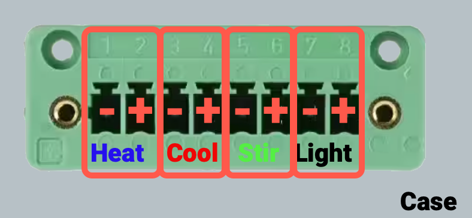
  

### 8-pin wiring

The 8-pin connector is connected to the positive and negative power wires for the accessory port, the stir rod, the cooling unit pump and then heating unit pump.

 - **Find the wires.** We describe the location of components as seen from the back on the box where you currently working.
  - The top barrel connection is for the stir rod
  - The bottom barrel connection is for the accessory port
  - The left pump is for the Cooling Pump Unit
  - The right pump is for the Heating Pump Unit

  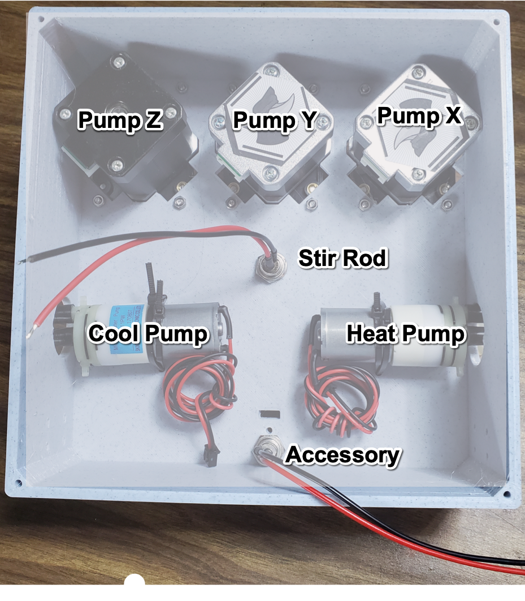

  - **Wire the 8-pin connector.** On the back on the  8-pin connector, from the left, insert and then screw down the power cables:
    - accessory positive (red)
    - accessory negative (black)
    - stir positive (red)
    - stir negative (black)
    - cooling pump positive (red)
    - cooling pump negative (black)
    - heating pump positive (red)
    - heating pump negative (black)

    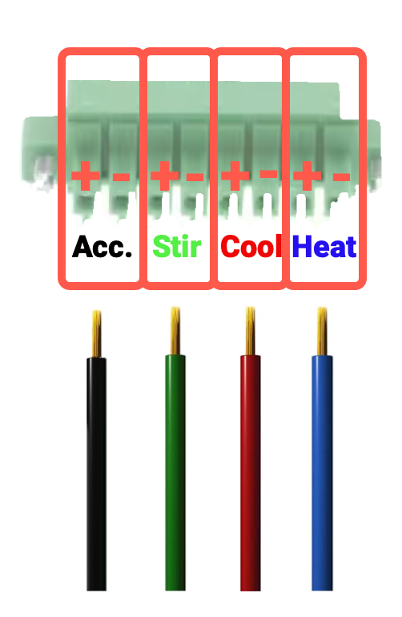

### 12-pin wiring

- **Wire the pumps.** Attach each of the connector ends of the stepper motor cables to one of the peristaltic pumps.
- **Wire the 12-pin connector.** Insert the stripped wire ends of the stepper motor cables into the back 12-pin connector socket. From left to right insert and then screw down the wires for the X and then Y and then Z cables.
  - Wire order. Each of the X, Y, and Z cables has 4 wires. From the left connect the wires in this order:
    - black
    - green
    - blue
    - red

    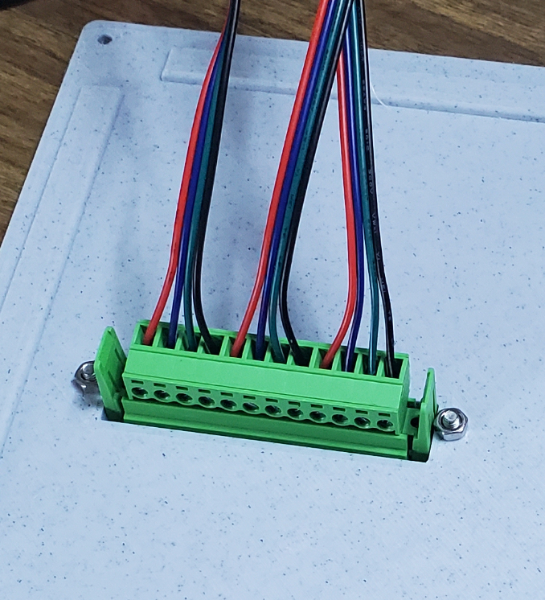

### Closing it up

- NOTE: You may want to test everything before closing the lid.
- Use the four 30mm M3 screws to attach the lid to the box, closing it up.

✨ 💖 ✨

Congratulations! You did it. Hopefully it wasn't too bad!

(Sorry if it was. We're trying to be encouraging here, not snarky.)

## Reactor Core Assembly

### Parts

| Part ID      | Part Name     | Count | Notes |
| ------------- | ------------- |------| ----|  
|||
RU-SRM|	Stir rod motor|	1
RU-STR|	Stir rod | 1
RU-SRC|	Stir rod coupler| 1
RU-RED|	Reducing fitting| 1
RU-COR|	Reactor manifold core (Printed)| 1
RU-LID|	Reactor manifold lid (Printed)| 1
RU-SRM|	Stir rod mount (Printed)|	1
RU-RJF|	Jar Flanges (Printed)|	2
RU-COR|	6 oz regular mouth mason jar for core chamber|	1
RU-OUT|	32oz wide mouth mason jar for outer jacket|	1
RU-SDH|	Reactor stand - H  (Printed)|	1
RU-SDH|	Reactor stand - A  (Printed)|	1
RU-SDH|	Reactor stand - ¢  (Printed)|	1
RU-SDH|	Reactor stand - K  (Printed)|	1
RU-TMP|	Thermistor|	1
RU-SYR|	Syringes|	3
CU-PLG|	Barrel plug connectors, 5.5mm x 2.1mm| 2 |female
SP-M3S-12| 12mm M3 screws with nuts | 3
SP-M3S-20| 20mm M3 screws with nuts | 3
SP-STB|Silicone tubing 7mm OD x 5mm ID|1

### Reactor Core Assembly

The Reactor Core houses the reaction chamber, which is where the SCIENCE happens. We're going to build the manifold, attach the stirring assembly, and put it all inside the mason jars!

#### Assembling the Reactor Core Manifold

First, we need to assemble the manifold lid that holds the jars together and allows tubing into the reaction chamber and temperature control chamber.

  

**Parts:**

* Reactor manifold core (Printed) (RU-COR)
* Reactor manifold lid (Printed) (RU-LID)
* 6 oz regular mouth mason jar for core chamber (RU-COR)
* 12mm M3 screws with nuts (SP-M3S-12)
* 20mm M3 screws with nuts (SP-M3S-20)

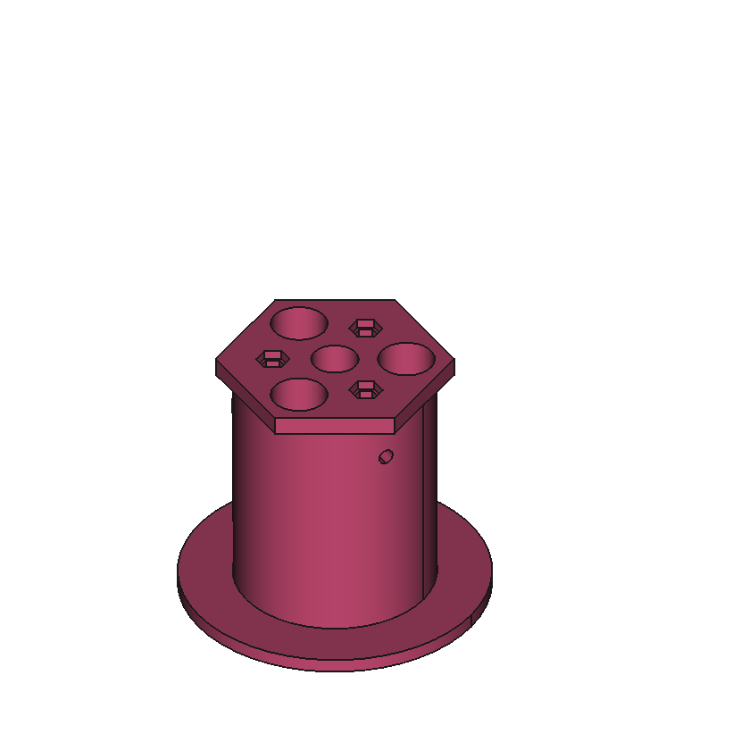

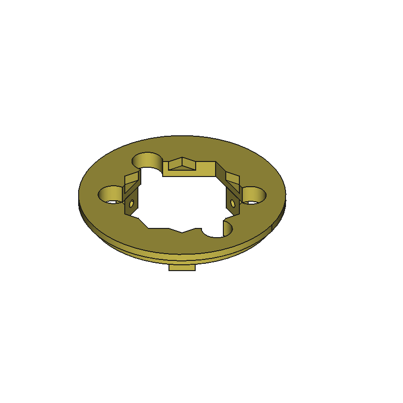

  

**Assembly:**

- Place the jar lid ring over the manifold core.

- Insert the manifold core through the manifold lid, then twist the lid slightly so that the manifold core fits snugly in the manifold lid.
- Check to make sure the holes on the side of the manifold core line up with those on the manifold lid
- The screwholes on sides of the lid and manifold core should be lined up, screw in the three 12mm M3 screws.

  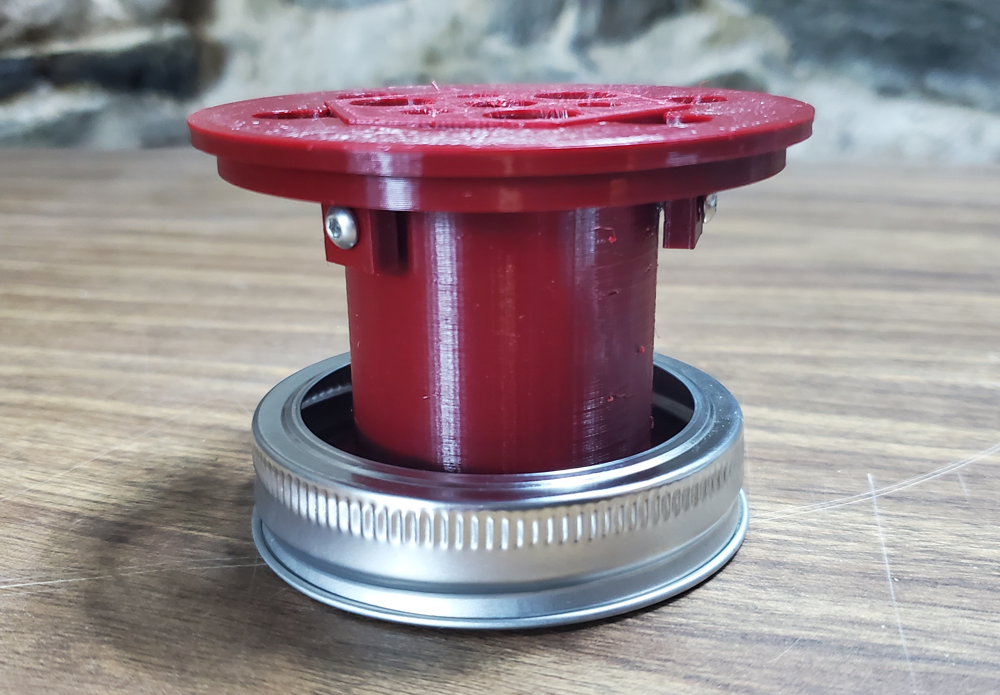

#### Assembling and Attaching the Stirring Motor Mount

Next, we need to attach the stirring motor mount to the top of the manifold, secure the stirring motor in place, and connect the motor shaft to the paddle.

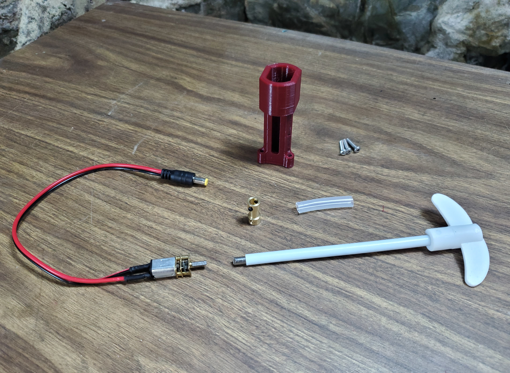
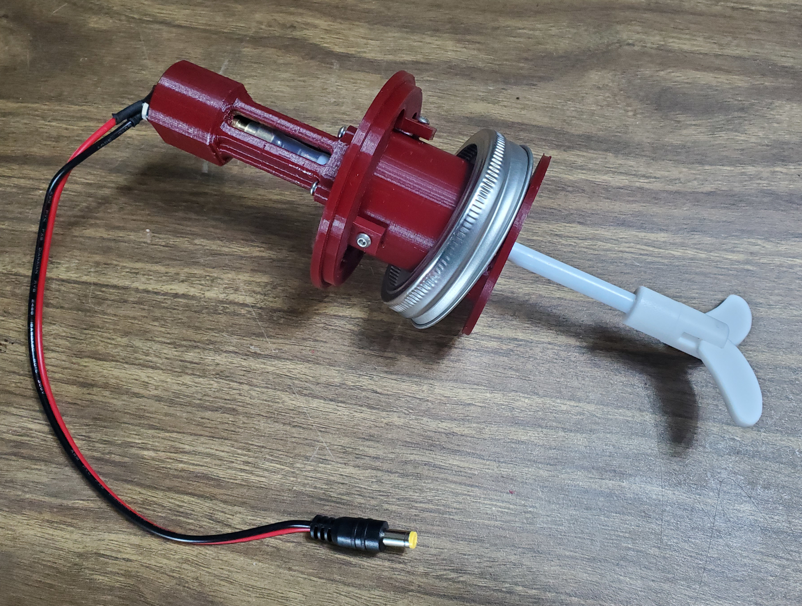

**Parts:**

* Stir rod motor (RU-SRM)
* Stir rod (RU-STR)
* Stir rod coupler (RU-SRC)
* Reducing fitting (RU-RED)
* Stir rod mount (Printed)(RU-SRM)
* Silicone tubing 8mm OD with 1mm wall, 1"
* Possibly necessary: Material such as dense foam to hold it in place.
* 20mm M3 screws with nuts (SP-M3S-20)

**Assembly:**

- **Attach stir rod motor to coupler.** Push one end of the stir rod coupler over the motor's shaft and secure it with one of the M3 screws that came with the coupler.
   - Take care to center it and be aware that the shaft likely has a flat spot that makes it non-symmetrical
   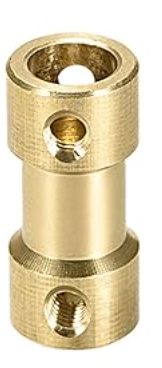
- **Attach tubing.** Push the tubing up over the other end of the shaft coupler, working it up until it is just below the set screws for the other end.
- **Insert coupler into mount.** Insert the coupler into the hole in the top of the stirring motor mount.
- **Insert stir rod into manifold** From the bottom of Reactor Core manifold insert the mixing paddle's shaft through the center.
- **Connect stir rod to mount.** Take the stirring motor mount and insert the stir rod's shaft until it slides into the coupling tubing.
- **Attach the mount to the manifold.** Use the M3 screws to connect the stirring mount to the top of the manifold.

  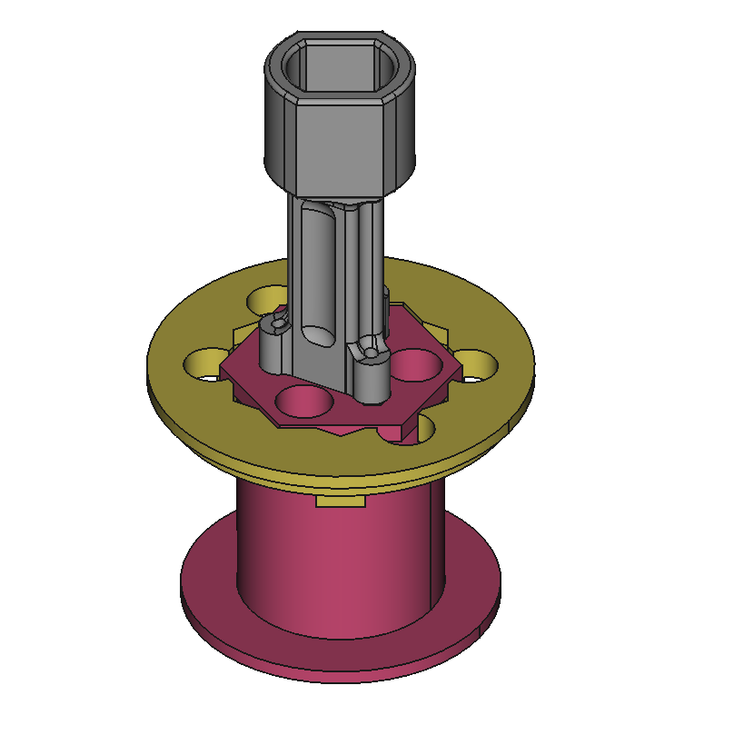
  

### Reactor Unit reaction chamber assembly

Almost there! Now we just have to put it all together!

**Parts:**

- 6oz Mason jar
- 32oz Mason jar and lid ring

**Assembly:**

- Lower the stir rod into the 6oz jar, seating the manifold lid on top of the jar. Screw the lid ring that is attached to the manifold on to the jar
  - If the stir rod shaft is too long, you will need to remove the it from the manifold, cut it shorter using a hacksaw or bolt cutters, and then reattach it.
- Place the 6oz jar inside the larger 32oz jar, slide the 32oz jar lid ring over top the manifold and screw it onto the jar.

TADA! Your Reactor Core is complete!

### Reactor Unit Assembly

These instructions assume you have already assembled the Pumps Box and the Reactor Core.

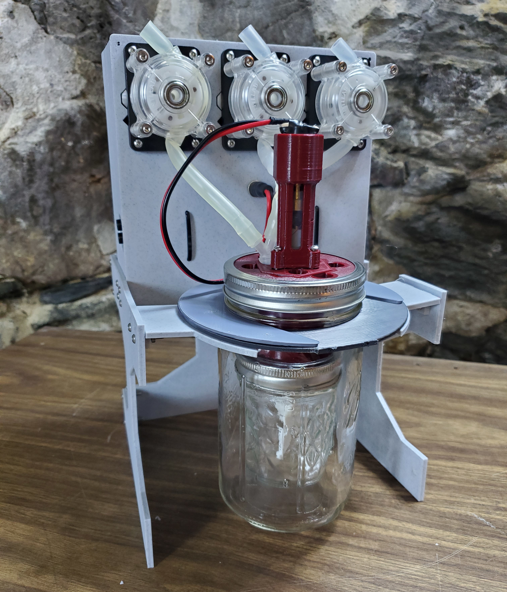

### Assembling the Stand

**Parts:**

* 6 oz mason jar for core chamber| (RU-COR)
* 32oz wide mouth mason jar for outer jacket (RU-OUT)
* Reactor stand - H  (Printed) (RU-SDH)
* Reactor stand - A  (Printed) (RU-SDA)
* Reactor stand - ¢  (Printed) (RU-SDC)
* Reactor stand - K  (Printed) (RU-SDK)

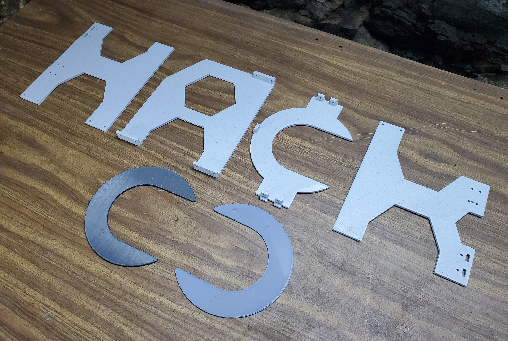

 
 

**Assembly:**

- Use the M3 screws to assemble the Reactor Stand pieces in the following way:
  - **Connect H and A**
    -  Place the H on the left, tilted up in its left side, the top "arms" of the H at the back should have 2 slots.
    - Place the A at the back tilted on its left side so the "feet" of the A line up with the top of the H.
    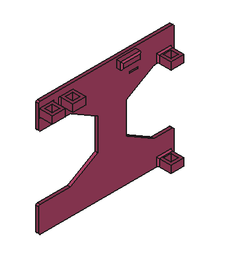
      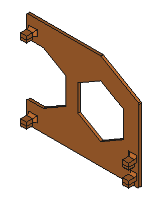
    -  Slide the hooks on the A into the slots on H

  - **Connect the A and K**
    - A is already positioned
    - Place the K on the right, tilt it up on its left side so A can hook into the two slots on the K.

      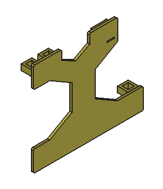

  - **Connect the ¢ to the H and K**
      - Position the ¢ between the H and K with the empty space of the C opening at the front. The ¢ is attached at the top, the two hooks on either end of the ¢ will line up with the 2 slots on the H and an on the K.  

          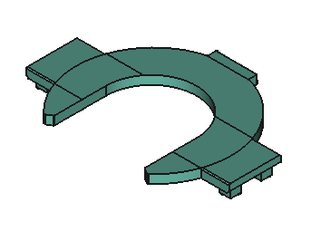

  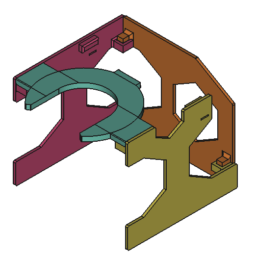

  -
### Reactor Unit - Putting it All Together

You've already built the core and the pump. All that's left to do is connect it all up.

**Components:**

* Reactor Stand
* Reactor Core
* Pumps Unit
* Jar Flanges (Printed) (RU-RJF)

**Assembly:**

- **Attach the Pumps box to the Reactor Stand.**
  - Take the Pumps Box and insert the tabs on H, ¢ , and K

  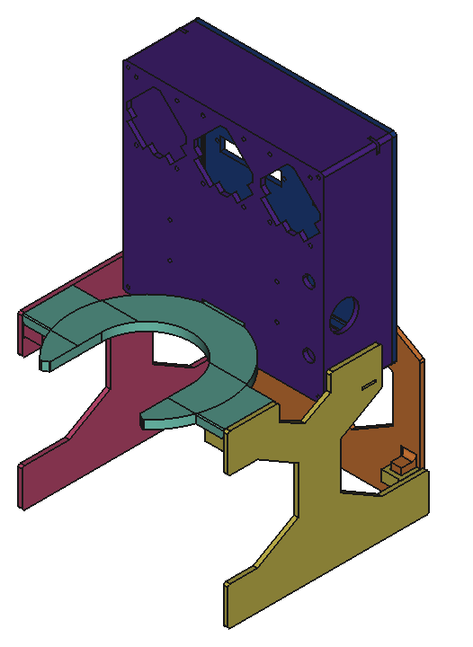

- **Attach the Reactor Core**
  * Place the Reactor Core in the center of the ¢.
  * Add the jar flanges (C shaped pieces) as shims in between the top of the ¢ part and the Reactor Core's outer jar. Two flanges should keep it snugly in place. If not, consider using another shim. (See picture below for reference, the jar flanges are orange and the ¢ piece is yellow.)

- **Connecting Reactor Core to Pumps Box**
  * Plug the stirring motor's plug into the upper barrel connector socket on the Pumps Box.
  * Attach one piece of tubing to each of the the peristaltic pumps and through the holes in the Reactor Core manifold to reach the 6oz mason jar chamber.

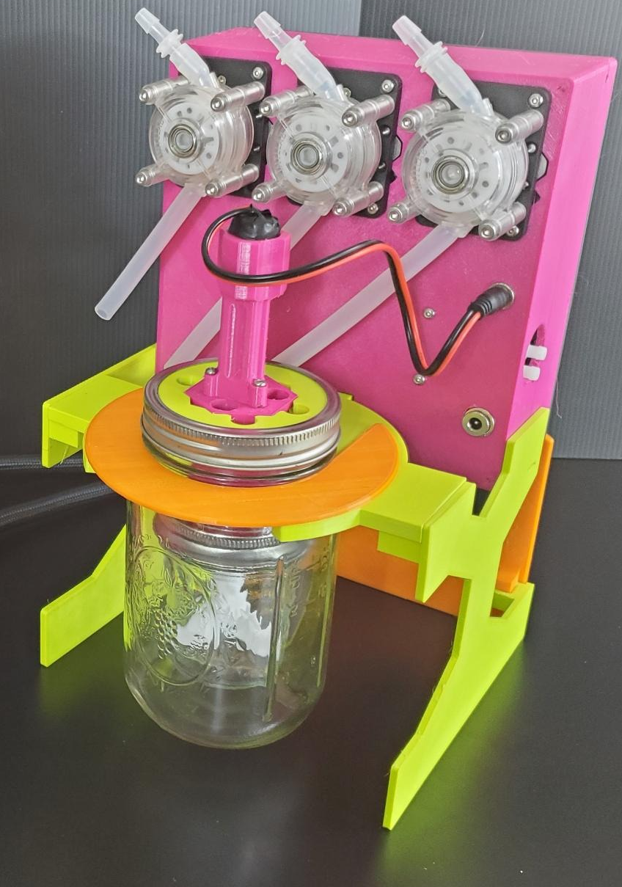

  
This concludes the assembly instructions for the Reactor Unit. Next up: [MicroLab Setup & Operation](/docs/operation.md).
