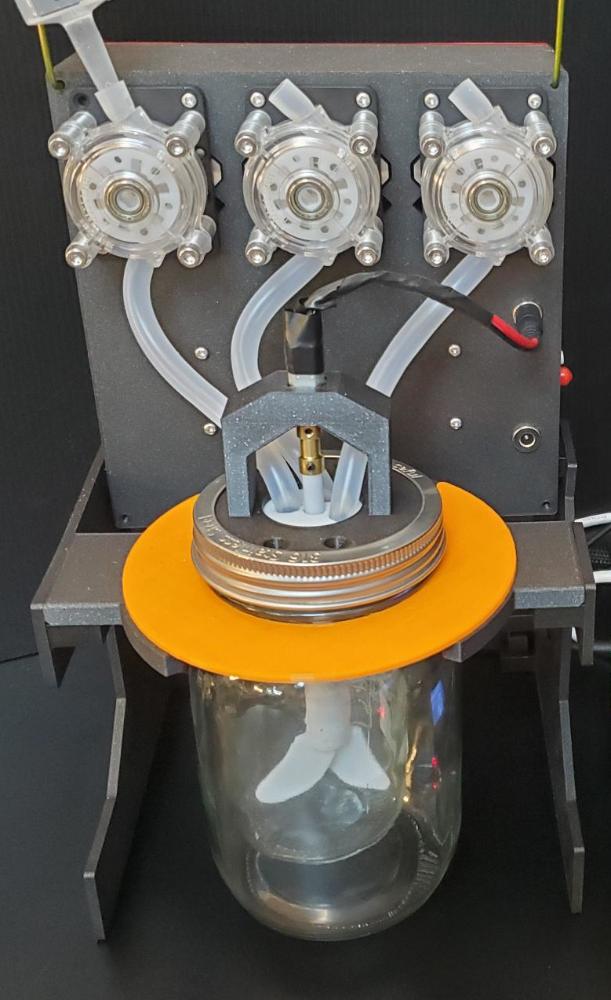
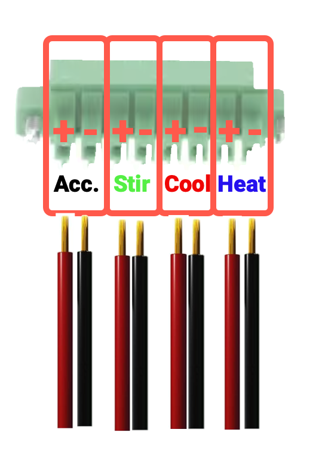
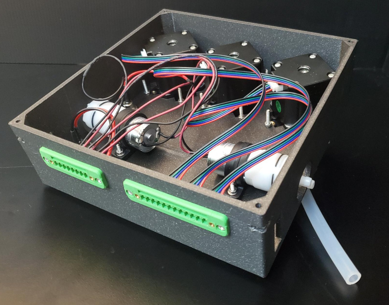
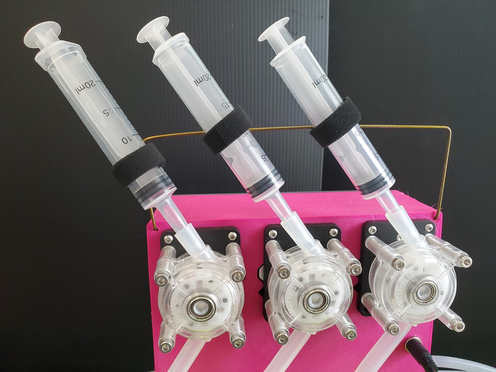
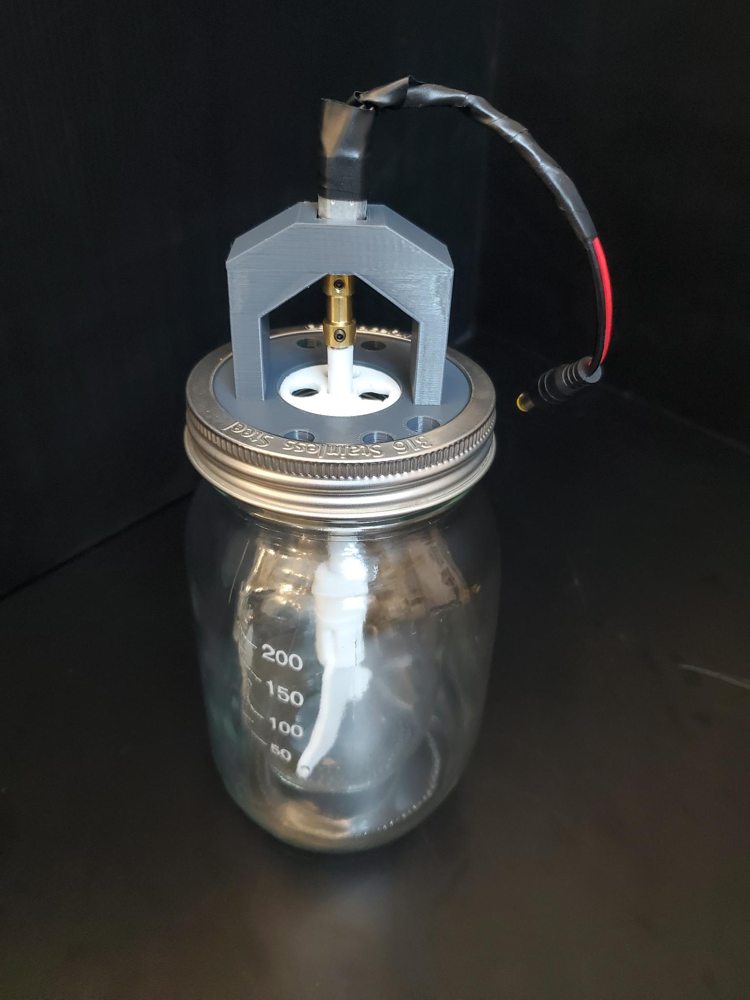
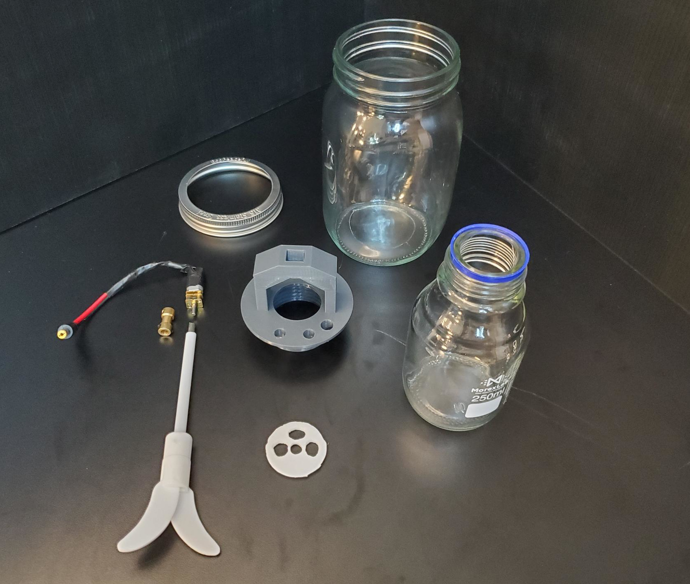

# MicroLab Reactor Unit Assembly

The Reactor Unit is where the action happens, it is made up of the pumps, pump case, reactor core and reactor unit stand.

- [Assembling the Pumps Box](#pumps)
- [Assembling the Reactor Core](#core)
- [Assembling the Reactor Unit](#unit)

## Skills Needed

- Wire stripping - one example [video](https://www.youtube.com/watch?v=N__OLJvq2HE)

## Parts

**Purchased parts info.** For more information on purchased parts, check the [MicroLab Parts List](microlab-parts-list.xslx).

**Printer parts info.** Parts listed as printed, like "CU-CB Control Case (Printed)", are 3D printed, check the [3D Printed Parts section ](docs/index.md#3d) of the "How to build the MicroLab" page.

| Part ID | Part Name                                    | Count | Notes                                                                                                     |
| ------- | -------------------------------------------- | ----- | --------------------------------------------------------------------------------------------------------- |
|         |                                              |
| RU-SRM  | Stir rod motor                               | 1     |
| RU-STR  | Stir rod                                     | 1     |
| RU-SRC  | Stir rod coupling                            |
| RU-LID  | Reactor Core manifold (Printed)               | 1     | 
| RU-RJF  | Jar Flanges (Printed)                        | 2     |
| RU-COR  | 250ml GL45 Borosilicate Glass Bottle             | 1     |
| RU-OUT  | 32oz wide mouth mason jar for outer jacket   | 1     |
| RU-SDH  | Reactor stand - H (Printed)                  | 1     |
| RU-SDH  | Reactor stand - A (Printed)                  | 1     |
| RU-SDH  | Reactor stand - ¢ (Printed)                  | 1     |
| RU-SDH  | Reactor stand - K (Printed)                  | 1     |
| RU-TMP  | Thermistor                                   | 1     |
| RU-PPM  | Peristaltic pumps with stepper motors        | 3     | [Or printable syringe pumps](https://github.com/FourThievesVinegar/microlab-parts/tree/main/syringe-pump) |
| SP-SMC  | Stepper motor cables                         | 3     | 6-pin end for motors                                                                                      |
| RU-SYR  | Syringes                                     | 3     |
| RU-PUB  | Pumps box (Printed)                          | 1     |
| RU-PUL  | Pumps lid (Printed)                          | 1     |
| RU-SUP  | Wire coat hanger                             | 1     |
| TC-PMP  | Circulating pump                             | 2     |
| SP-PC12 | 12-pin connector, panel-mount screw terminal | 1     |
| SP-PC8  | 8-pin connector, panel-mount screw terminal  | 1     |
| CU-PLG  | Barrel plug connectors, 5.5mm x 2.1mm        | 2     | female                                                                                                    |

## Assembling the Pumps Box

The Pumps Box has 3 Peristaltic pumps w/ stepper motors on the front that inject reagents into the Reactor Core and the 2 circulating pumps on the sides that move hot and cold fluids to control the Reactor Core's temperature. It also has plugs on the front for the stirring motor and an accessory port that can be used to power accessories like a light.

### Tools required

- Small screwdrivers for M3 screws
- Wire cutters and strippers

### Parts

- 3 Peristaltic pumps w/ stepper motors (RU-PPM)
- 2 Circulating pumps (TC-PMP)
- 12-pin connector
- 8-pin connector
- 2 barrel plug connectors, female (5.5mm x 2.1mm)
- 3 stepper motor cables, the 6 pin end that connects to the stepper motors
- 20 M3 screws, 16mm
- 4 M3 screws, 30mm
- Pumps box
- Pumps lid
- Wire coat hanger

### Mounting the Parts to the Box

We're going to mount the pumps then install the plugs for the stirring motor and light on the front of the box. After that we will mount the circulating pumps on the sides of the box.

**Assembly:**

- Push the female barrel plug connectors into the smaller round holes on the front of the box. Secure them with the nuts that came with the connectors.
- Place each of the peristaltic pumps in large diamond shaped holes and screw each in with four 16mm M3 screws and nuts.
- Place the circulation pumps inside of the box, one on each side on the box. Use the manufacturer-provided mounting hardware and two 16mm M3 screws to secure each pump.

### Mounting and Wiring the Connectors

Next, we'll install the 8-pin and 12-pin connector sockets and wire them to the components in the box.

**Assembly:**

- Connect the 12-pin and 8-pin connector sockets with their mounting plates and use 2 M3 screws with each to attach them securely to the Pumps Box ccase.
- Cut and strip the wires on the pumps and barrel plug connectors.

### **Wire Order**

The connectors need to be wired the same as the ones in the Control Unit. The wiring order is further explained on the [MicroLab Wiring](/docs/wiring.md) page. It's important to maintain the same wiring order throughout the project.
 

### 8-pin wiring

The 8-pin connector is connected to the positive and negative power wires for the accessory port, the stir rod, the cooling unit pump and then heating unit pump.

- **Find the wires.** We describe the location of components as seen from the back on the box where you currently working.
- The top barrel connection is for the stir rod
- The bottom barrel connection is for the accessory port
- The left pump is for the Cooling Pump Unit
- The right pump is for the Heating Pump Unit

  

- **Wire the 8-pin connector.** On the back on the 8-pin connector, from the left, insert and then screw down the power cables:

  - accessory positive (red)
  - accessory negative (black)
  - stir positive (red)
  - stir negative (black)
  - cooling pump positive (red)
  - cooling pump negative (black)
  - heating pump positive (red)
  - heating pump negative (black)

  

### 12-pin wiring

- **Wire the pumps.** Attach each of the connector ends of the stepper motor cables to one of the peristaltic pumps.
- **Wire the 12-pin connector.** Insert the stripped wire ends of the stepper motor cables into the back 12-pin connector socket. From left to right insert and then screw down the wires for the X and then Y and then Z cables.

  - Wire order. Each of the X, Y, and Z cables has 4 wires. From the left connect the wires in this order:
    - black
    - green
    - blue
    - red

  

  

### Finishing it up

- NOTE: You may want to test everything before closing the lid.
- Use the four 30mm M3 screws to attach the lid to the box, closing it up.
- Place the coat hanger on top of the pumps Box and cut it so that it has approximately 3 inches of length beyond the pumps box on either side. Once it is cut, bend it so that it has two 90 degree bends at each end (see image below). Insert the ends into the holes in the top corners of the pumps box and use straps so that it can support the syringes when they are in use.

✨ 💖 ✨

Congratulations! You did it. Hopefully it wasn't too bad!

(Sorry if it was. We're trying to be encouraging here, not snarky.)

## Reactor Core Assembly

The Reactor Core houses the reaction chamber, which is where the SCIENCE happens. We're going to build the manifold, attach the stirring assembly, and put it all inside the mason jars!

 

### Parts

| Part ID   | Part Name                                     | Count | Notes  |
| --------- | --------------------------------------------- | ----- | ------ |
|           |                                               |
| RU-SRM    | Stir rod motor                                | 1     |
| RU-STR    | Stir rod                                      | 1     |
| RU-SRC    | Stir rod coupler                              | 1     |
| RU-COR    | Reactor manifold core (Printed)               | 1     | [Use this instead](https://github.com/FourThievesVinegar/microlab-parts/tree/master/additional-parts/reactor-manifold-GL45)
| RU-LID    | Reactor manifold lid (Printed)                | 1     | You don't need this part if you use the part linked above.
| RU-SRM    | Stir rod mount (Printed)                      | 1     |
| RU-RJF    | Jar Flanges (Printed)                         | 2     |
| RU-COR    | 250ml GL45 Borosilicate Glass Bottle          | 1     | 
| RU-OUT    | 32oz wide mouth mason jar for outer jacket    | 1     |
| RU-SDH    | Reactor stand - H (Printed)                   | 1     |
| RU-SDH    | Reactor stand - A (Printed)                   | 1     |
| RU-SDH    | Reactor stand - ¢ (Printed)                   | 1     |
| RU-SDH    | Reactor stand - K (Printed)                   | 1     |
| RU-TMP    | Thermistor                                    | 1     |
| RU-SYR    | Syringes                                      | 3     |
| CU-PLG    | Barrel plug connectors, 5.5mm x 2.1mm         | 2     | female |
| SP-M3S-12 | 12mm M3 screws with nuts                      | 3     |
| SP-M3S-20 | 20mm M3 screws with nuts                      | 3     |
| SP-STB    | Silicone tubing 8mm OD x 5mm ID               | 1     |

### Tools

- A hack saw or bolt cutter that can cut through the stirring paddle's shaft

#### Assembling the Reactor Core Manifold

The printed manifold screws onto the GL45 250ml bottle, but first you have to carve the PTFE disc to fit between them and insert the stirrer through the central hole. Then you can use the shaft coupler to connect the motor to the stirrer. You may want to shim the motor with some tape to hold it more firmly in place. Then insert the whole thing into the main jar.

The trickiest thing is connecting the barrel plug connector to the motor. Soldering honestly helps here but you can also use thin solid-core wire (wires from ethernet cables are good for this) inserted into the motor's contacts.

#### Assembling and Attaching the Stirring Motor Mount

Next, we need to secure the stirring motor in place, and connect the motor shaft to the paddle.

**Parts:**

- Stir rod motor (RU-SRM)
- Stir rod (RU-STR)
- Stir rod coupler (RU-SRC)
- Stir rod mount - part of the manifold
- Possibly necessary: Material such as electrical tape to shim it in place.

**Assembly:**

- **Cut the PTFE disc.** It should be approximately 35mm across. The central hole for the stirrer shaft should be 8mm in diameter. The three holes around the edge should be 10mm in diameter but they don't need to be perfectly circular. 
- **Insert stir rod motor into manifold.** Place the stir motor into the recess at the top of the manifold. If it is loose, you may want to apply a small patch of electrical tape on the corners of the gearbox where there aren't any gears.
- **Attach stir rod motor to coupler.** Push the end of the stir rod coupler with the smaller hole over the motor's shaft and secure it with one of the set screws that came with the coupler.
  - Take care to center it and be aware that the shaft likely has a flat spot that makes it non-symmetrical
- **Wire the motor.**
  - This is one place where soldering may come in handy. The motor in the parts list does not have built-in leads. It is possible to add leads using small solid-core wires, such as those from an ethernet cable. You can strip extra length, feed the wires through the contacts on the motor, then use pliers to fold and twist the wires to themselves to maintain contact. In this case, wrapping with electrical tape, hot glue, or heat shrink is advised. You can use a 2x lever connector to attach the motor leads to the barrel plug connector.
- **Insert stir rod through the disc into the coupler.** Strip a few mm of PTFE coating from the end of the stirrer's shaft. Then thread it through the central hole in the PTFE disc and insert it through the central hole in the manifold up into the shaft coupler attached to the motor
- **Connect stir rod to coupler.** Tighten the set screws on the coupler to connect the stirrer to the motor.
- **Be ready to resize.** When fully assembled, the mixing paddle should be suspended in the reaction chamber and should not touch the bottom or sides of the chamber. You will likely need to cut the stirrer's shaft short for this to fit properly. Take your time when cutting the shaft, as cutting it too short will make it impossible to use.

  

### Reactor Unit reaction chamber assembly

Almost there! Now we just have to put it all together!

**Parts:**

- 250ml Bottle
- 32oz Mason jar and lid ring

**Assembly:**

- Lower the stir rod into the bottle, screwing the bottle into the manifold.
  - If the stir rod shaft is too long, you will need to remove the it from the manifold, cut it shorter using a hacksaw or bolt cutters, and then reattach it.
- Place the bottle inside the larger 32oz jar, slide the 32oz jar lid ring over top the manifold and screw it onto the jar.

TADA! Your Reactor Core is complete!

### Reactor Unit Assembly

These instructions assume you have already assembled the Pumps Box and the Reactor Core.

### Assembling the Stand

**Parts:**

- 250ml GL45 Borosilicate Glass Bottle (RU-COR)
- 32oz wide mouth mason jar for outer jacket (RU-OUT)
- Reactor stand - H (Printed) (RU-SDH)
- Reactor stand - A (Printed) (RU-SDA)
- Reactor stand - ¢ (Printed) (RU-SDC)
- Reactor stand - K (Printed) (RU-SDK)

**Assembly:**

- Assemble the Reactor Stand:
  - **Connect H and A**

    - Place the H on the left, tilted up in its left side, the top "arms" of the H at the back should have 2 slots.
    - Place the A at the back tilted on its left side so the "feet" of the A line up with the top of the H.
      
      
    - Slide the hooks on the A into the slots on H

  - **Connect the A and K**

    - A is already positioned
    - Place the K on the right, tilt it up on its left side so A can hook into the two slots on the K.

      

  - **Connect the ¢ to the H and K**

    - Position the ¢ between the H and K with the empty space of the C opening at the front. The ¢ is attached at the top, the two hooks on either end of the ¢ will line up with the 2 slots on the H and an on the K.

        

  

### Reactor Unit - Putting it All Together

You've already built the core and the pump. All that's left to do is connect it all up.

**Parts:**

- Reactor Stand
- Reactor Core
- Pumps Unit
- Jar Flanges (Printed) (RU-RJF)

**Assembly:**

- **Attach the Pumps box to the Reactor Stand.**
  - Take the Pumps Box and insert the tabs on H, ¢ , and K

- **Attach the Reactor Core**

  - Place the Reactor Core in the center of the ¢.
  - Add the jar flanges (C shaped pieces) as shims in between the top of the ¢ part and the Reactor Core's outer jar. Two flanges should keep it snugly in place. If not, consider using another shim. (See picture below for reference, the jar flanges are orange and the ¢ piece is yellow.)

- **Connecting Reactor Core to Pumps Box**
  - Plug the stirring motor's plug into the upper barrel connector socket on the Pumps Box.
  - Attach one piece of tubing to each of the the peristaltic pumps and through the holes in the Reactor Core manifold to reach the 6oz mason jar chamber.

 

This concludes the assembly instructions for the Reactor Unit. Next up: [MicroLab Setup & Operation](/docs/operation.md).
