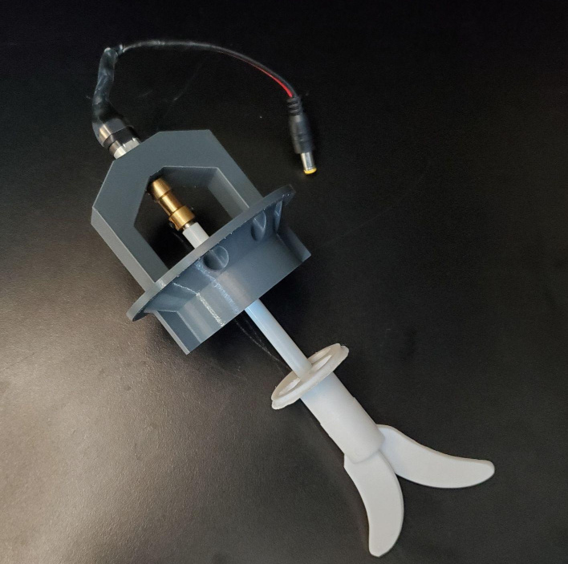

# MicroLab Reactor Unit Assembly

The Reactor Unit is where the action happens, it made up of the pumps, pump case, reactor core and reactor unit stand.

* [Assembling the Pumps Unit](#pumps)
* [Assembling the Reactor Core](#core)
* [Assembling the Reactor Unit](#unit)

### Parts

| Section | Part ID      | Part Name     | Count | Notes |
|--- | ------------- | ------------- |------| ----|  
|||
|PUMPS UNIT|
PU-PSP|Peristaltic pumps|3
PU-SYR|Syringes|3+
PU-HOU|Pumps Unit box and lid|1 each
PU-PLG|Female barrel plug connector|2
||
|REACTOR UNIT|
RX-MXM|Mixing motor|1
RX-PDL|Mixing paddle|1
RX-MXC|Mixing paddle coupling|
RX-RED|Reducing fitting|
RX-LID|Reactor manifold core and lid|1
RX-MMM|Mixing motor mount|1
RX-RUC|Reactor collar|2
RX-COR|6 oz mason jar for core chamber|1
RX-OUT|32oz wide mouth mason jar for outer jacket|1
RX-STD|Reactor stand|1
???|A 12v light with a male barrel connector plug|
||
|Shared Parts|
SP-M3|Various M3 Screws|1

#### Printed Parts

- All Reactor Stand pieces: H A ¢ k
- Jar flanges (thin c-shaped pieces used to hold the Reactor Core more securely)

## Pumps Box Assembly

The Pumps Box contains 3 Peristaltic pumps w/ stepper motors that inject reagents into the Reactor Core and 2  circulating pumps that move hot and cold fluids to control the Reactor Core's temperature. It also has plugs for the stirring motor and the Reactor Stand's optional light.

## Skills Needed

* Wire stripping [URL]
* Reading circuit board diagrams [URL]

## Tools required

- Small screwdrivers for M3 screws
- Wire cutters and strippers

## Parts

### Purchased Parts

- 3 peristaltic pumps
- 2 circulating pumps
- 12-pin panel-mounted female Phoenix-style connector
  - 3 stepper motor cables, already connected to the Arduino
- 8-pin panel-mounted female Phoenix-style connector
- 2 barrel plug connectors, female (5.5mm x 2.1mm)

- 20 M3 screws, 16mm
- 4 M3 screws, 30mm

### Printed Parts

- Pumps box
- Pumps lid

## Assembling the Pumps Unit

### Mounting the Components to the Box

We're going to mount the pumps then install the plugs for the stirring motor and light on the front of the box. After that we will mount the circulating pumps on the sides of the box.

  

**Parts:**

- Pumps box
- Pumps box lid
- 3 peristaltic pumps
- 2 circulating pump
- 16 M3 screws and nut
  - 12 for the peristalic pumps
  - 4 for circulating pumps
- 2 barrel plug connectors, female
- TODO: Maybe some wire connectors in here as well

**Assembly:**

- Push the female barrel plug connectors into the smaller round holes on the front of the box. Secure them with the included nuts.
- Place each of the peristaltic pumps in large diamond shaped holes and screw each in with four M3 screws and nuts.
- Place the circulation pumps inside of the box, one on each side on the box. Use the manufacturer-provided mounting hardware and two M3 screws to secure each pump.
  - If your pump does not come with mounting hardware, you may need to get creative. In a pinch, zipties should work although you may want to double them up or drill out the holes to support thicker ties.
  - NOTE: [Suggestions for better solutions are welcome](https://github.com/FourThievesVinegar/solderless-microlab/issues/184).

## Mounting and Wiring the back panel

Next, we'll install the 8-pin and 12-pin Phoenix connector sockets and wire them to the components in the box.

**Parts:**

- Pumps box back panel
- 12-pin panel-mounted female Phoenix-style connector
- 3 stepper motor cables, already connected to the peristalic pumps
- 8-pin panel-mounted female Phoenix-style connector
- Additional wire connectors (as needed)

**Assembly:**

- Connect the Phoenix sockets with their mounting panels and use 2 M3 screws with each to attach them securely to the lid.
- Cut and strip the wires on the pumps and barrel plug connectors.
- The Phoenix connectors need to be wired the same as the ones in the Control Unit.
  - [Wire Order in the Control Unit ](https://github.com/FourThievesVinegar/solderless-microlab/blob/master/docs/assembly-control-unit.md#wireorder) as seen from outside the case.  
  
  - You may need wire connectors to extend the barrel plug leads.

### 8 pin wiring

The 8-pin Phoenix connector is connected to the positive and negative power wires for the light (optional), the stir rod, the cooling unit pump and then heating unit pump.

Wiring the Phoenix connector
  - We describe the location of components as seen from the back on the box where you currently working.
      - The top barrel connection is for the stir rod
      - The bottom barrel connection is for the optional light
      - The left pump is for the Cooling Pump Unit
      - The left pump is for the Heating Pump Unit

  

  - On the back on the female 8-pin Phoenix connector, from the left, insert and then screw down the power cables:
    - light positive (red)
    - light negative (black)
    - stir positive (red)
    - stir negative (black)
    - cooling pump positive (red)
    - cooling pump negative (black)
    - heating pump positive (red)
    - heating pump negative (black)

    

### 12pin wiring

Connect the 12-wire Phoenix connector to the stepper motor cables for the 3 peristalic pumps. When viewed from the back of the open box the pump from left to right are Z, Y, X.
- On the back on the Phoenix connector, from the left, insert and then screw down the power cables for the X and then Y and then Z cables. Each cable has 4 wires. From the left connect the wires in this order:
  - black
  - green
  - blue
  - red
    - Take the other end of the 4-wire cable and place the black and green wire in their own slots of the 4-to-1 wire connector #1. Then put the red and blue wires together in one slot. That leaves the last slot open for power (-12V), put the 4" black wire in that slot.
  - Plug the X cable into the X motor, the Y cable into the Y motor and the the Z cable into the Z motor.

    

## Closing it up

- Use the 30mm M3 screws to close the box using the lid.
  - NOTE: You may want to test everything before closing the lid.

✨ 💖 ✨

Congratulations! You did it. Hopefully it wasn't too bad!

(Sorry if it was. We're trying to be encouraging here, not snarky.)

# Reactor Core Assembly

## Partse

### Purchased parts

- Wide mouth quart Mason jar 32oz, plus its lid ring
- Regular mouth Mason jar 6oz, plus its lid ring
- MStir rod
- Stir rod motor
  - Padding to hold the motor in place if it is smaller than the opening in the stirrer mount (we are looking into redesigning this)
- Male barrel plug connector (if your motor does not already have one)
  - Wire connector to attach it to the motor if necessary
- 3x 12mm M3 screws
- 3x 20mm M3 screws

### Printed parts

- Reactor manifold core
- Reactor manifold lid
- Stirring motor mount

## Reactor Core assembly

The Reactor Core houses the reaction chamber, which is where the SCIENCE happens. We're going to build the manifold, attach the stirring assembly, and put it all inside the mason jars!

### Assembling the Reactor Core Manifold

First, we need to assemble the manifold lid that holds the jars together and allows tubing into the reaction chamber and temperature control chamber.

**Parts:**

- Reactor Core manifold
- Reactor Core lid
- 6 oz jar lid ring
- 3 M3 screws, 12mm
- 3 M3 screws, 20mm

**Assembly:**

- Place the jar lid ring over the manifold core.

- Insert the manifold core through the manifold lid, then twist the lid slightly so that the manifold core fits snugly in the manifold lid. Check to make sure the holes on the side of the manifold core line up with those on the manifold lid

- The screwholes on sides of the lid and manifold core should be lined up, screw in the three 12mm M3 screws.

### Assembling and Attaching the Stirring Motor Mount

Next, we need to attach the stirring motor mount to the top of the manifold, secure the stirring motor in place, and connect the motor shaft to the paddle.

Please note that we are experimenting with sinking nuts into various components for more reliable and durable connections. This is why the screw holes on top of the manifold are hexagonal at the top. Doing this requires a soldering iron and a steady hand. You may also want to drill out the stirring mount screw holes with a 1/8" bit to give the screws more play to mate with the nuts.

The motor mount is in active development as of v0.6 and we thank you for patience with the rough edges.

**Parts:**

- Stirring motor mount
- Stirring motor
  - Possiby necessary: Material such as dense foam to hold it in place.
- Shaft coupler to connect the motor to the stirring paddle shaft.
  - Possibly necessary: ~1" of silicone or surgical tubing to connect the shaft coupler to the stirring paddle's shaft. There are couplers that will mate various motors to the shaft, but finding them in the exact sizes required can be tricky. We have found that silicone tubing with 1mm walls and an 8mm outer diameter gives a snug fit that isn't too hard to work with.
- Stirring paddle
- 3x 20mm M3 screws

**Assembly:**

- If using tubing with the coupler:
  - Make sure that one end of the coupler is able to securely connect with the motor's shaft.
  - Push the tubing up over the other end of the shaft coupler, working it up until it is just below the set screws for the other end.
- Push one end of the shaft coupler over the motor's shaft and secure it with one of the M3 screws that came with the coupler.
   - Take care to center it as well as possible and note that the shaft is likely has a flat spot that makes it non-symmetrical
- Insert the coupler into the hole in the top of the stirring motor mount.
- From the bottom of Reacter Core manifold insert the mixing paddle's shaft through the center.
- Take the stirring motor mount and insert the mixing paddle's shaft until it slides into the coupling tubing.
- Use the M3 screws to connect the stirring mount to the top of the manifold.
  - Drilling or otherwise widening the motor mount's screw holes can make this easier depnding on you 3D print quality

## Reactor Unit reaction chamber assembly

Almost there! Now we just have to put it all together!

**Parts:**

- 6oz Mason jar
- 32oz Mason jar and lid ring

**Assembly:**

- Place the mixing paddle in the 6oz jar and screw on the lid ring that is attached to the manifold.
  - If the paddle shaft is too long, you will need to cut it shorter using a hacksaw or bolt cutters.
- Place the 6oz jar inside the larger 32oz jar, slide the 32oz jar lid ring over top the manifold and screw it onto the jar.

TADA! Your Reactor Core is complete!

## Reactor Unit Assembly

These instructions assume you have already assembled the Pumps Box and the Reactor Core.

## Assembling the Stand

**Components:**

- 20 M3 screws, 12mm
- [optional]] 12v light with a male barrel connector plug
- 4 Reactor Stand pieces: H A ¢ k
- 2 Jar flanges (thin c-shaped pieces used to hold the Reactor Core more securely)

 
 

**Assembly:**

- Use the M3 screws to assemble the Reactor Stand pieces in the following way:
  - Connect H and A
    -  H placed on the left, tilted up in its left side, the top "arms" of the H should have 1 slot
    -  A placed at the back tilted on its left side so the "feet" of the A line up with the top of the H.
    - Slide the hooks on the A into the slots on H
  - Connect the A and K
    -  A is already positioned
    - K placed on the right, tilted up on its left side so the two hook on the top left "arm" can slide into slots on the A
  - Connect the ¢ to the H and K
      - ¢ is positioned between the H and K with the empty space of the C opening at the front. The ¢ is attached at the top, the two hooks on either end of the ¢ will line up with teh 2 slots on the H and an on the K.  

  -
## Assembling the Rest of the Fucking Reactor

You've already built the core and the pump. All that's left to do is connect it all up.

**Components:**

- Reactor Stand
- Reactor Core
- Pumps Unit
- 2x Reactor Core shims
- A 12v light with a male barrel connector plug

**Assembly:**

- Attach the Pumps box to the Reactor Stand .

- Place the reactor core in the center of the ¢.
- Place the C shims in between the top of the ¢ and the underside of the rim on the neck of the Reactor Core's outer jar. Two shims should keep it snugly in place. If not, consider using another shim.
- Plug the stirring motor's plug into the upper barrel connector socket.
- Attch the tubing to the peristaltic pumps and Reactor Core manifold's inner channels.
  - For more on this, see [MicroLab Operation](/docs/operation.md).

This concludes the assembly instructions for the Reacter Unit. Next up: [MicroLab Operation](/docs/operation.md).
