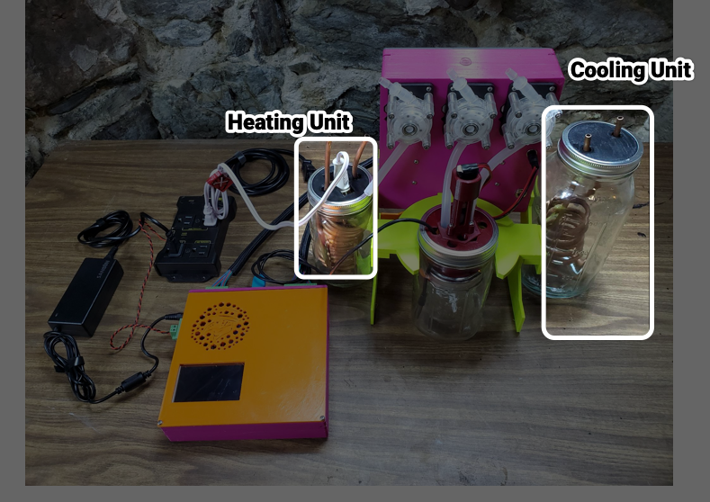
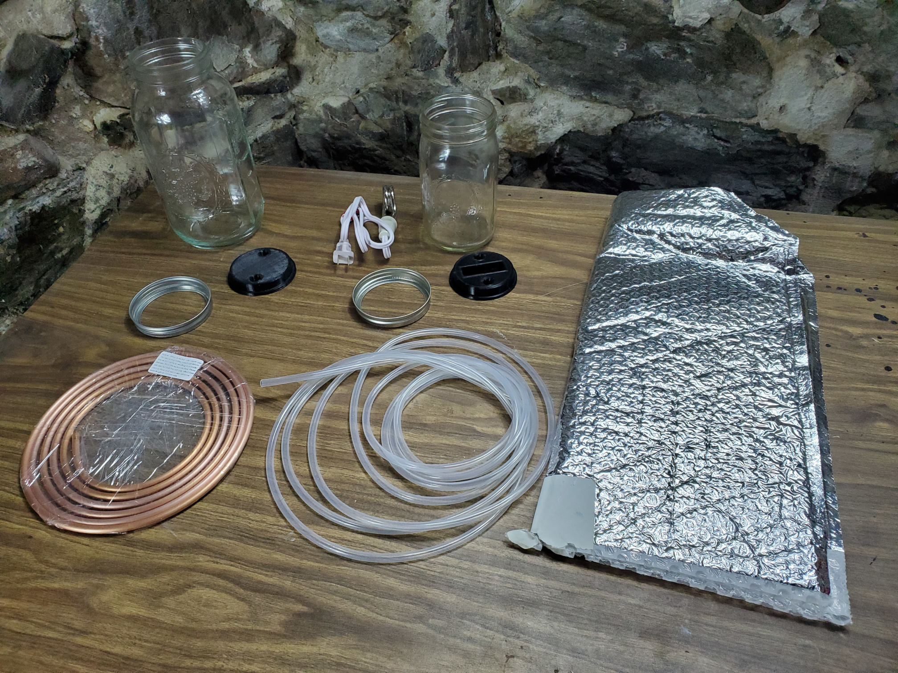
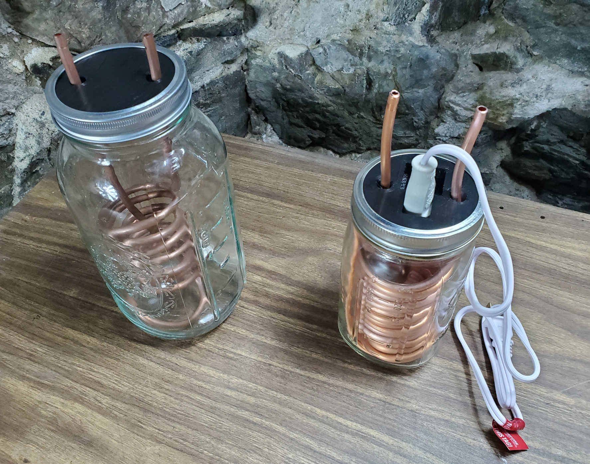
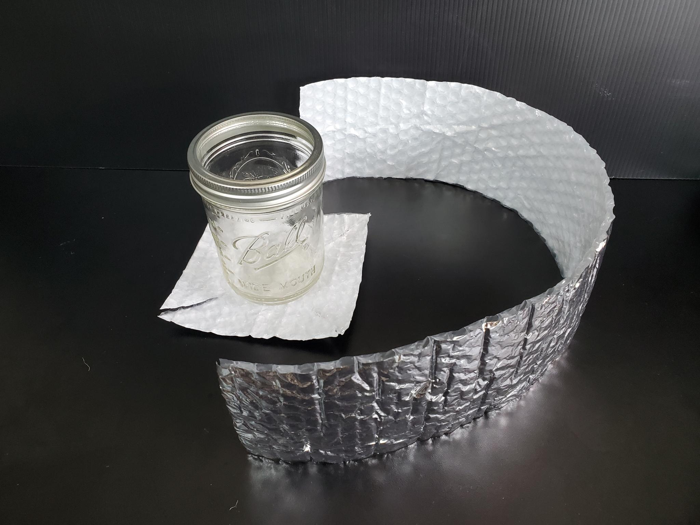
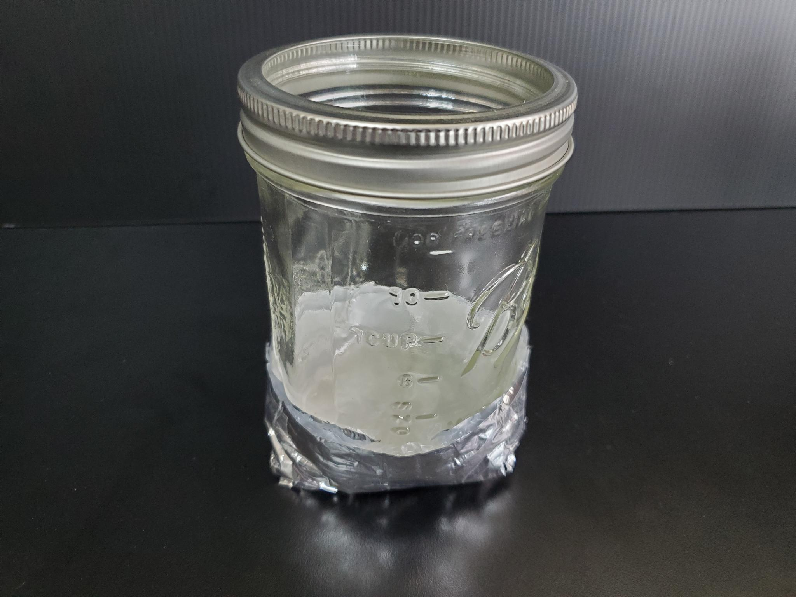
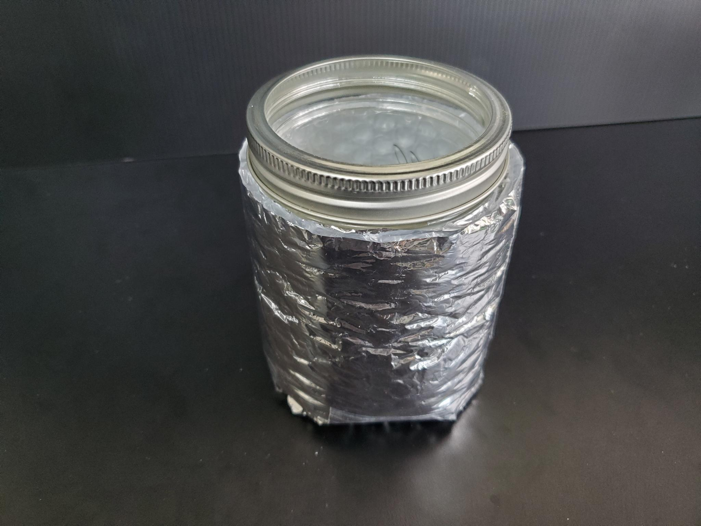

# Heating and Cooling Units Assembly

The Heating Unit and Cooling Units are supporting components of the MicroLab that heat or cool the fluids that circulate in the Reactor Core.

## Skills Needed

* Bending copper tubing

## Tools Needed

* Copper tube jig - for bending the copper without pinching it (optional but recommended).
    - Jig options includes
      - a cylinder with a smaller diameter than the jar or a medium-to-large dowel/tube
      - the Reactor Core manifold, which is approximately the correct size. We opened [an issue about this](https://github.com/FourThievesVinegar/solderless-microlab/issues/136)
* Tube cutters - very helpful for neatly cutting the copper tubing without crushing it

## Parts

**Purchased parts info.** For more information on purchased parts, check the [MicroLab Parts List](microlab-parts-list.xslx).

**Printer parts info.** Parts listed as printed, like "CU-CB Control Case (Printed)", are 3D printed, check the [3D Printed Parts section ](docs/index.md#3d) of the "How to build the MicroLab" page.

| Part ID      | Part Name     | Count | Notes |
| ------------- | ------------- |------| ----|  
|||
TC-PMP|Circulating pump|2
TC-SBH|Submersible heater|1
TC-CTB|Copper tubing 1/4" OD x 3/16" ID|1
TC-ST7|Silicone tubing 7mm OD x 5mm ID|1
RX-TEE|Barbed tee fittings for 6mm tubing|2
TC-JAR|32oz canning jar |2 | We've don't have a optimal size for the jar, we've also used 16oz jars. You may want to experiment to find the best size for your project.
TC-REL|Switchable power supply|1
TC-INS|	Insulation for jars|	2
TC-TAP|	Tape for the insulation|	2
TC-TCT|	Copper tube cutter tool|1
TC-CTJ|	Copper tube jig	|1
TC-CUL|	Cooling Unit Lid (Printed)| 1
TC-HUL|	Heating Unit Lid (Printed)| 1

||

## Assembly

### Heat Exchanger

This component heats and stores hot water, or other liquids, which are then used to heat the Reactor Core.

* **Bending the tubing.** Gently bend the copper tubing into a helix that will fit in the jar, be sure to leave space for the heating coil.
 - Tips
    - More is better, the more copper tubing you can fit, the more heat will be exchanged.
    - It is OK (good even!) if the copper tubing and heating coils touch.
    - Take care when bending, copper tubing kinks easily, reducing or blocking the flow of the liquid.
    - You can support the tube using a long spring around  it or fill the tube with salt or sand to support it from the inside.

* **Insert tubing into lid.** Take the Heating Unit Lid (TC-HUL). Insert the ends of your copper tube helix up through the holes in the lid.
* **Add the heating coil.** Take the submersible heater (TC-SBH) and insert its heating coil through the rectangular hole in the top, then twist it 90 degrees so that the top part of the heater fits snugly in the slot in the jar lid.
  - You may need to cut off a hook or tab meant to hold the heater to the side of a mug.
- **Attach lid.** Lower the copper tubing into the jar (TC-JAR) as you place the lid on top of the jar. Place the canning jar lid ring (that comes with the Mason jar) over the lid and screw it to the jar to secure the lid in place.

  

- **Attach the insulating material.** Take the insulation for jars (TC-INS) and wrap it around the jar, securing it with tape.

### Cooling Unit

This component holds ice water or another cold substance to cool the reactor core.

* **Bending the tubing.** Gently bend the copper tubing into a helix that will fit in the jar.
 - Tips
    - More is better, the more copper tubing you can fit, the more heat will be exchanged.
    - Take care when bending, copper tubing kinks easily, reducing or blocking the flow of the liquid.
    - You can support the tube using a long spring around  it or fill the tube with salt or sand to support it from the inside.

* **Insert tubing into lid.** Take the Cooling Unit Lid (TC-CUL). Insert the ends of your copper tube helix up through the holes in the lid.
* **Attach lid.** Lower the copper tubing into the jar (TC-JAR) as you place the lid on top of the jar. Place the canning jar lid ring (that comes with the Mason jar) over the lid and screw it to the jar to secure the lid in place.

  

* **Attach the insulating material.** Take the insulation for jars (TC-INS) and wrap it around the jar, securing it with tape.

### MicroLab Connector Tubing

Both the Heating and Cooling Units will need two pieces 16 inch tubing and 1 piece of 8 inch tubing to connect them to MicroLab during operation.

* Take the silicone tubing (TC-ST7) and cut four pieces to be 16 inches (16") long.
* Cut two pieces to be 8 inches (8") long.
* These lengths have worked for us so far. You may find different lengths works better for you and we'd love to hear what works.

This concludes the assembly instructions for the Heating and Cooling Units. Next up: [Building the Reactor Unit](/docs/assembly-reactor-unit.md)
