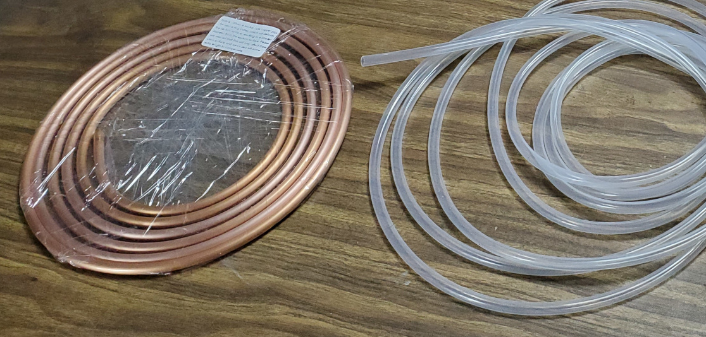

# Heating and Cooling Units Assembly

The Heating Unit and Cooling Units are supporting components of the MicroLab that heat or cool the fluids that circulate in the Reactor Core.

## 🚨 UNDER ACTIVE DEVELOPMENT🚨

Please note that this part of the project is under active development.
While these instructions show jars for the heat source and heat sink, these can be limited and impractical for many applications.
Our development team is exploring additional options like:
- A [mini deep fryer](https://www.amazon.com/dp/B09HW3GFKP?th=1) full of propylene glycol as a heat source.
- A [mini chest freezer](https://www.homedepot.com/p/COWSAR-20-67-in-W-1-8-Cubic-Feet-Manual-Defrost-Garage-Ready-Chest-Freezer-with-Adjustable-Temperature-Controls-in-Black-SZHD-D5850-BLACK/330363273) as a heat sink.
- Even a cooler full of ice would be better than a jar.
- You can also insulate the tubing and reactor core for added efficiency.

We will update with more details as part of the next release.

## Skills Needed

* Bending copper tubing

## Tools Needed

* Copper tube jig - for bending the copper without pinching it (optional but recommended).
    - Jig options includes
      - a cylinder with a smaller diameter than the jar or a medium-to-large dowel/tube
      - the Reactor Core manifold, which is approximately the correct size. We opened [an issue about this](https://github.com/FourThievesVinegar/solderless-microlab/issues/136)
* Tube cutters - very helpful for neatly cutting the copper tubing without crushing it

## Parts

**Purchased parts info.** For more information on purchased parts, check the [MicroLab Parts List](microlab-parts-list.xslx).

**Printer parts info.** Parts listed as printed, like "CU-CB Control Case (Printed)", are 3D printed, check the [3D Printed Parts section ](docs/index.md#3d) of the "How to build the MicroLab" page.

| Part ID      | Part Name     | Count | Notes |
| ------------- | ------------- |------| ----|  
|||
TC-PMP|Circulating pump|2
TC-CTB|10` Copper tubing 1/4" OD x 3/16" ID|2
TC-STB|Silicone tubing 8mm OD x 5mm ID|1
TC-TCT|	Copper tube cutter tool|1
TC-CTJ|	Copper tube jig	|1

### Auxiliary heat sources and sinks

As mentioned above, we are looking for optimal head sources and sinks. Consider ice baths and deep fryers with operational temperatures below 188.2 °C / 370.8 °F (the boiling point of propylene glycol).

## Assembly

### Heat Exchanger

This component heats and stores hot water, or other liquids, which are then used to heat the Reactor Core.

* **Bending the tubing.** Gently bend the copper tubing into a helix that will fit in the jar, be sure to leave space for the heating coil.
 - Tips
    - More is better, the more copper tubing you can fit, the more heat will be exchanged.
    - It is OK (good even!) if the copper tubing and heating coils touch.
    - Take care when bending, copper tubing kinks easily, reducing or blocking the flow of the liquid.
    - You can support the tube using a long spring around  it or fill the tube with salt or sand to support it from the inside.

Put this in something hot like a deep fryer with operational temperatures below 188.2 °C / 370.8 °F (the boiling point of propylene glycol)

### Cooling Unit

This component holds ice water or another cold substance to cool the reactor core.

* **Bending the tubing.** Gently bend the copper tubing into a helix that will fit in the jar.
 - Tips
    - More is better, the more copper tubing you can fit, the more heat will be exchanged.
    - Take care when bending, copper tubing kinks easily, reducing or blocking the flow of the liquid.
    - You can support the tube using a long spring around it or fill the tube with salt or sand to support it from the inside.

Put this in something very cold like an ice bath or a block of ice in a mini chest freezer. We are exploring the best methods for this.

### MicroLab Connector Tubing

Both the Heating and Cooling Units will need two pieces 16 inch tubing and 1 piece of 8 inch tubing to connect them to MicroLab during operation. You may want to cut these tubes shorter (or longer) depending on your setup.

* Take the silicone tubing (TC-ST7) and cut four pieces to be 16 inches (16") long.
* Cut two pieces to be 8 inches (8") long.
* These lengths have worked for us so far. You may find different lengths works better for you and we'd love to hear what works.
* You can wrap the tubes in insulating material to increase efficiency. We are looking for affordable options here and will update the docs when we settle on the best / easiest / most available method. For now, you can buy commercial stuff that fits around the silicone tubes or even use silicone tubes with an interal diameter slightly larger than the external diameter of the silicone tubing (TC-ST7).

This concludes the assembly instructions for the Heating and Cooling Units. Next up: [Building the Reactor Unit](/docs/assembly-reactor-unit.md)

