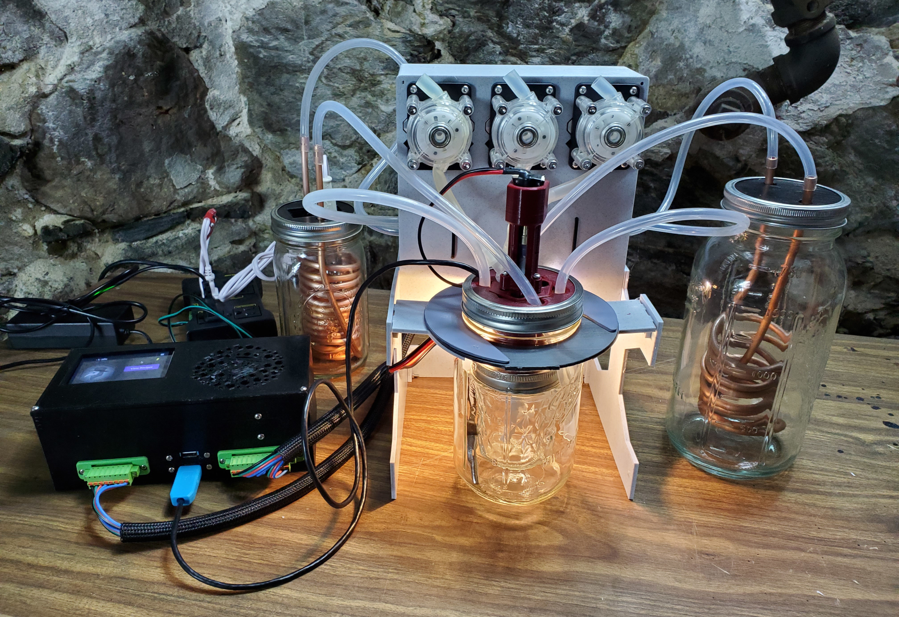
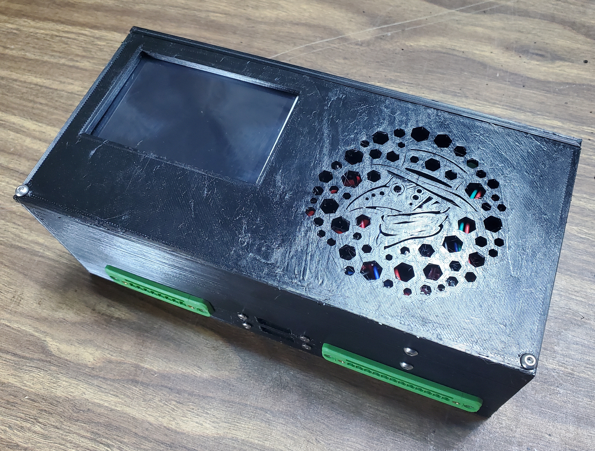

# MicroLab Assembly

Welcome! This document will walk you through the steps to construct a MicroLab. Each major component has its own instructions. There is [a parts list](https://github.com/FourThievesVinegar/solderless-microlab/raw/master/docs/microlab-parts-list.xlsx) that you can peruse to make sure you have everything. 

**Some notes:**

- The MicroLab is designed to be assembled without the need for soldering or other specialized tooling. If you are equipped to solder, you can construct one at a lower cost and with less junk in the case by replacing the lever-action wire connectors with solder joints (or screw cap connectors).
- Additionally, you can save space in the case by splicing wires and modifying components like USB cables to remove extraneous material.
- Send us your feedback! If you're replicating and you see opportunities to improve the design, the docs, or the code, please feel free to put up a pull request or to contact us through the volunteer email posted on the website.

## Building a MicroLab

The MicroLab consists of five major parts:

1. Reactor Core
1. Reactor Pumps
1. Reactor Stand
1. Control Unit
1. Temperature Control Units

### Reactor Core

The central part of the MicroLab is the reaction chamber. It consists of a 3D printed manifold that interfaces with a Mason jar lid ring. This allows a small mason jar to nest into a larger, wide-mouthed mason jar. During operation, the large mason jar is partly filled with water. Holes in the manifold allow a circulation pump to inject hot or cold water to control the temperature in the core. A stir rod with paddle mixes the chemicals in the smaller jar.

### Reactor Pumps

The MicroLab uses peristaltic pumps to inject additional chemicals into the reaction chamber according to the recipe in progress. These pumps can have syringes inserted into them, or can feed from another container. In both cases, they are driven by stepper motors that are controlled by the Lab Control Unit. This unit also houses the circulation pumps for the Temperature Control Units.

### Reactor Stand

A flat-packable structure that supports the Reactor Core and the Reactor Pumps housing.

### Control Unit

The Control Unit is the brain of the device. It consists of an Arduino microcontroller (a programmable circuit board), a Raspberry Pi (or another single-board mini computer), a set of relays, and several other components.

The Arduino controls the reagent pumps. The Pi controls everything else, including the stirrer, temperature control pumps, Reactor Core thermometer, and user interface.

**Temperature Control Units**
The Temperature Control Units contain (a) the heating element used to raise the temperature in the Reactor Core and (b) an ice bath used to cool the Reactor Core. These act as (a) a thermal source and (b) a thermal sink for closed-loop circulation systems using copper heat exchangers. The heating element is activated using an off-the-shelf switchable plug controlled by the Control Unit.

### Tools required

- Small screwdrivers for M3 screws, USB mount screws, and screw terminals
- Wire cutters and strippers
- Needle-nosed pliers
- Flush cutters (optional but recommended)
- Small hex bits to tighten set screws on the sirring shaft coupler.
- Possibly required: power drill and 1/8" bit for drilling out holes
- Possibly required: hacksaw or bolt cutters to cut the mixing paddle shaft.

### Safety

#### Chemistry

Chemicals can be dangerous. Make sure you research any reagents, solvents, and other chemicals you work with to ensure you're handling them properly. Always wear appropriate protective equipment and make sure your work area is properly ventilated.

#### Electricity

You are a sweet bag of mostly water and you are highly vulnerable to electricity damage. Although we will only be doing DIY on 12v and below, please keep yourself safe.

### Materials

TODO: PHOTO OF ALL 3D PRINTED PARTS
TODO: PHOTO OF ALL PURCHASED PARTS

### Parts List

The boards, components, and parts needed for this project are located in the Bill of Materials (BOM) file.

Download the BOM here: [https://github.com/FourThievesVinegar/solderless-microlab/raw/master/docs/microlab-parts-list.xlsx](https://github.com/FourThievesVinegar/solderless-microlab/raw/master/docs/microlab-parts-list.xlsx)

### 3D Printed Parts

While most items on the parts list can be purchased, a few items will need to be printed using a 3D printer:

1. Control Unit
    1. housing
    1. lid
1. Reactor Stand parts: 5 total: H A ¢ k and c. Extra jar flanges may be helpful for securing the reactor core to the stand.
1. Reactor Core
    1. manifold 
    1. lid
    1. stirring motor mount
1. Reactor Pumps
    1. housing
    2. lid
1. heating vessel lid
1. cooling vessel lid

Parts files are available here: [https://github.com/FourThievesVinegar/microlab-parts/tree/master/v6](https://github.com/FourThievesVinegar/microlab-parts/tree/master/v6)

#### Inspect 3D printed parts

Before assembly, be sure to check the parts that have come out of the 3D printer.

1. Inspect the parts for defects and print errors, cut away any excess strings or blobs.
1. Check to make sure all screw holes are open. Use a drill to clear them if needed.
1. Test the fit of all parts with one another.

## Instructions

### Control Unit assembly

Assembling the Control Unit involves assembling and wiring most of the electronic components of the MicroLab. It's all down hill from here.

For full instructions, including the cables for connecting to the Pumps Unit, see [MicroLab Control Unit Assembly](/docs/assembly-control-unit.md).

### Pumps Unit assembly

The Pumps Unit is assembled by mounting the various pumps and 12v electrical sockets to the printed box and lid.

For full instructions, see: [Pumps Unit Assembly](/docs/assembly-pumps-unit.md).

### Reactor assembly

Assembling the Reactor unit involves three major steps: assembling the Reactor Stand, attaching the Pumps Unit, and assembling the Reactor Core itself.

For Reactor Core assembly instructions, see [MicroLab Reactor Core Assembly](/docs/assembly-reactor-core.md).

For Stand and Reactor Unit assembly, see [Microlab Reactor Unit Assembly](/docs/assembly-reactor-unit.md).

### Temperature Control Unit assembly

Assembling the Temperature Control Units involves assembling (a) the Heating Unit and (b) the Cooling Unit. The Heating Unit is controlled by an off-the-shelf switchable plug controlled by a cable to the Control Unit.

For full instructions, see [MicroLab Temperature Control Unit Assembly](/docs/assembly-temperature-control-unit.md).

### Putting it all together

Once you have assembled the 5 major components, you will have what you need to run the MicroLab. These components are designed to be modular and easy to disassemble for storage and transportation. All that's left is connecting the modules with appropriate wire and tubing, and plugging it all in!

For full assembly instructions, see [MicroLab Operation](/docs/operation.md).
