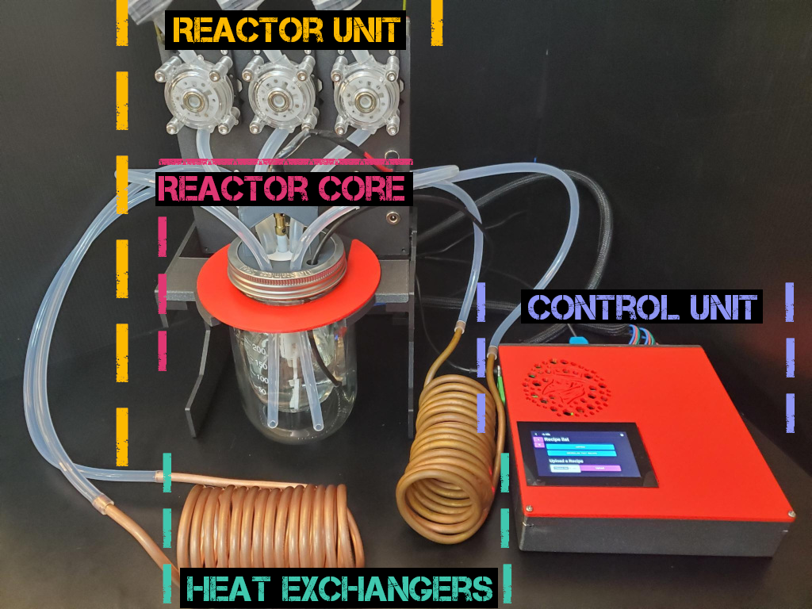

# Welcome to The MicroLab

The MicroLab is part of the MicroLab Suite. Learn more about the hardware/software stack [here](/docs/motivation.md#Meet-the-MicroLab-Suite)

The MicroLab is made up of:
* **Control Unit** - Runs the software and hardware
* **Heating Unit** - Heats the liquid that circulates outside the reactor to warm it
* **Cooling Unit** - Cools the liquid that circulates outside the reactor to cool it
* **Reactor Unit** - Reactor core and pumps box assembled together
   * Reactor Core - made up of the inner chamber (small glass jar) where compounds are made, outer chamber (large glass jar) where liquid circulates to warm or cool the inner chamber, thermistor to take temperature in the inner chamber, stir rod to mix things in the inner chamber, and the parts to mount and hold all the pieces together.
   * Pumps Box - houses the circulating pumps, peristaltic pumps and two ports, one for the stir rod and one as an accessory port.

## Index

- [About the MicroLab and MicroLab Suite](docs/motivation.md)
- [Welcome to the MicroLab](docs/index.md)  <-- You are Here
  - [Purchased Parts](#purchased_parts)
  - [Printed Parts](#3d)
  - [Building the MicroLab](#build)
  - [Using the MicroLab](#use)
  - [Resources](#resources)

## Parts

### Purchased Parts

We created a parts list with all the purchased and printed parts that you will need to build a MicroLab.

For the purchased items, we have links to one or more sources. We used the links more as reference so you can see the item and specifications. We did not optimize for price or local availablity. We encourage everyone to look for the best price and supplier for themselves.

[The MicroLab's Parts List](https://github.com/FourThievesVinegar/solderless-microlab/blob/master/docs/microlab-parts-list.xlsx)

### Printed Parts

The MicroLab uses several custom parts, listed on [parts list](https://github.com/FourThievesVinegar/solderless-microlab/blob/master/docs/microlab-parts-list.xlsx), the raw and printable files for these parts can be found on the [MicroLab Parts' Github repo](https://github.com/FourThievesVinegar/microlab-parts/tree/master/v6).

Below we have linked to the printable files in the repo for the parts. These files have the extension .stl at the end. The STL file format is what 3D printers use when printing an item.

No 3D printer? If you do not have a 3D printer, there are a few options including:
* Have a friend with a 3D printer print the parts.
* Check if a local library or makerspace has a 3D printer you can use -- and maybe get help with printing.
* Use an online 3D printing service. We don't endorse any service but have linked a couple sites below as a starting point. We urge you to look at reviews and get quotes to find the best option for you.  
  * https://www.pcbway.com/rapid-prototyping/manufacture/
  * https://www.shapeways.com/

**Printable Files (STLs) for the 3D Parts**
* Control Unit
  * [Case for the Control Unit](https://github.com/FourThievesVinegar/microlab-parts/blob/master/v6/control-box/control-box-flat-v.1.0.stl)
  * [Lid for the Control Unit Case](https://github.com/FourThievesVinegar/microlab-parts/blob/master/v6/control-box/control-box-lid-flat-v.1.0.stl)
  * Internal Subcomponent - [Case for the 4-channel Relay Board](https://github.com/FourThievesVinegar/microlab-parts/blob/master/v6/control-box/control-box-flat-v.1.0.stl)
  * Internal Subcomponent- [Case for the 12V to 5V Converter](https://github.com/FourThievesVinegar/microlab-parts/blob/master/v6/control-box/control-box-flat-v.1.0.stl)
* Cooling Unit
  * [Lid for Cooling Unit](https://github.com/FourThievesVinegar/microlab-parts/blob/master/v6/temperature-units/cold-unit-lid-v.1.0.stl)
* Heating Unit
  * [Lid for Heating Unit](https://github.com/FourThievesVinegar/microlab-parts/blob/master/v6/temperature-units/hot-unit-lid-v.1.0.stl)
* Reactor Unit
  * Pumps box
     * [Box for the Pumps](https://github.com/FourThievesVinegar/microlab-parts/blob/master/v6/pumps-box/pumps-box-v.1.0.stl)
     * [Lid for the Pumps Box](https://github.com/FourThievesVinegar/microlab-parts/blob/master/v6/pumps-box/pumps-box-lid-v0.3.stl)
  * Reactor Core
     * [Manifold Core](https://github.com/FourThievesVinegar/microlab-parts/blob/master/v6/reactor-manifold/reactor-manifold-core-v0.1.stl)
     * [Manifold Lid](https://github.com/FourThievesVinegar/microlab-parts/blob/master/v6/reactor-manifold/reactor-manifold-lid-v0.1.stl)
     * [Stirring Mount](  https://github.com/FourThievesVinegar/microlab-parts/blob/master/v6/reactor-manifold/stirring-mount-screws-accessible.stl)
  * Reactor stand
     * [Piece 1: H shape](https://github.com/FourThievesVinegar/microlab-parts/blob/master/v6/reactor-stand/reactor-stand-H.v1.0.stl)
     * [Piece 2: A shape](https://github.com/FourThievesVinegar/microlab-parts/blob/master/v6/reactor-stand/reactor-stand-A.v1.0.stl)
     * [Piece 3: ¢ shape](https://github.com/FourThievesVinegar/microlab-parts/blob/master/v6/reactor-stand/reactor-stand-c.v1.0.stl)
     * [Piece 4: K shape](https://github.com/FourThievesVinegar/microlab-parts/blob/master/v6/reactor-stand/reactor-stand-k.v1.0.stl)
     * [Piece 5: Jar flange shape (2)](https://github.com/FourThievesVinegar/microlab-parts/blob/master/v6/reactor-stand/reactor-stand-jar-flange.v0.1.STL)
  * Syringe Pumps (if not using peristaltic pumps)
     * [See assembly docs here](https://github.com/FourThievesVinegar/microlab-parts/tree/master/syringe-pump)  

## Building the MicroLab

Use the following index to build the units and then assemble into the MicroLab
  1. [Building the Control Unit](/docs/assembly-control-unit.md)
  1. [Building the Heating and Cooling Units](/docs/assembly-temperature-exchangers-unit.md)
  1. [Building the Reactor Unit](/docs/assembly-reactor-unit.md)

## Using the MicroLab
       
- [Setting up and using the MicroLab](/docs/operation.md)

## Resources

[MicroLab Suite - Vinni](https://vinni.fourthievesvinegar.org/projects/NVXg2yPAKaMu)
[MicroLab Suite - Recipe Press](https://recipepress.fourthievesvinegar.org/)
