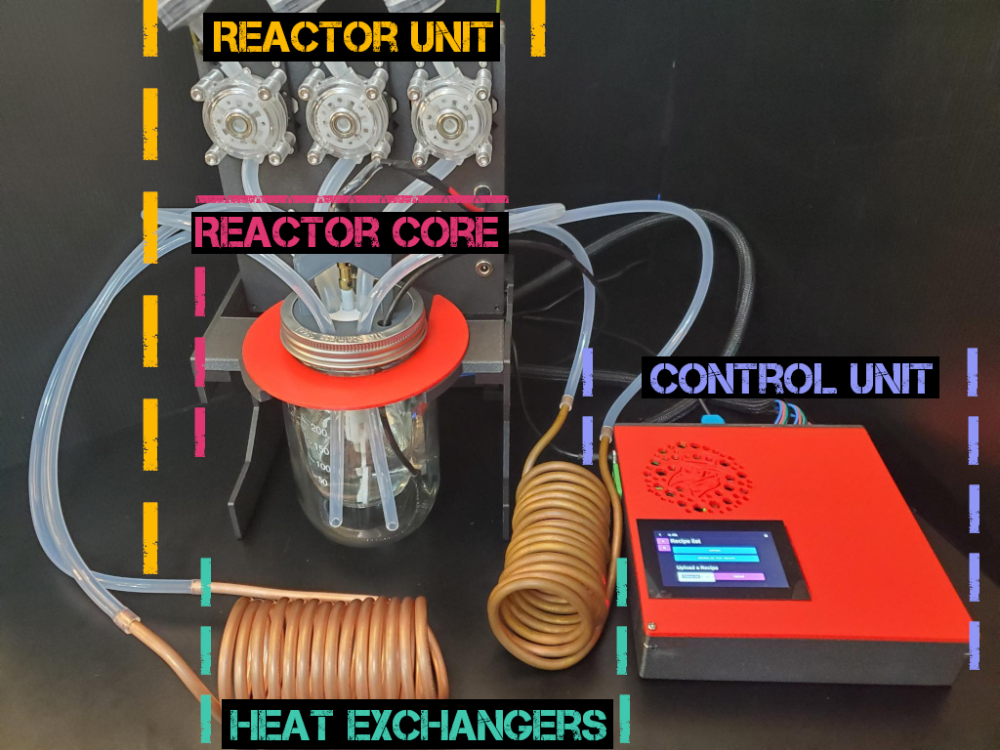

# Welcome to The MicroLab

The MicroLab is part of the MicroLad Suite. Learn more about the hardware/software stack [here](/docs/motivation.md#Meet-the-MicroLab-Suite)

The MicroLab is made up of:
* Control Unit - Runs the software and hardware
* Heating Unit - Heats the liquid that circulates outside the reactor to warm it
* Cooling Unit - Cools the liquid that circulates outside the reactor to cool it
* Reactor Unit - Reactor core and pumps box assemebled together
   * Reactor core - made of of the inner chamber where compounds are made, outer chamber where liquid circualtes to warm or cool the inner chmaber, thermistor to take temperature in the inner chamber, stir rod  to mix things in the inner chmaber, and the parts to mount and hold all the pieces together
   * Pumps Box - houses the circulating pumps, peristaltic pumps and two ports, one for the stir rod and one as an accessory port.

## Index

- [About the MicroLab and MicroLab Suite](docs/motivation.md)
* about.md
- [How to build & use the MicroLab and MicroLab Suite](docs/index.md)  <-- You are Here
  - include index + assembly
  - microlab-parts-list.xlsx
  - Last updated
  - Link to github

## Parts

### Purchased Parts

We have the parts list below. There are links to the items. We did not optimize for price or

Link to xlsx

### Printed Parts

The MicroLab uses several custom parts Part of the this 3D printed parts [Github repo](https://github.com/FourThievesVinegar/microlab-parts/tree/master/v6)

All cases and housings are 3D printed. The Control Unit box and lid are designed to support all components and ports that comprise the unit.

* Control Unit
  * [Case for the Control Unit](https://github.com/FourThievesVinegar/microlab-parts/blob/master/v6/control-box/control-box-flat-v.1.0.stl)
  * [Lid for the Control Unit Case](https://github.com/FourThievesVinegar/microlab-parts/blob/master/v6/control-box/control-box-lid-flat-v.1.0.stl)
  * Internal Subcomponent - [Case for the 4-channel Relay Board](https://github.com/FourThievesVinegar/microlab-parts/blob/master/v6/control-box/control-box-flat-v.1.0.stl)
  * Internal Subcomponent- [Case for the 12V to 5V Converter](https://github.com/FourThievesVinegar/microlab-parts/blob/master/v6/control-box/control-box-flat-v.1.0.stl)
* Cooling Unit
  * [Lid for Cooling Unit](https://github.com/FourThievesVinegar/microlab-parts/blob/master/v6/temperature-units/cold-unit-lid-v.1.0.stl)
* Heating Unit
  * [Lid for Heating Unit](https://github.com/FourThievesVinegar/microlab-parts/blob/master/v6/temperature-units/hot-unit-lid-v.1.0.stl)
* Reactor Unit
  * Pumps box
   * [Box for the Pumps](https://github.com/FourThievesVinegar/microlab-parts/blob/master/v6/pumps-box/pumps-box-v.1.0.stl)
   * [Lid for the Pumps Box](https://github.com/FourThievesVinegar/microlab-parts/blob/master/v6/pumps-box/pumps-box-lid-v0.3.stl)
  * Reactor Core
    * [Manifold Core](https://github.com/FourThievesVinegar/microlab-parts/blob/master/v6/reactor-manifold/reactor-manifold-core-v0.1.stl)
   * [Manifold Lid](https://github.com/FourThievesVinegar/microlab-parts/blob/master/v6/reactor-manifold/reactor-manifold-lid-v0.1.stl)
   * [Stirring Mount](  https://github.com/FourThievesVinegar/microlab-parts/blob/master/v6/reactor-manifold/stirring-mount-screws-accessible.stl)
  * Reactor stand
   * [Piece 1: H shape](https://github.com/FourThievesVinegar/microlab-parts/blob/master/v6/reactor-stand/reactor-stand-H.v1.0.stl)
   * [Piece 2: A shape](https://github.com/FourThievesVinegar/microlab-parts/blob/master/v6/reactor-stand/reactor-stand-A.v1.0.stl)
   * [Piece 3: C shape](https://github.com/FourThievesVinegar/microlab-parts/blob/master/v6/reactor-stand/reactor-stand-c.v1.0.stl)
   * [Piece 4: K shape](https://github.com/FourThievesVinegar/microlab-parts/blob/master/v6/reactor-stand/reactor-stand-k.v1.0.stl)
   * [Piece 5: Jar flange shape (2)](https://github.com/FourThievesVinegar/microlab-parts/blob/master/v6/reactor-stand/reactor-stand-jar-flange.v0.1.STL)

## Building the MicroLab
Use the following index to build the units and then assemble into the MicroLab
  1. [Building the Control Unit](/docs/assembly-control-unit)
  1. [Building the Heating and Cooling Units](/docs/assembly-temperature-exchangers-unit.md)
  1. [Building the Reactor Unit](/docs/assembly-reactor-unit.md)

## Using the MicroLab        
- [Setting up and using the MicroLab](/docs/operation.md)

## Further Documentation

Resources
