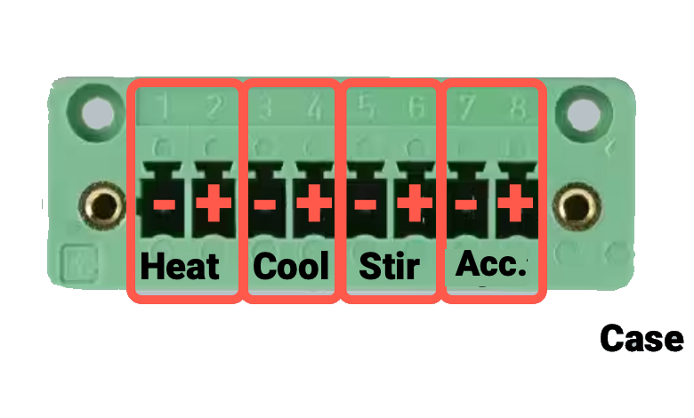
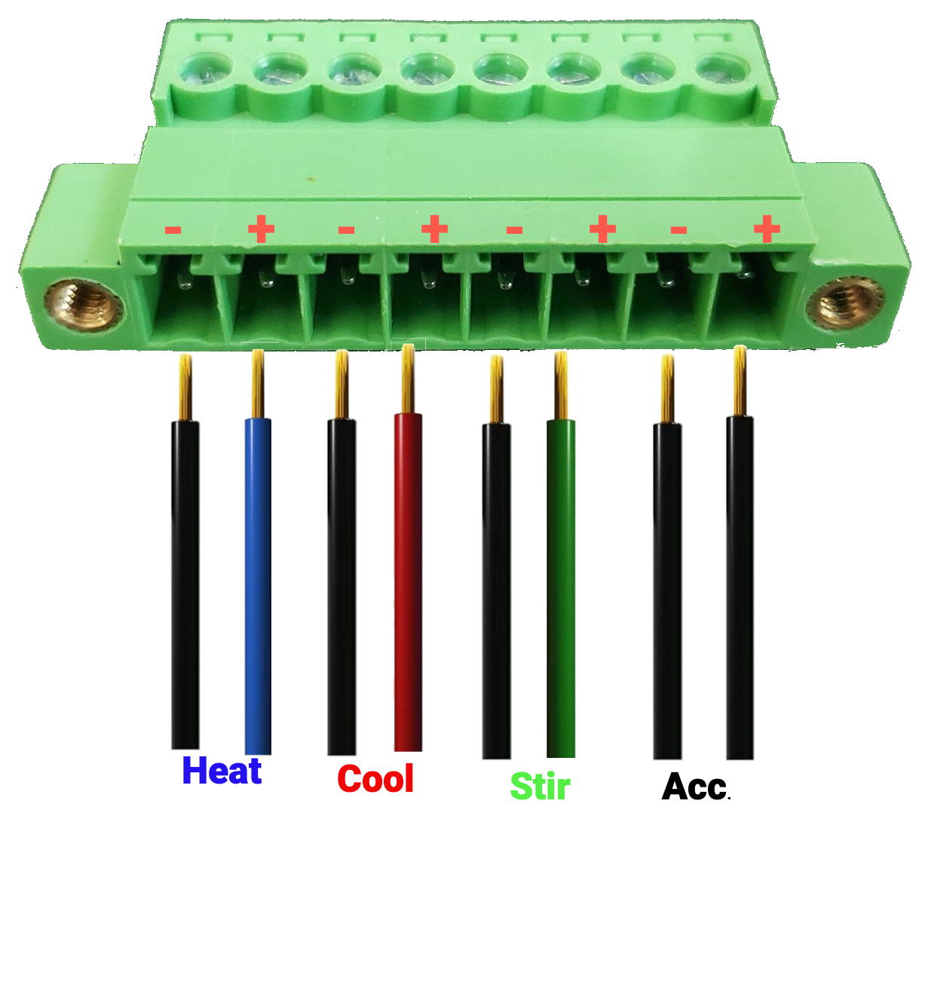
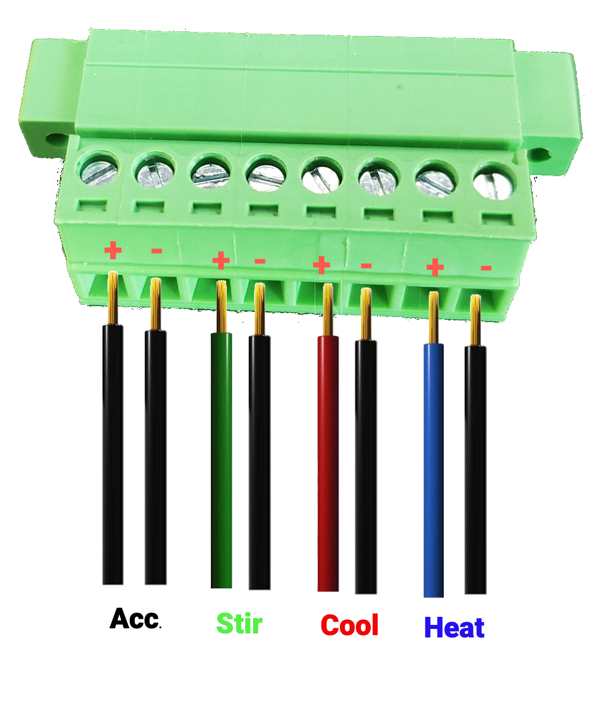
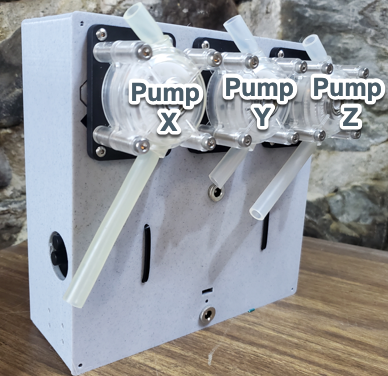

# MicroLab Wiring Guide

The most important part of wiring is to be consistent throughout the project.

We use two kinds of wires for connecting the electronic components in the MicroLab:
* 16 gauge wire in blue, red, green, black (ethernet cables and their wires will also work)
* 22 gauge breadboard jumper wire

Several of the boards and connectors have a fairly straight forwarding wiring. For example the barrel connectors have 2 wires for power, one red (positive) and one black (negative).

* Relay Board
* 12v to 5v converter
* Arduino
* Raspberry Pi

There are two connectors that have more complex wiring: the 8-pin and 12-pin mountable screw terminal connectors.

This style of connector has 3 pieces: socket, mount plate and plug.

  

###  **8-pin Wire Order:**

Note: It's important to maintain the same wiring order throughout the project.

The 8-pin connector passes 12V along to the Accessory port (Acc), Stir rod (Stir), Cooling pump (Cool), and Heating pump (Heat) wires.

There are four 8-pin connectors that will need to be wired. One mounted to the Control Unit and one mounted to the Pumps Box. The other two are for the ends of the 8-pin MicroLab cable used to connect the 8-pin connectors on both boxes.

**Front order - 8-pin connector - external & cable**
If looking at the front of 8-pin socket connector from outside the case, from left to right the wires will go:
* Heat negative (-), black
* Heat positive (+), blue
* Cool negative (-), black
* Cool positive (+), red
* Stir negative (-), black
* Stir positive (+), green
* Accessory negative (-), black
* Accessory positive (+), black

This is the same order for placing the wires at the back of the 8-pin socket for MicroLab cable.

  

  

**Reverse order - 8-pin connector - internal**
From inside the case, looking at the back of the 8pin connector then the wiring order will be reversed and look like this:

###  **12-pin Wire Order:**
Note: It's important to maintain the same wiring order throughout the project.

The 12-pin connector passes 12V along to three peristaltic pumps. When viewed from front of pumps box they are named X, Y, and Z.

The stepper motor cable that comes with the pumps will be cut in half and the cut ends stripped (you will likely need much less than half), creating 6 cables. Three will be used in the Control unit and three will be used in the Pumps Box.

There are four 12-pin connectors that will need to be wired. One mounted to the Control Unit and one mounted to the Pumps Box. The other two are for the ends of the 12-pin cable used to connect the 12-pin connectors on both boxes.

### **12-pin connector - internal**.
The 12-pin connector passes 12V to the three peristaltic pumps. From inside the case, we'll wire the back of the 12-pin connector. When attaching the stripped wires to the back of the 12-pin connector socket the order is from left to right:
  * Pump Z cable - black wire
  * Pump Z cable - green wire
  * Pump Z cable - red wire
  * Pump Z cable - blue wire
  * Pump Y cable - black wire
  * Pump Y cable - green wire
  * Pump Y cable - red wire
  * Pump Y cable - blue wire
  * Pump X cable - black wire
  * Pump X cable - green wire
  * Pump X cable - red wire
  * Pump X cable - blue wire

NOTE: Your cables may differ from these - the color and order can vary between different manufacturers. When in doubt, keep the order consistent with the cables that shipped with your pumps / motors.

  
