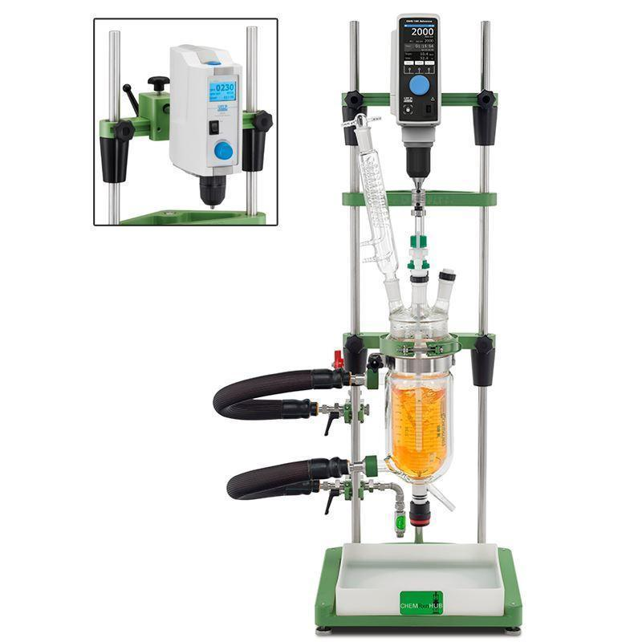
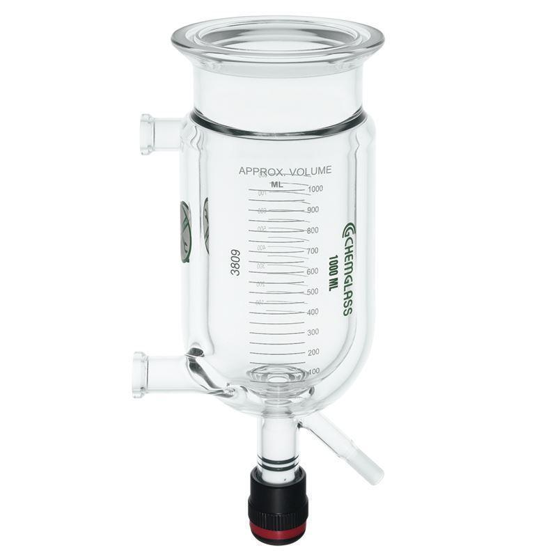
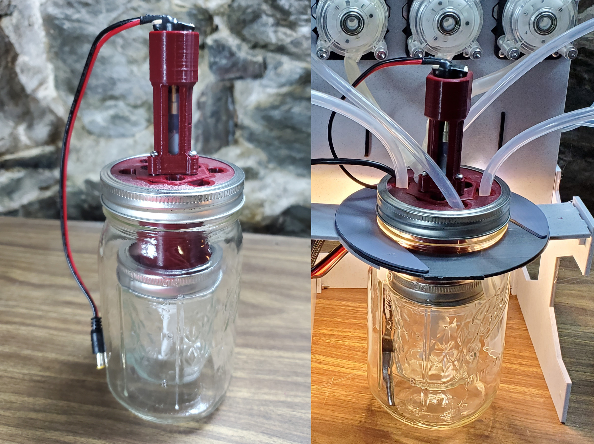
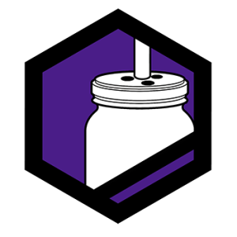

# About MicroLab and the MicroLab Suite

## Motivation

Our goal is to build an open-source DIY controlled lab reactor that people can assemble with parts available online. We hope this will do for chemistry what the 3D printer did for manufacturing: provide a DIY, hackable, low-cost method to design and produce certain needful things that otherwise would be out of reach.

Eventually, we hope this will allow people to make certain medicines at home. We also hope it will empower them to believe more deeply in their own bodily autonomy. This is in line with our mission to deliver a de facto "Right to Repair" for the human body as a way of providing *harm reduction for the living*.

## What is a Controlled Lab Reactor?

Lab reactors provide a controlled environment for conducting chemical reactions, mixing, dispersing, and homogenizing processes. Lab reactors come in various designs, when they are automated they are called Controlled Lab Reactors (CLR). 

A commercial CLR looks like this:

But it costs thousands of dollars and is only available to labs for purchase.

Its reaction vessel looks like this:

The reaction vessel has 2 chambers nested toegther, a bit like stacked bowls. The reactions happen in the inner chamber. The outer chamber (sometimes called the jacket) has hot or cold liquid pumped in to it to control the temperature. To reaction vessel is covered and reagents are dispensed through ports in the lid. There is a stirring rod in the center.

## Why Use a CLR?

 You don’t need a CLR to make chemical reactions happen, but it makes the process of synthesizing compounds from precursors much easier and more reliable. 
 
A CLR is to organic chemistry what an espresso machine is to coffee. It is possible to make coffee over an open fire with nothing more than beans, water, and a tin can. But you will get a better, more consistent cup of coffee from an automatic machine that dispenses the right amount of water at the right temperature in such a way that ensures the water is in contact with the grounds for the right amount of time.

## Commercial CLR vs. MicroLab

Commercial CLRs are the equivalent of high end, fully automatic espresso machines. As long as the appropriate reservoirs are filled with beans, water, milk, and flavoring, anyone can consistently craft a quality cappuccino at the touch of a button.

The MicroLab is more like a home espresso machine that will let you reliably make a good cappuccino but won’t do every single step for you. For both the espresso machine and the CLR you need to understand basic procedures, measurement techniques, and safety.

The MicroLab loads a recipe for a chemical reaction, automatically controls the temperature, adds reagents, and stirring when needed. It is designed for small-molecule organic chemistry to make certain medicinal compounds in your own home or workshop.

## How the MicroLab Works

The MicroLab has a similar design as a commerical one. The reaction vessel has 2 mason jars nested together. The 6 oz Mason jar is attached to the custom lid for the 32 oz Mason jar. When screwed together the 6oz jar is suspended in the 32 oz jar. The lid has ports for reagents, a temperature probe, a stirring rod, and ports for the hot or cold water to be added to the outer vessel. 

The reagents are held in syringes or other vessels and loaded into pumps powered by stepper motors.
The thermal regulator fluid is delivered by pumps controlled by relays. We heat the liquid with tea
warmer coils and cool it with an ice water bucket.

The hardware is driven by a Raspberry Pi, which controls relays and stepper motors used to activate the MicroLab's various features. The parts can be assembled without soldering.

The user selects "recipes" - reactions to run - from an integrated touch screen menu. The recipe guides them, step-by-step, through the reaction, controls the temperature, and automatically dispenses the correct amount of reagents at the right times.

## Meet the MicroLab Suite

The microlab suite is a hardware/software stack that enables the full drug development lifecycle from the chemistry itself back through reaction planning, and even initial research in scientific literature.
|||
|-----|-----|
||**The MicroLab** - A DIY automated lab that you download, 3D print, and assemble with commonly available hardware. The MicroLab works together with a suite of apps to guide and automate a variety of lifesaving drugs from your home.|
|  | **[Recipe Press](https://apothecarium.fourthievesvinegar.org/)** - A simple web app to create "recipes" - sets of instructions the MicroLab uses to run chemical reactions. |
|  | **[Chemhacktica](https://synth.fourthievesvinegar.org/)** - A tool that uses machine learning to automagically discover reaction pathways to target compounds. Please use the link gently, it's our development server. |
|  | **Vinni** - Your guide to your new medical laboratory. Vinni keeps track of your projects including "recipes" from the Apocatherium and compounds of interest from Chemhacktica. Stay tuned for updates on Vinni's ability to help you sift through all the latest scientific literature. |
|||

## Being the Cyberpunk Dystopia We Want to See in the World

In our current situation, closed-source, opaque, unaccountable systems govern us from afar. We live our lives at the mercy of the state, the dollar, and the algorithm. These forces smile benevolently on some while they ignore or discipline others. With this project, we hope to nudge the world toward a future where each of us can help and heal one another and ourselves directly, without the need to grovel before modern day gods and masters.