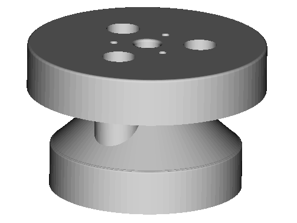
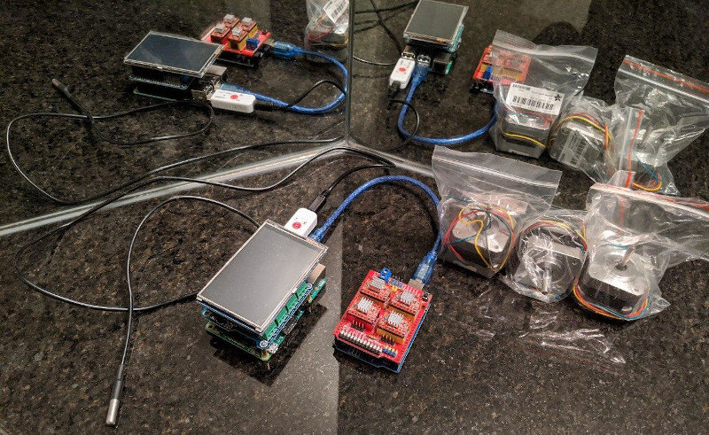

# Motivation

This document describes the project we are working on and its purpose.

## Background

Our goal is to design an open-source DIY automated jacketed lab reactor that
people can assemble with parts they can buy online. The result will be
analogous to a 3D printer for chemistry. This will allow people to make their
own medicine at home.

A commercial one looks like this:

But it costs thousands of dollars and is only available to labs for purchase.

Its reaction vessel looks like this:

The reaction happens in the inner chamber, and hot or cold liquid is pumped
through the outer jacket as thermal regulator fluid. Reagents are dispensed
through ports on top and a stirring rod is sent through the center.

## Apothecary Microlab

Our solution, the Apothecary Microlab, will use two concentric mason jars that
screw into a 3D printed manifold with ports for reagents, a temperature probe, a
stirring rod, and thermal regulator fluid input / output.

A small mason jar screws into the bottom, while a larger mason jar screws into
the top.

The reagents will be held in large syringes and loaded into 3D printed linear
drivers powered by stepper motors. The thermal regulator fluid will be
delivered by a pump controlled by a relay. We can heat the liquid with a tea
warmer coil or cool it with an ice water bucket.

All of the hardware will be controlled by a Raspberry Pi with various shields
and USB devices plugged into it. We've found parts online that can all be
snapped together without soldering.

The hardware we currently have selected is this:

Going left to right:

- waterproof thermometer
- controller (top to bottom):
  - resistive touch screen shield
  - 4 relay shield
  - Raspberry Pi
- Arduino + stepper motor shield
- stepper motors

(the stirring rod's DC motor and limit switches are missing)

The user will select a recipe to make in the touch screen menu. The controller
will guide them, step-by-step, through the recipe and automatically dispense the
correct amount of reagents at the right times.

## Previous Solution

The [previous solution](https://github.com/FourThievesVinegar/microlab-pcb) used
a PCB that users would have to get manufactured and then assemble by hand. We
came to the realization that soldering is a skill out of reach for many, so the
goal of this version is to be completely solderless.
