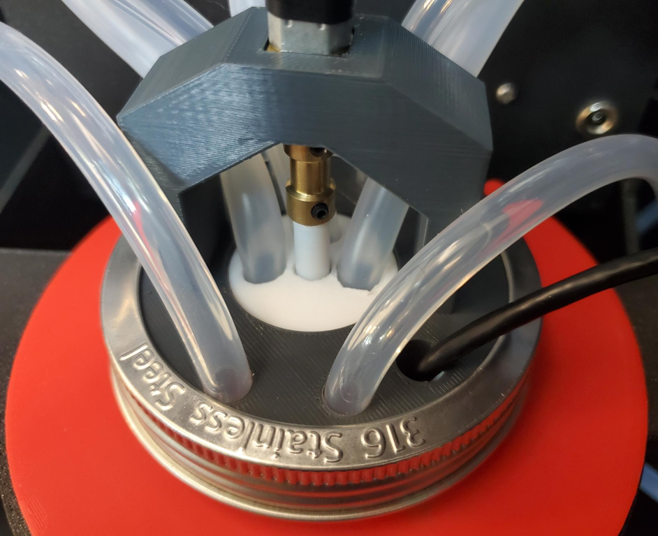
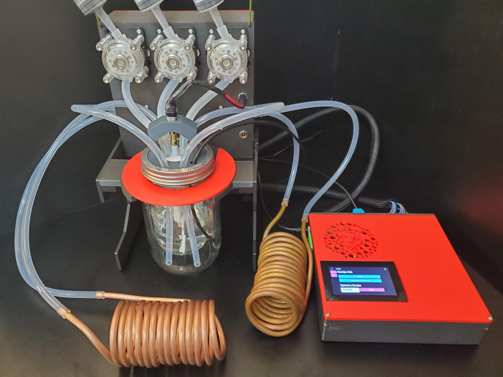

# Setting Up and Operating the MicroLab

## Setting it up

This section describes how to assemble a complete but disassembled MicroLab. If you need to build one from scratch, see the links in the next section.

## Parts

* [Reactor Unit](/docs/assembly-reactor-unit.md)
* [Heating Unit](/docs/assembly-temperature-exchangers-unit.md)
* [Cooling Unit](/docs/assembly-temperature-exchangers-unit.md)
* [Control Unit](/docs/assembly-control-unit.md)
* [MicroLab Cables](/docs/assembly-control-unit.md#cables)
* Cable - Power cord on submersible heater (TC-SBH)
* Cable - USB cord on Thermistor (RU-TMP)
* [MicroLab Tubing](/docs/assembly-temperature-exchangers-unit.md#tubing) (6 pieces, four 16" and two 8")
* Power - MicroLab power supply (CU-POW)
* Power - Switchable power strip or aquarium temperature controller
* Water or other liquids (TC-LIQ) for the heating unit, cooling unit, and reactor core

## MicroLab Assembly

* [Setting up the Reactor Unit](#reactor)
* [Setting up Heating Unit](#heat)
* [Setting up Cooling Unit](#cool)
* [Cabling the Control Unit](#control)

## Setting up the Reactor Unit

- **Assembled Reactor Unit.** If not already assembled, put together the stand, add the Pumps Box and Reactor Core. You can refer to [Building the Reactor Unit](/docs/assembly-reactor-unit.md) for more information.
- **Add outer chamber liquid.** Unscrew the 32 oz mason jar outer chamber lid ring. Lift up the manifold lid and add the liquid to the jar. Re-seat the manifold and screw the lid ring back to secure the manifold. You may need to add more liquid after running the circulation pumps.
- **Add Thermistor** Insert Thermistor in the opening on the manifold so the probe reaches the liquid in the 6oz mason jar inner chamber of the Reactor Core.

  

## Setting up the Heating Unit

- **Add fluid.** Take the Heating Unit, unscrew the ring and lift up the heating lid. Add the liquid, return the lid and screw the lid ring back on.
- **Add tubing**. The 3 pieces of tubing connect heating unit, pump and reactor core.
  * Attach one 16" piece of silicone tubing from the top of heating circulation pump to Reactor Core manifold. Be sure the tubing goes through the manifold and down a couple inches below the liquid's surface.
  * Attach one piece of 8" silicone tubing from the bottom of heating circulation pump to one of the copper tubes on the Heating Unit.
  * Attach one 16" piece of silicone tubing from Heating Unit copper tube to the Reactor Core manifold.
- **Heat the liquid** When you are ready to run the recipe, plug the submersible heater into the switched power strip or aquarium temperature controller and allow it to run and heat up the water.

## Setting up the Cooling Unit

- **Add cold fluid.** Take the Cooling Unit, unscrew the ring and lift up the cooling lid. Add the liquid and ice, return the lid and screw the lid ring back on.
   * You may need to experiment with water, ice and additives to get the best cold temperature that lasts as long as you need.
   * You may want to use a bigger container than a mason jar for the ice bath. A cooler full of ice will also work. Make sure that your circulating fluid does not freeze in whatever you use.
- **Add tubing**. The 3 pieces of tubing connect cooling unit, pump and reactor core.
  *  Attach one 16" piece of silicone tubing from the top of cooling circulation pump to Reactor Core manifold. Be sure the tubing goes through the manifold and down a couple inches below the liquid's surface.
  * Attach one piece of 8" silicone tubing from the bottom of cooling circulation pump to one of the copper tubes on the Cooling Unit.
  * Attach one 16" piece of silicone tubing from Cooling Unit copper tube to the Reactor Core manifold.

## Cabling the Control Unit

The Control Unit will need to be connected to the power supply, the Pumps box (to run the pumps and power the ports), and the Thermistor.

* **8-pin cable** connects the 8-pin cable to mounted 8-pin connector on the Control Unit box and on the Pumps Box.
* **12-pin cable** connects the 12-pin cable to mounted 12-pin connector on the Control Unit box and on the Pumps Box.
* **Connect Thermistor USB to Control Unit** Plug the USB end of the Thermistor into the Control Unit's USB port.
* **Plug in Power supply** Insert the barrel connector of the power supply to the barrel connector power port on the Control Unit.

The MicroLab should now be connected and ready to be setup up for a recipe and run.
* The picture below shows the syringes attached, we left that step for later when actually using it, but wanted to show the connected MicroLab in all its glory.

## Getting Started Using Your MicroLab

When you add power to the Control Unit, it will turn on. You should a see start-up sequence on the touchscreen.

Once your MicroLab is set up it just needs a recipe to run, the ingredients loaded, and some human actions during the recipe making.

## MicroLab Recipes

Recipes are a set of instructions the MicroLab uses to run chemical reactions. They are created on the Recipe Press site.

### About Recipes

A recipe is a series of numbered steps. Each step has:
 * User message - test displayed on the touchscreen
 * Task type - action the MicroLab will take
 * Task icon - icon that will display on touchscreen
 * User Option(s) - "links" to next steps that depend on user input or judgement (used with Human Tasks)
 * Detailed description - more text that can be shown on the touchscreen

   

The MicroLab is able to perform 5 task types:
* Human Task - pause until the person completes the task shown on the touchscreen and taps on a menu button to move to the next stop
* Pump - turn one pump on to dispense a set volume of liquid over a certain period of time (while optionally stirring and maintaining a temperature)
* Stir - activate the stir rod for a set period of time with optional task to maintain temperature
* Cool - cools the reactor jacketing liquid to the set temperature
* Heat - heats the reactor jacketing liquid to the set temperature

### The Test Recipe

We have a Test Recipe designed to check that all the parts of the MicroLab are working correctly. It is available on the Recipe Press site and is also preloaded on the Control Unit.

On the Press Recipe site, you can see the how the Test Recipe is built.

#### **Closer Look at Step 0**

Let's take a look at Step 0 to see how a step works. Step 0 is where the MicroLab greets the human and asks if they want to continue.

**Step details:**
* User message is the greeting
   * "Hello and welcome! This recipe is to test the function of the microlab. Ready to see the test options?"
* Task type is Human Task, the Microlab is waiting for a User Option or Menu button to be selected.
* Task icon - shows the Human Task icon
* User Option(s) - there is one option, called "Yes", it sets the next step to Step 1.
* Detailed description - this field is empty in step 0

The Recipe Press also allows you to simulate your recipe:

#### Test Recipe Steps

When running the recipe you are able to test the X pump, Y pump, Z pump, stir rod, and temperature control.

The MicroLab is able to do these tests by using and reusing its 10 steps.

* Step 0: Human Task - Welcome
* Step 1: Human Task - Select test for pumps, heating or stirring
* Step 2: Pump - Test Pump X
* Step 3: Pump - Test Pump Y
* Step 4: Pump - Test Pump Z
* Step 5: Human Task - Ask if they want another test
* Step 6: Heat - Heat to 30C
* Step 7: Human task - Shows action complete, ask if they want another test
* Step 8: Stir - use stir rod for 10 seconds
* Step 9: Human task - Shows action complete, ask if they want another test
* Step 10: Human task - Confirmation that user tapped no to doing another test and test is complete

## Using a Recipe

Before starting a recipe:
* Set up the MicroLab
* Have Heating Unit reach the needed temperature
* Have Cooling Unit reach the needed temperature
* Load the syringes with the needed liquid ingredients
* Load the inner reaction chamber with needed ingredients

With the Test Recipe you:
* Set up the MicroLab
* Load the syringes with water and attach to the top three peristaltic pumps
* Let the Heating Unit heat up
* Setup the Cooling Unit

Once ready, use the touchscreen to start the Test Recipe. follow the steps to test each pump and confirm the contents of syringes enter the chamber. Run the heating and confirm the MicroLab heats the chamber to 30C. Run the stirring and confirm the stir rids runs for the appropriate time. Once all tests are complete, you can exit the recipe.  

## Writing a Recipe

New recipes can be made online, downloaded to a thumbdrive and then uploaded to the Control Unit.  

You make a recipe directly on the [Recipe Press site](https://recipe-press.fourthievesvinegar.org/).

Another option is to start [a project in Vinni](https://vinni.fourthievesvinegar.org/projects/NVXg2yPAKaMu) and save your recipes that way.
   * More on this as Vinni approaches a real release and our services get integrated.
