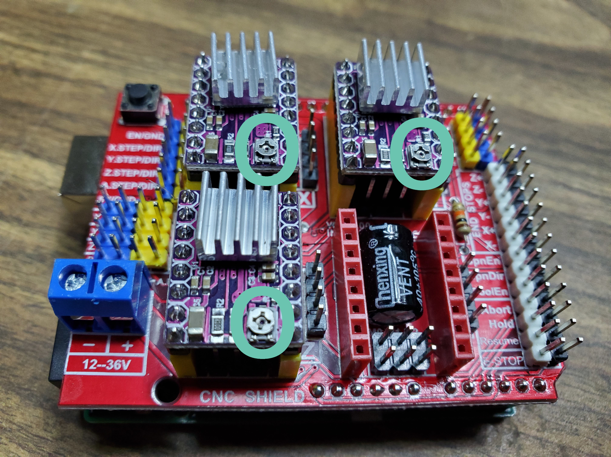

#MicroLab Troubleshooting

Touchscreen for Raspberry Pi (CU-RPI). Make sure you get the proper drivers – different manufacturers may require different drivers. For the linked model, try these: link
https://www.dropbox.com/scl/fo/hawpkmswazw5h7lv2p8vq/AJa3CosqXNYN0Y3zPbmVNjM/Driver?rlkey=ev89s381ag053wue395hf4ueb&e=1&subfolder_nav_tracking=1&dl=0

## Stepper Motor Calibration

Before we continue with assembly we should tune the potentiometers and test the stepper motor wiring.

We will need the:
- Raspberry Pi that is setup
- Arduino that is setup
- **Pi power cable?**
- Peristaltic pumps with stepper motors
- Small phillips head screw driver

### Potentiometer tuning

* On the Arduino, each A4988 stepper motor driver board has a small potentiometer that look like a small phillips head screw on the board.
* You **DEFINITELY** want to tune the potentiometers. If you don't, the stepper motors will likely behave strangely and could be damaged by excess voltage.

Note:
In the image above, the potentiometers are circled and their slightly-flat sides are pointed to the left. This is the "slightly-open" position.

**WARNING!** Failure to correctly tune the potentometers can damage the motor controller and the motors themselves.

How to tune:
You will **gently** turn the potentometers on the motor control boards clockwise or counter-clockwise using a small phillips head screw driver. Be careful to stop once there is any resistance, do not to turn past the resistance.
* Turning them clockwise "closes" the voltage down
* Turning them counter-clockwise "opens" the voltage up

1. Attach the Arduino's stepper motor cables to the stepper motor on the peristalic pump.

1. Double check the everything is connected properly.
1. Start with the potentiometers in the "closed" position.

1. Power on the Raspberry Pi, the Arduino shield and the pumps.
1. **Don't we need to add cable between Arduino and Pi?**
1. On the Raspberry Pi, the MicroLab software will load, locate the Test Recipe and choose to manually run each of the peristalic pumps. **More detail needed** 

1. Slowly turn the potentiometer counter-clockwise an eighth of a turn at a time to "open" them. Check if the stepper motors turn smoothly. If they do not move, "open" the potentiometer an eighth-turn and try again. If they move erratically, your voltage is likely too high and you "close" the potentiometer.

1. Once tuned, power off the motors and the Raspberry Pi. Remove the stepper motor cabls from the stepper motors of the eristaltic pumps.

* You can tune the potentiometers later as well, but the lid on the Control Unit will need to be off.

### Stepper motor verification
Check each peristaltic pump's motor. With the cables and power disconnected, you should be able to spin the shaft of the stepper motor with your fingers and feel almost no resistance.

Testing the motor. Take a short length of wire and jumper the top two pins (Pins 1 and 2) of the connector together.

If the motor is wired correctly you should now feel some resistance when you spin the shaft (you should be able to feel the “steps” in the stepper motor). Repeat this procedure with the bottom two pins (Pins 3 and 4).

If you do not feel any change in resistance, try jumpering other combinations of pins until you identify the two pairs. See Troubleshooting Stepper Motor if you continue to have issues.

## Pumps Box Assembly

- If your pump does not come with mounting hardware, you may need to get creative. In a pinch, zipties should work although you may want to double them up or drill out the holes to support thicker ties.
- NOTE: [Suggestions for better solutions are welcome](https://github.com/FourThievesVinegar/solderless-microlab/issues/184).

### Reactor Core
Please note that we are experimenting with sinking nuts into various components for more reliable and durable connections. This is why the screw holes on top of the manifold are hexagonal at the top. Doing this requires a soldering iron and a steady hand. You may also want to drill out the stirring mount screw holes with a 1/8" bit to give the screws more play to mate with the nuts.

The motor mount is in active development as of v0.6 and we thank you for patience with the rough edges.

###
Heating Coolingg
(We are looking into upcycling heat sinks from old computers but are still experimenting - please reach out if you have done this or have suggestions)
