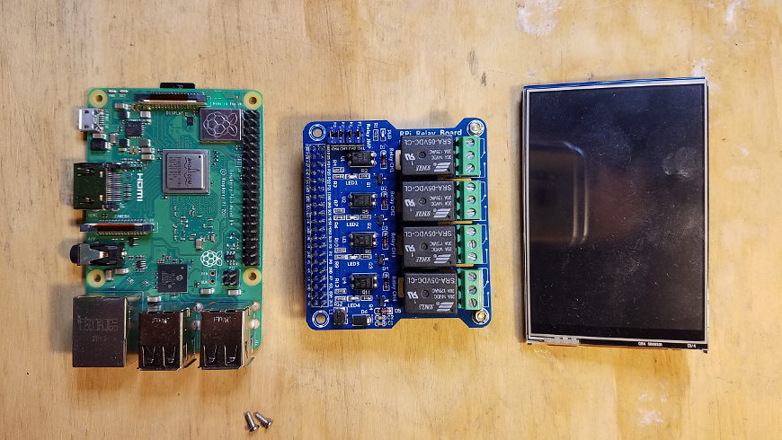
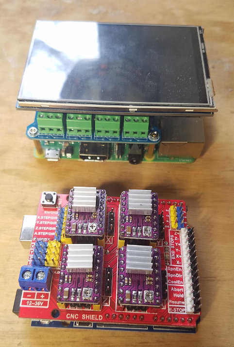

# Welcome!

The hardware for the Four Thieves Vinegar Microlab consists of a few main assemblies. Please note that these docs are in progress and may be updated. Links to specific parts are provided in the

## 1. The Raspberry Pi Assembly, which includes:

- Raspberry Pi
- Relay shield,
- LCD screen for the Raspberry Pi

  

## 2. The Arduino Assembly, which includes:

- Arduino
- Motor control shield and its motor drivers (4x Pololu Corporation 2987)
- 4 stepper motors (and their wires)

  

## 3. The Reactor assembly, which includes:

- The reactor manifold (see the STL file in this directory)
- 1 liter wide mouth mason jar
- 4 oz smaller mason jar
- Tubing (TODO: How much and what length?)
- Syringes (TODO: How many and what size?)
- Whatever is used to plunge the syringes (TODO: fill this out)
- Stiring rod (TODO: get details)
- Thermometer (TODO: get details)

# Assembly instructions

1. Unbox components and verify you have all required parts for all assemblies
2. Assemble the Raspberry Pi assembly by stacking the relay shield and LCD screen on top of the main board. The GPIO pins should line up on each board, as should the edges of the Pi, the relay shield, and the LCD screen. Use the support columns that came with the relay shield to support the edge of the shield opposite the GPIO pins.
3. Assemble the Arduino assembly by stacking the CNC / Motor control board on top of the Arduino. Make sure to install the smaller motor control boards in the CNC controller properly. The small circular potentiometers should be oriented toward the bottom of the board (TODO: Verify this). Attach heat sinks to the microprocessors if present.
   
4. TODO: Reactor Assembly instructions and pictures

# Parts list

DC, stepper motor control + limit switch:

- https://www.aliexpress.com/item/Free-shipping-cnc-shield-v3-engraving-machine-3D-Printer-4pcs-A4988-driver-expansion-board-for-Arduino/32808916949.html
- Using gcode to drive it: https://en.wikipedia.org/wiki/G-code
- Using grbl for the gcode interface: https://github.com/grbl/grbl/wiki/Interfacing-with-Grbl

Interface + buttons:

- https://www.aliexpress.com/item/Free-shipping-LCD-module-Pi-TFT-3-5-inch-320-480-Touchscreen-Display-Module-TFT-for/32587995145.html

Relay board:

- https://www.aliexpress.com/item/1PCS-Raspberry-Pi-Power-Relay-Board-Expansion-Module-Shield-Supports-RPi-A-B-2-B-3/32961638909.html
- Driver code: https://github.com/FourThievesVinegar/solderless-microlab/blob/master/backend/relay.py
- Usage example: https://github.com/FourThievesVinegar/solderless-microlab/blob/master/backend/relay_test.py

Temperature:

- https://m.aliexpress.com/item/32827261401.html
- Sample code: https://github.com/urwen/temper

Suggested stepper motors:

- https://www.aliexpress.com/item/32853499120.html
