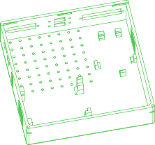

# /pub/medical/4tvc/microlab/v6

The latest version Microlab by Four Thieves Vinegar Collective.

This is a [PartCAD](https://partcad.org/) package for MicroLab.
It is intended to maintain the information about all the parts
for the following purposes: manufacturing, procurement and assembly
(both manual and automated assembly instructions).

*DISCLAIMER: PartCAD is still under heavy development, and so is
the PartCAD package for Microlab. Please, consider contributing to
both PartCAD and this package, but do not yet use this package
for manufacturing or ordering Microlab parts.*

## Assemblies

### microlab
<table><tr>
<td valign=top></td>
<td valign=top>Parameters: <ul><li>profile: <ul><li>regular</li><li><b>flat</b></li></ul></li></ul></td>
</tr></table>

## Parts

### control-box
<table><tr>
<td valign=top></td>
<td valign=top>Regular size control box</td>
</tr></table>

### control-box-lid
<table><tr>
<td valign=top></td>
<td valign=top>Control box lid for regular size control box</td>
</tr></table>

### control-box-flat
<table><tr>
<td valign=top></td>
<td valign=top>Low profile control box</td>
</tr></table>

### control-box-lid-flat
<table><tr>
<td valign=top></td>
<td valign=top>Control box lid for low profile control box</td>
</tr></table>

### relay-case-no-top
<table><tr>
<td valign=top></td>
<td valign=top>Relay board case without a top cover</td>
</tr></table>

### relay-case
<table><tr>
<td valign=top></td>
<td valign=top>Relay board case with a top cover</td>
</tr></table>

### stepdown-case
<table><tr>
<td valign=top></td>
<td valign=top>A case fir 12V-to-5V stepdown converter</td>
</tr></table>

  

*Generated by [PartCAD](https://partcad.org/)*
