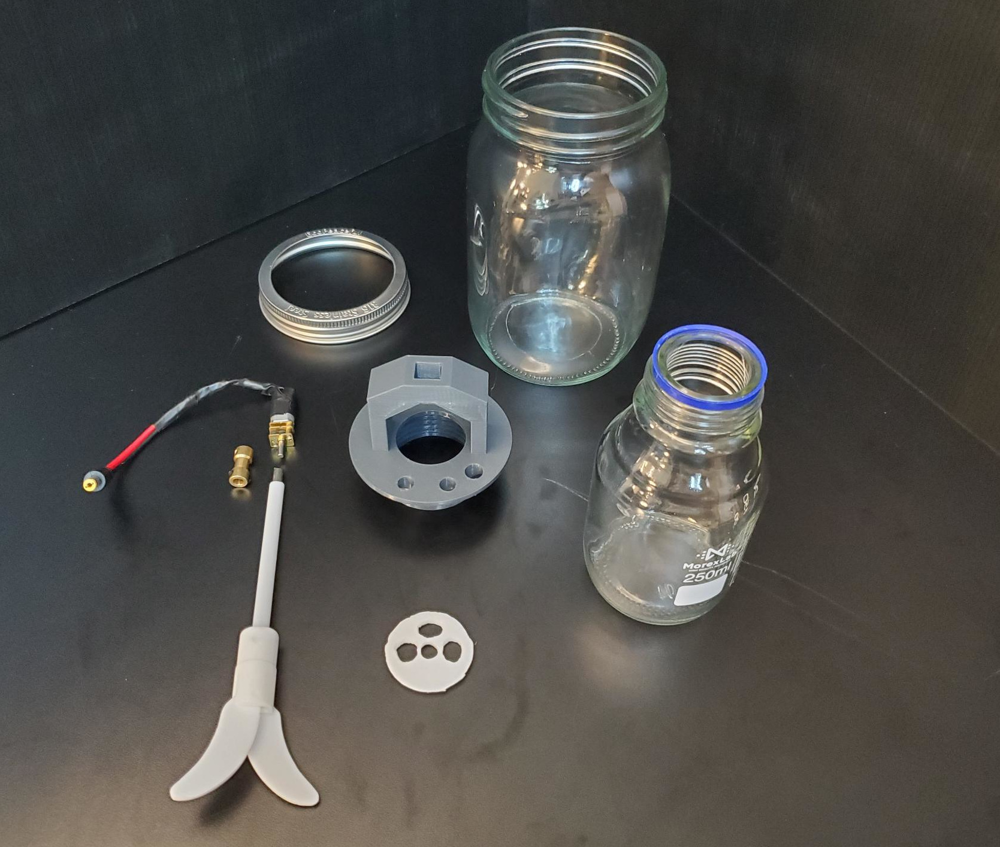
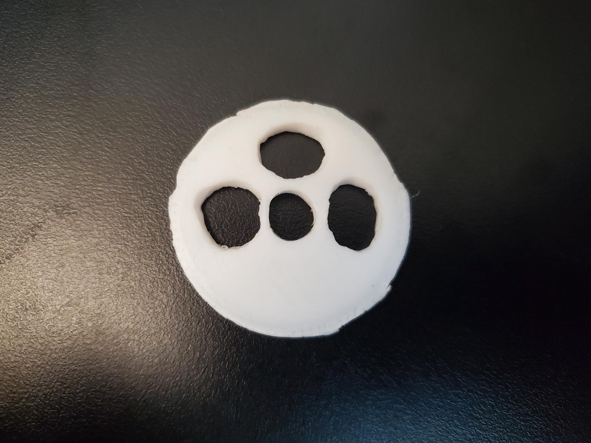
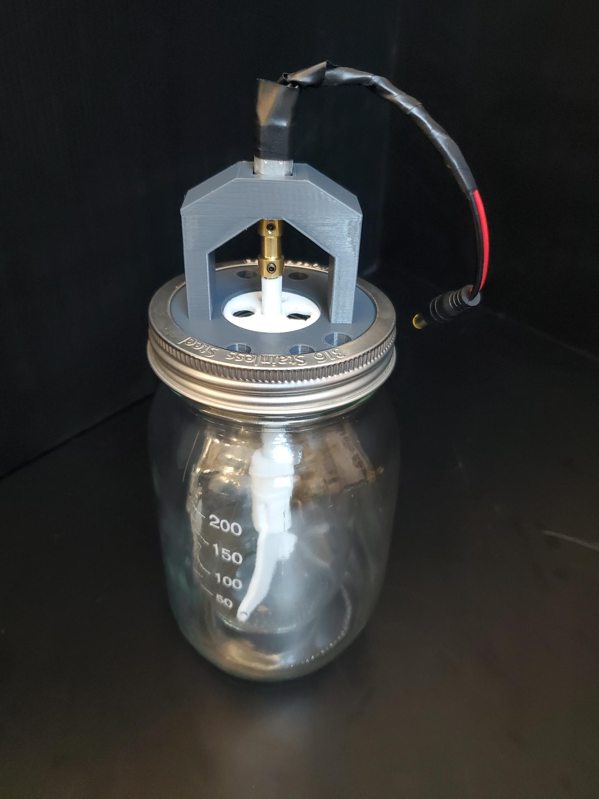

# GL45 Variant Reactor Core

This design uses a borosilicate media bottle with GL45 threads as the inner vessel and a hand-cut teflon disk as the lid to improve chemical compatibility. Because the sealing surface is the bottom of the teflon disk, not the edges, tight tolerances are not required.

## Parts

Reactor Core parts list:

- Outer Jar and lid ring
- Inner 250ml GL45 borosilicate bottle
- Printed Reactor Core
- Carved PTFE Disc
- PTFE stirrer
- Shaft coupler.
- Motor with barrel plug attached

Refer to [the parts list](https://github.com/FourThievesVinegar/solderless-microlab/blob/main/docs/parts-list.md) for exact specifications and notes.

## PTFE Disc

The disc itself is approximately 35mm in diameter. The stirrer in the parts list requires a central hole approximately 8mm in diameter. The reagent pump tubes have an outside diameter of 10mm. While it is possible to drill PTFE, it is much easier to work it with a knife.

## Assembled

## Increasing Temperature Tolerance

The temperature tolerance of the Reactor Core is a major reason for the transition to this new design. In order to increase tolerances further, we have conducted annealing experiments involving heat treating the part. Based on these experiments, we recommend the following:

- Print the part in PETG filament, which has more thermal resistance than PLA. If you have used other materials, and especially if you have conducted temperature tests, please contact us with your findings. 
- Anneal the PETG manifold in an oven for 60 minutes at 185°F / 85°C.
- This will cause the part to shrink in the X/Y dimensions and expand slightly in the Z direction. To account for this deformation, we recommend scaling the model to 103.5% in the X and Y dimensions while scaling it to 97.5% in the Z dimension.
